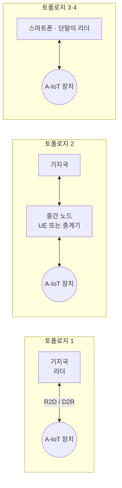

# Ambient IoT

!!! spec "스펙 · 릴리즈"
    서비스 요구사항: TR 22.840 (SA1, Rel-19) · 무선 연구: TR 38.848 (Rel-18 RAN) · Rel-19 WI: Ambient IoT 무선 인터페이스 (RAN1/2/3/4) · 핵심망 연구: SA2 Rel-19
    Rel-18 연구 → Rel-19 **첫 규격** (가장 단순한 장치, 기지국 리더, 실내) → Rel-20 이후 확장 → 6G 연계

!!! basic "한눈에 보기"
    **Ambient IoT**는 **배터리 없는 IoT 단말**을 이동통신망에 연결하는 기술입니다. 단말은 주변의 전파·빛·진동·열에서 아주 작은 에너지를 모아(에너지 수확) 동작합니다.

    - 소비 전력: **마이크로와트(µW) 수준** — NB-IoT 단말보다 수천 배 이상 작음
    - 비용: 매우 저렴 (RFID 태그에 가까운 수준 목표)
    - 통신 방식: 대부분 스스로 전파를 만들지 않고, 받은 전파를 **반사해서(후방 산란, backscatter)** 정보를 실음

    물류 창고의 상자 수천 개, 공장 부품, 스마트 농업 센서를 **배터리 교체 없이** 추적하는 것이 목표입니다. 기존 RFID와 달리 **기지국이나 휴대폰이 리더 역할**을 하므로 넓은 지역을 관리할 수 있습니다.

## 장치 유형 (연구 분류) { .l2 }

| 유형 | 에너지 저장 | 신호 생성 | 소비 전력 (목표) | 비유 |
|---|---|---|---|---|
| **장치 A** | 없음 (거의) | 후방 산란만 | ~1 µW | 수동형 RFID |
| 장치 B | 있음 (작은 커패시터) | 후방 산란 + 증폭 가능 | 수 µW ~ 수십 µW | 반능동형 태그 |
| 장치 C | 있음 | **능동 송신** (자체 RF 발생) | 수백 µW 이하 | 초저전력 송신기 |

## 배치 구조 (토폴로지) { .l2 }

| 링크 | 의미 | 방식 |
|---|---|---|
| **R2D** (Reader-to-Device) | 리더 → 장치: 명령·에너지 공급 | OOK 등 단순 변조 (포락선 검출로 수신) |
| **D2R** (Device-to-Reader) | 장치 → 리더: 데이터 | 후방 산란 (반송파를 리더나 별도 송신기가 공급) |
| 반송파 공급 | 장치가 반사할 연속파(CW) 제공 | 리더 자신 또는 별도 노드 |

## Rel-19 규격 범위 (요약) { .l2 }

| 항목 | 선택 |
|---|---|
| 장치 | 가장 단순한 유형(장치 A에 해당하는 후방 산란 장치) 우선 |
| 배치 | **기지국이 리더**, 실내 공장·창고 시나리오 우선 |
| 대역 | FR1 면허 대역 (FDD 등) |
| 서비스 | 재고 관리(inventory), 명령(command) — 장치 ID 읽기, 소량 데이터 |
| 핵심망 | 장치 식별·인증·데이터 전달의 경량 절차 (SA2) |

??? expert "전문가 노트 — 기술 쟁점"
    **링크 버짓.** 후방 산란은 리더 → 장치 → 리더 왕복 경로 손실을 모두 겪어서(거리의 4제곱에 비례) 거리가 짧습니다. 장치 A 실내 목표 거리는 수십 m 수준으로 논의되었고, 별도 반송파 공급 노드나 중간 UE(토폴로지 2)가 거리를 늘립니다.

    **자기 간섭.** 리더가 연속파를 보내면서 동시에 아주 약한 반사 신호를 받아야 하므로 강한 자기 간섭 제거가 필요합니다(기지국 리더 구조의 어려움). 반송파 공급 노드를 분리하는 구조가 대안입니다.

    **간섭과 공존.** 같은 면허 대역의 NR/LTE와 공존해야 하므로 R2D 신호의 대역 밖 방사, D2R 주파수 위치(반송파 주변 부반송파 이동)를 설계합니다.

    **6G와 연결.** Ambient IoT는 6G 사용 시나리오 "대규모 통신"과 센싱(장치 위치·상태 감지)과 결합될 후보입니다. 이 기술이 5G-Advanced에서 시작해 6G에서 본격화될 가능성이 큽니다.

## 관련 페이지

- [LTE-M과 NB-IoT](../lte/advanced/lte-m-nbiot.md)
- [RedCap](../nr/advanced/redcap.md)
- [UE 전력 절약](../nr/advanced/power-saving.md) — LP-WUS
- [Rel-19](rel19.md)
