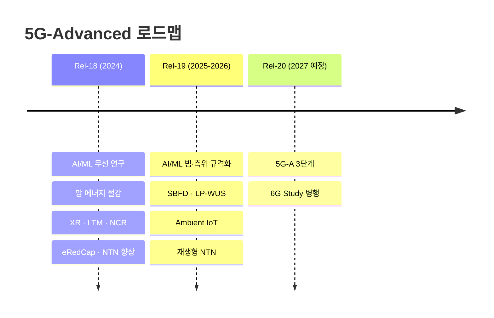

# 5G-Advanced

!!! spec "범위"
    3GPP Rel-18 · Rel-19 · Rel-20 (5G-Advanced 부분) · 대표 개요 문서: 각 릴리즈 Release Description (TR 21.918 Rel-18, TR 21.919 Rel-19 등)

    Rel-18 (2024 동결) → Rel-19 (2025 말~2026 동결) → Rel-20 (2027 예정, 6G 연구와 병행)

!!! basic "5G-Advanced란"
    **5G-Advanced**는 3GPP가 Rel-18부터 붙인 이름입니다. 4G가 LTE → LTE-Advanced로 발전했듯이, 5G NR을 크게 한 단계 발전시킨 묶음입니다.

    5G-Advanced의 키워드는 크게 다섯 가지입니다.

    1. **AI/ML**: 무선 인터페이스와 망 운용에 인공지능을 공식적으로 도입
    2. **에너지 절감**: 기지국이 쓰는 전력을 줄이는 표준 기능
    3. **새 서비스**: XR(확장 현실), 무전원 IoT(Ambient IoT), 드론, 위성
    4. **성능 고도화**: MIMO, 이동성(LTM), 상향 커버리지, 전이중(SBFD)
    5. **6G로 가는 다리**: 6G 핵심 기술(AI, 센싱, FR3)을 미리 실험

    상용망에서는 2025년 무렵부터 Rel-18 기능이 단계적으로 도입되고 있습니다.

## 릴리즈별 큰 흐름 { .l2 }

| 테마 | Rel-18 | Rel-19 | Rel-20 (예정) |
|---|---|---|---|
| AI/ML | 연구 (CSI, 빔, 측위), RAN3 망 AI | **빔 관리·측위 규격화**, CSI 예측 | 확장 (CSI 압축 등) |
| 에너지 | 셀 DTX/DRX, 공간·전력 적응 | On-demand SSB/SIB1 | 계속 |
| MIMO | CJT, 8Tx UL, 통합 TCI multi-TRP | MIMO Phase 5 (UL 3Tx, CJT TDD 등) | |
| 이동성 | **LTM**, CHO+SCG | LTM 확장 | |
| 듀플렉스 | SBFD 연구 | **SBFD 규격** | |
| IoT | eRedCap, Ambient IoT 연구 | **Ambient IoT**, LP-WUS | Ambient IoT 확장 |
| 위성 | NTN Ka 대역, 커버리지 | **재생형 페이로드**, RedCap NTN | |
| 기타 | XR, 사이드링크 진화, 측위 향상, 드론 | XR 향상, 7–24 GHz 채널 모델, ISAC 채널 모델 | 6G 연구와 연계 |

## 이 섹션의 페이지

| 페이지 | 내용 |
|---|---|
| [Rel-18](rel18.md) | 5G-Advanced 첫 릴리즈 기능 정리 |
| [Rel-19](rel19.md) | 두 번째 릴리즈 기능 정리 |
| [Rel-20 (5G-A)](rel20.md) | 세 번째 단계와 6G 연구 병행 |
| [무선 인터페이스 AI/ML](ai-ml.md) | CSI·빔·측위 AI, 모델 수명 주기 |
| [네트워크 에너지 절감](network-energy-saving.md) | 기지국 전력 절감 기법 |
| [XR과 저지연 서비스](xr.md) | PDU Set, XR용 스케줄링 |
| [Ambient IoT](ambient-iot.md) | 무전원 IoT |

!!! warning "최신성"
    Rel-19 이후 내용은 회의 진행에 따라 범위가 조정될 수 있습니다. 이 섹션은 공개된 작업 항목을 바탕으로 요약했으며, 정확한 내용은 각 릴리즈의 3GPP 규격과 Release Description으로 확인하세요.
