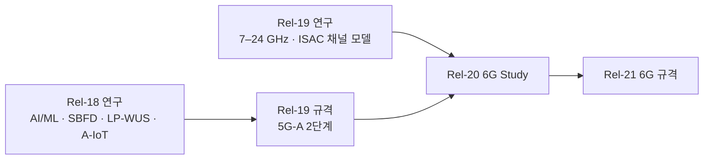

# Rel-19 — 5G-Advanced 2단계

!!! spec "스펙 · 릴리즈"
    패키지 승인: 2023-12 (RAN#102) · 동결: Stage 3 2025 말, ASN.1 2026 초 (대략) · 주요 규격: TS 38.2xx/38.3xx Rel-19 버전, AI/ML 일반 절차, Ambient IoT 신규 규격 · 채널 모델 연구: 7–24 GHz, ISAC (TR 38.901 확장)

!!! basic "한눈에 보기"
    Rel-19는 Rel-18에서 **연구했던 기술을 실제 규격으로** 만드는 데 무게가 실린 릴리즈입니다. 동시에 6G를 위한 **기초 연구**(새 대역 채널 모델, 센싱 채널 모델)도 시작했습니다.

    핵심만 꼽으면:

    - **AI/ML이 처음으로 무선 인터페이스 규격에** 들어감 (빔 관리, 측위)
    - 기지국이 **같은 TDD 대역에서 송수신을 동시에** (SBFD)
    - **배터리 없는 IoT** 단말 (Ambient IoT)
    - 초저전력 **웨이크업 수신기** (LP-WUS)
    - 위성에 **기지국을 직접 탑재** (재생형 NTN)

## 주요 항목 { .l2 }

| 영역 | 항목 | 내용 |
|---|---|---|
| **AI/ML** | 빔 관리 | 단말 측·망 측 모델로 **공간 예측**(일부 빔만 측정해 최고 빔 추정), **시간 예측**(미래 빔) |
| | 측위 | **직접 AI 측위**(측정 → 위치), **AI 보조 측위**(LOS/NLOS 판정·측정 보정) |
| | CSI | 단말 측 **CSI 예측** 규격화, 양측(two-sided) CSI 압축은 추가 연구 |
| | 공통 | 모델 식별·기능(functionality) 기반 LCM, 데이터 수집, 성능 모니터링 |
| **듀플렉스** | **SBFD** | TDD 캐리어 일부 부대역을 같은 시간 UL로 사용, 기지국 측 전이중·단말 반이중, CLI 처리 |
| **에너지** | NES 2단계 | SCell **on-demand SSB**, Idle 단말용 **on-demand SIB1**, 공통 신호 전송 적응 |
| **전력 절약** | **LP-WUS / LP-SS** | 별도 초저전력 수신기용 OOK 기반 웨이크업·동기 신호 (IDLE/INACTIVE, CONNECTED 일부) |
| **IoT** | **Ambient IoT** | 에너지 수확·후방 산란(backscatter) 단말, 기지국 리더 기반 실내 시나리오 우선 |
| **MIMO** | MIMO Phase 5 | UL 3Tx 등 상향 확장, TDD CJT, 비대칭 DL/UL multi-TRP, LTM 연동 측정 |
| **이동성** | LTM 확장 | CU 간 LTM, 조건부 LTM 등 |
| **위성** | NTN 4단계 | **재생형 페이로드**(위성 탑재 gNB), RedCap over NTN, UL 용량 향상 |
| | IoT NTN | **저장 후 전달**(Store & Forward), 비연속 피더 링크 |
| **XR** | XR 향상 | UL 속도 적응, 지연 인지 스케줄링 개선 |
| **채널 모델** | 7–24 GHz | FR3 후보 대역 측정 기반 채널 모델 검증·보완 |
| | ISAC | 표적 반사·센싱 경로를 포함한 채널 모델 (6G 센싱 평가 기반) |

## Rel-18 → Rel-19 → 6G 연결 { .l2 }

??? expert "전문가 노트 — 표준화 쟁점"
    **AI/ML 규격화 방식.** 모델 구조나 가중치는 표준화하지 않습니다. 대신 (1) 모델 입력·출력과 보고 형식, (2) 학습·추론용 **데이터 수집** 절차, (3) 모델(또는 기능) **식별·활성화·전환·모니터링**, (4) 성능 요구사항과 시험 방법(RAN4)을 정합니다. 단말–망 간 모델 쌍이 필요한 양측 CSI 압축은 **모델 쌍 맞춤·상호운용** 문제 때문에 더 오래 연구됩니다.

    **SBFD 쟁점.** 기지국 자기 간섭 억제(안테나 분리, 아날로그·디지털 제거), 부대역 간 누설, 인접 사업자·인접 셀 간섭(기지국–기지국 CLI), 단말 측 같은 시간 UL 부대역 이웃 단말의 DL 간섭(단말–단말 CLI) 관리가 핵심입니다. 단말 변경을 최소화하는 방향으로 규격화되었습니다.

    **Ambient IoT 범위.** Rel-19 WI는 가장 단순한 장치(에너지 저장이 거의 없는 후방 산란형)와 기지국이 직접 읽는 실내 구조를 먼저 다루고, 다른 장치 유형과 배치(중계 단말 경유 등)는 이후 릴리즈로 넘겼습니다. → [Ambient IoT](ambient-iot.md)

## 관련 페이지

- [Rel-18](rel18.md) · [Rel-20](rel20.md)
- [무선 인터페이스 AI/ML](ai-ml.md)
- [슬롯 포맷과 TDD 패턴](../nr/phy/slot-format.md) — SBFD
- [6G 후보 기술](../sixg/key-technologies.md)
