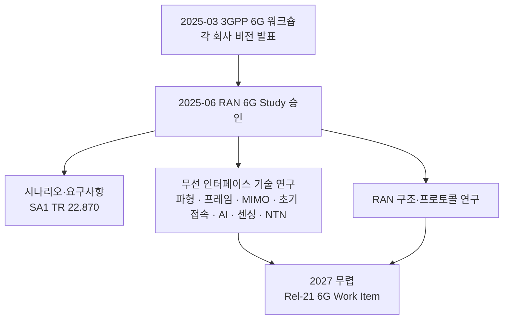

# Rel-20 — 5G-Advanced 3단계와 6G 연구

!!! spec "스펙 · 릴리즈"
    패키지 승인: 2025-06 (RAN#108, 5G-Advanced 항목 + 6G Study Item) · 6G 요구사항 연구: TR 22.870 (SA1) · 6G 무선 연구: RAN 6G SI · 동결 목표: 2027 (대략)

!!! basic "한눈에 보기"
    Rel-20은 **두 갈래**로 진행되는 특별한 릴리즈입니다.

    1. **5G-Advanced 3단계**: Rel-18·19 기능의 마지막 고도화 (5G 규격으로 출시)
    2. **6G 연구(Study Item)**: 6G의 요구사항·시나리오·기술 후보를 연구 — 실제 6G 규격은 **Rel-21**부터

    즉 Rel-20은 "5G를 마무리하면서 6G를 설계하는" 릴리즈입니다. 3GPP는 회의 시간의 상당 부분을 6G 연구에 배정하기로 해서, 5G-Advanced 항목은 상대적으로 선별적입니다.

## 5G-Advanced 3단계 { .l2 }

공개된 작업 항목을 바탕으로 한 **대표 방향**입니다(세부 목록은 3GPP 자료로 확인).

| 방향 | 내용 |
|---|---|
| AI/ML 확장 | Rel-19 이후 남은 유스케이스(양측 CSI 압축 등) 및 LCM 보완 |
| IoT | Ambient IoT 확장(장치·배치 유형), IoT 기능 정리 |
| 위성 | NTN 추가 향상 |
| 센싱 연계 | 5G-Advanced 범위에서의 센싱(예: 드론 감지) 관련 작업 |
| 기타 | MIMO·이동성·XR 등 상용 수요가 큰 항목의 보완 |

## 6G Study Item { .l2 }

| 연구 영역 (요약) | 질문 |
|---|---|
| 배치 시나리오·대역 | FR1 확장, **FR3(7–24 GHz)**, FR2, 위성 통합 |
| 파형·numerology·프레임 | OFDM 계열 유지 여부, 새 SCS·CP 설계 |
| MIMO | FR3에서 매우 큰 안테나 배열(giga-MIMO) |
| 채널 코딩 | LDPC·Polar 개선 |
| 초기 접속·이동성 | 에너지 효율적 SSB·시스템 정보, 빔 기반 접속 |
| **AI-native** | 처음부터 AI를 전제한 무선 인터페이스 |
| **센싱** | 통신과 센싱 통합(ISAC) |
| 에너지 효율 | 기지국·단말 전력 |
| 5G와 공존 | **같은 대역에서 5G와 6G 공존**(MRSS 등)과 이동성 |

??? expert "전문가 노트 — 일정 해석"
    **왜 Rel-20에서 연구, Rel-21에서 규격인가.** 5G는 Rel-14 연구 → Rel-15 규격(약 2년)이었습니다. 6G도 비슷한 구조로 약 2년 연구 후 Rel-21 작업 항목을 시작하고, 첫 규격은 2028년 말~2029년 동결, 2030년 전후 상용화가 목표로 알려져 있습니다. ITU-R IMT-2030 제출 일정과 맞춘 것입니다. → [3GPP 6G 일정](../sixg/3gpp-6g-timeline.md)

    **5G-Advanced와 6G의 경계.** 같은 기술(AI/ML, ISAC, 에너지 절감)이 두 트랙에 모두 등장합니다. 5G-Advanced 쪽은 **기존 NR과의 하위 호환**을 지키는 범위의 개선이고, 6G 쪽은 하위 호환 제약 없이 새로 설계할 수 있는 영역입니다.

## 관련 페이지

- [Rel-19](rel19.md)
- [6G 맛보기](../sixg/index.md)
- [3GPP 6G 일정](../sixg/3gpp-6g-timeline.md)
