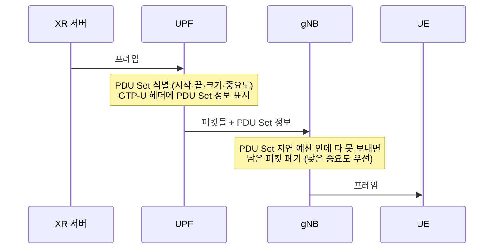

# XR과 저지연 서비스

!!! spec "스펙 · 릴리즈"
    연구: TR 38.838 (Rel-17, XR 평가), TR 38.835 (Rel-18, XR 향상) · QoS: TS 23.501 §5.7.7 (PDU Set QoS, Rel-18) · 미디어: TS 26.928 (XR over 5G) · RAN 규격: TS 38.321 (지연 상태 보고), 38.331, 38.214 Rel-18
    Rel-17 XR 연구 → Rel-18 **XR 향상**(PDU Set, DRX·CG 개선) → Rel-19 XR 3단계 → 6G 몰입형 통신

!!! basic "한눈에 보기"
    **XR**(확장 현실: VR, AR, MR)은 이동통신에 까다로운 트래픽입니다.

    - **크고**: 영상 프레임 하나가 수십~수백 kB, 수십~수백 Mbps
    - **주기적이고**: 60·90·120 fps → 16.67 ms, 11.1 ms, 8.33 ms마다 프레임
    - **늦으면 쓸모없고**: 10–20 ms 안에 도착하지 않으면 그 프레임은 버려짐 (멀미 유발)
    - **조각 하나만 빠져도** 프레임 전체가 망가짐

    5G-Advanced는 망이 "패킷"이 아니라 "**프레임(PDU Set)**" 단위로 생각하도록 바꾸고, 비정수 주기(16.67 ms)에 맞는 스케줄링과 절전 기능을 추가했습니다.

## XR 트래픽 특성 (평가 가정 예) { .l2 }

| 항목 | VR / 클라우드 게임 (DL) | AR (UL 영상) | 자세(pose) 정보 (UL) |
|---|---|---|---|
| 속도 | 30 – 60 Mbps (평가값, 고화질은 그 이상) | 10 – 20 Mbps | 수백 kbps |
| 주기 | 60 / 90 / 120 fps | 30 / 60 fps | 4 ms 등 짧은 주기 |
| 패킷 지연 예산 (PDB) | 10 – 15 ms | 30 ms 수준 | 10 ms |
| 성공 기준 | 프레임의 99%가 PDB 안에 도착 | | |
| 지터 | 프레임 도착 시간이 수 ms 흔들림 | | |

**XR 용량**은 "만족 사용자 수(90% 이상 단말이 만족)"로 평가합니다. 일반 eMBB보다 셀당 수용 인원이 훨씬 적은 것이 평가 결과의 공통점이었습니다.

## Rel-18 주요 기능 { .l2 }

| 영역 | 기능 | 효과 |
|---|---|---|
| QoS | **PDU Set** (프레임 단위 묶음), PDU Set 지연 예산·오류율, 중요도(PSI) | 망이 프레임 단위로 판단 |
| | **PDU Set 기반 폐기** | 이미 늦거나 일부가 빠진 프레임의 나머지 전송을 중단 → 자원 절약 |
| 절전 | DRX 주기를 **비정수**(예: 16.67 ms)로 맞춤 | 프레임 도착과 onDuration 정렬 |
| 상향 | **CG 한 주기에 여러 PUSCH**, 사용하지 않은 CG 기회 알림 | 크기 변하는 프레임 수용 |
| 상향 보고 | **지연 상태 보고(DSR)**, 세분화된 BSR 표 | 남은 지연 예산을 기지국에 알림 |
| 망 노출 | 혼잡 정보 노출(ECN/L4S) | 응용이 비트레이트를 빠르게 조정 |

??? expert "전문가 노트 — 평가 지표와 미해결 과제"
    **지터와 DRX.** 프레임 도착이 ±4 ms 수준으로 흔들리면 C-DRX onDuration을 넉넉하게 잡아야 하고 전력 절감 효과가 줄어듭니다. 비정수 DRX 주기와 도착 시간 정보(TSCAI 유사 정보)를 함께 써서 onDuration을 좁히는 것이 목표입니다.

    **멀티모달.** 같은 XR 세션의 영상·음성·햅틱·자세 정보는 서로 다른 QoS 플로우에 있지만 **동기화**가 필요합니다. Rel-18 SA는 멀티모달 플로우를 묶어 정책을 주는 기능을 다뤘습니다.

    **상향 병목.** AR 안경처럼 상향으로 고화질 영상을 보내는 경우 TDD UL 비율과 단말 출력이 병목입니다. SBFD(Rel-19), UL 다중 PUSCH CG, 6G 상향 설계가 이 문제를 겨냥합니다.

    **6G 몰입형 통신.** IMT-2030의 첫 번째 사용 시나리오가 "몰입형 통신"입니다. 홀로그램, 촉각 인터넷처럼 더 큰 대역폭과 더 짧은 지연, 센싱 연동이 요구됩니다. → [IMT-2030 비전](../sixg/imt-2030.md)

## 관련 페이지

- [QoS 플로우](../nr/architecture/qos-flow.md)
- [UE 전력 절약](../nr/advanced/power-saving.md)
- [LTE DRX](../lte/procedures/drx.md)
- [Rel-18](rel18.md)
