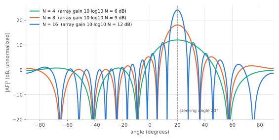
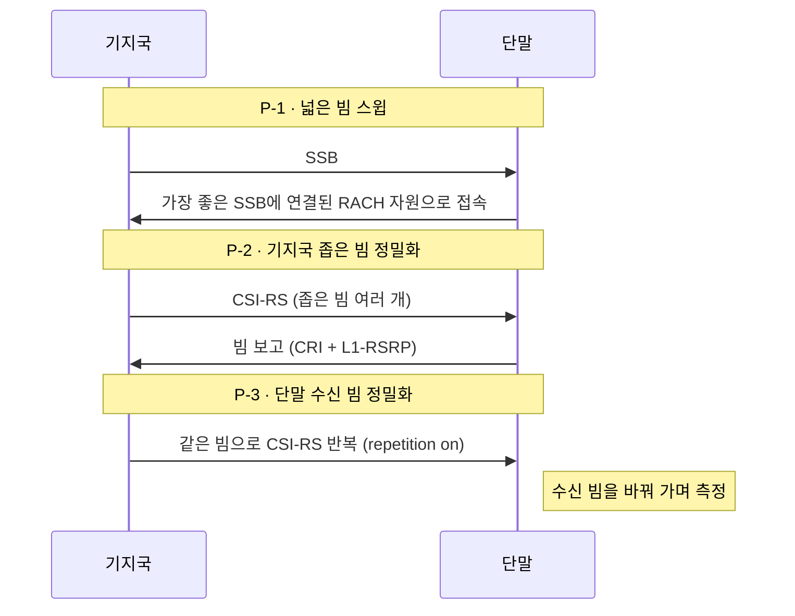

# 빔포밍

!!! spec "스펙 · 릴리즈"
    LTE: TS 36.213 §7.1 (TM7/8/9 빔포밍 전송 모드), FD-MIMO: Rel-13/14 · NR 빔 관리: TS 38.213 §6 (빔 실패 복구), TS 38.214 §5.1.5 (TCI/QCL), §5.2 (빔 보고)

    안테나 배열 모델: TR 38.901 §7.3

!!! basic "한눈에 보기"
    손전등의 빛을 렌즈로 모으면 더 멀리 비출 수 있습니다. **빔포밍**은 여러 안테나에서 나가는 전파의 **위상을 조금씩 다르게** 해서, 원하는 방향에서는 보강되고 다른 방향에서는 상쇄되게 만드는 기술입니다.

    - 원하는 단말 쪽으로 에너지가 모여 신호가 강해집니다(**배열 이득**).
    - 다른 방향으로는 덜 퍼져서 다른 셀·단말에 주는 간섭이 줄어듭니다.
    - 안테나가 많을수록 빔이 좁고 강해집니다.

    파장이 짧은 mmWave(FR2)에서는 작은 면적에 안테나를 수십~수백 개 넣을 수 있어서, 빔포밍이 **필수**가 됩니다. 그래서 NR에는 빔을 찾고 바꾸는 **빔 관리** 절차가 따로 있습니다.

## 배열 패턴 { .l2 }

안테나 \(N\)개를 반 파장(\(\lambda/2\)) 간격으로 일렬로 놓고(ULA) 각 안테나에 위상 \(e^{-j\pi k \sin\theta_0}\)를 주면, 빔이 \(\theta_0\) 방향을 향합니다.

<figure markdown>

<figcaption>λ/2 간격 균일 선형 배열을 20° 방향으로 조향한 배열 인자. 안테나 수가 두 배가 될 때마다 피크 이득은 3 dB 늘고, 빔 폭은 절반이 됩니다.</figcaption>
</figure>

| 안테나 수 N | 배열 이득 | 반전력 빔 폭(정면) |
|---|---|---|
| 4 | 6 dB | 약 26° |
| 8 | 9 dB | 약 13° |
| 16 | 12 dB | 약 6.4° |
| 64 | 18 dB | 약 1.6° |

반전력 빔 폭은 \(\approx 102°/N\)로 근사할 수 있습니다(정면 기준, 조향각이 커지면 \(1/\cos\theta_0\) 배로 넓어짐).

## 구현 방식 { .l2 }

| 방식 | 구조 | 장점 | 단점 | 주 사용처 |
|---|---|---|---|---|
| **디지털** | 안테나(또는 소자 묶음)마다 RF 체인 + ADC/DAC | 주파수별 다른 빔, 여러 사용자 동시 빔 (MU-MIMO) | 전력·비용 큼 | FR1 Massive MIMO (32T32R, 64T64R) |
| **아날로그** | RF 체인 1개 + 소자별 위상 천이기 | 저전력, 많은 소자 | 한 시점에 한 방향 빔만 | FR2 단말 |
| **하이브리드** | RF 체인 몇 개 × 소자 서브어레이 | 둘의 절충 | 설계 복잡 | FR2 기지국 |

아날로그 빔은 한 번에 한 방향만 보므로, 기지국은 여러 방향을 **시간을 나누어 훑어야(beam sweeping)** 합니다. NR의 SSB가 여러 개(FR2 최대 64개)인 이유입니다.

## 빔 관리 개요 (NR) { .l2 }

자세한 내용은 [NR 빔 관리 개요](../nr/beam/overview.md)에서 다룹니다.

??? expert "전문가 노트 — 배열 수식과 실무"
    **배열 인자.** 간격 \(d\), 조향각 \(\theta_0\)인 \(N\)-소자 ULA:

    \[
    AF(\theta) = \sum_{k=0}^{N-1} e^{\,j 2\pi \frac{d}{\lambda} k (\sin\theta - \sin\theta_0)}, \qquad
    |AF(\theta_0)|^2 = N^2
    \]

    송신 전력을 \(N\)개 소자에 나누면 소자당 \(1/N\)이므로 실제 EIRP 증가는 \(10\log_{10}N\) (배열 이득)이고, 소자마다 증폭기가 있으면 총 송신 전력도 \(N\)배가 되어 EIRP는 \(20\log_{10}N\)만큼 커집니다.
    \(d > \lambda/2\)이면 큰 조향각에서 **그레이팅 로브**(원치 않는 두 번째 주 빔)가 생깁니다.

    **안테나 배열 표기 (TR 38.901).** \((M, N, P, M_g, N_g)\) = (세로 소자 수, 가로 소자 수, 편파 수, 세로 패널 수, 가로 패널 수).
    예: 64T64R 매크로 안테나는 192개 소자(12×8×2)를 TXRU 64개로 묶는 식으로 구성합니다. 소자 → TXRU 매핑 방식에 따라 세로 방향 빔 조향 범위가 달라집니다.

    **LTE의 빔포밍 이력.**
    - TM7 (Rel-8): 단일 레이어, 단말별 참조신호(포트 5)
    - TM8 (Rel-9): 이중 레이어 빔포밍 (포트 7, 8)
    - TM9 (Rel-10): 최대 8 레이어, CSI-RS 기반
    - FD-MIMO (Rel-13/14): 2차원 배열(최대 32 포트), 세로 방향 빔포밍, beamformed CSI-RS (Class B)

    **NR 빔 관련 핵심 개념.** **QCL Type-D**(공간 수신 파라미터 공유) = "이 신호는 저 기준 신호와 같은 수신 빔으로 받아라".
    TCI state가 PDCCH/PDSCH마다 어떤 기준신호(SSB/CSI-RS)의 빔을 따를지 지정합니다. Rel-17에서 **통합 TCI(unified TCI)**로 DL/UL 빔 지시가 단순해졌고, Rel-18에서는 다중 TRP용으로 확장되었습니다.

## 관련 페이지

- [MIMO 기초](mimo.md)
- [NR 빔 관리](../nr/beam/overview.md)
- [NR SSB 구조](../nr/phy/ssb.md)
