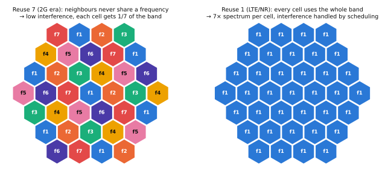

# 셀룰러 개념과 간섭

!!! spec "스펙 · 릴리즈"
    LTE ICIC/eICIC: TS 36.300 §16.1.5, §16.1.6 (Rel-8 ICIC, Rel-10 eICIC) · SINR 정의: TS 36.214 / 38.215 · 시스템 평가 방법론: TR 36.814, TR 38.913

!!! basic "한눈에 보기"
    주파수는 한정되어 있습니다. 그래서 넓은 지역을 작은 구역(**셀, cell**)으로 나누고, 멀리 떨어진 셀에서는 **같은 주파수를 다시 씁니다(재사용)**. 이것이 "셀룰러" 이동통신의 기본 아이디어입니다.

    - 셀을 작게 쪼갤수록 같은 주파수를 더 많이 재사용할 수 있어 전체 용량이 늘어납니다.
    - 대신 이웃 셀이 같은 주파수를 쓰면 서로 **간섭**합니다.
    - 단말이 셀 경계를 넘어 이동하면 연결을 옆 셀로 넘겨야 합니다(**핸드오버**).

    LTE와 NR은 **모든 셀이 같은 주파수를 쓰는(재사용 1)** 방식이라, 셀 가장자리의 간섭을 줄이는 기술이 매우 중요합니다.

## 주파수 재사용 { .l2 }

<figure markdown>

<figcaption>왼쪽: 재사용 계수 7 — 이웃 셀이 절대 같은 주파수를 쓰지 않습니다. 오른쪽: 재사용 계수 1 — 모든 셀이 전체 대역을 씁니다.</figcaption>
</figure>

| 재사용 계수 | 셀당 사용 대역 | 셀 가장자리 SINR | 시스템 |
|---|---|---|---|
| 7 (또는 4, 3) | 전체의 1/7 | 높음 | 1G, 2G(GSM) |
| 1 | 전체 | 0 dB 근처까지 낮아짐 | 3G CDMA, LTE, NR |

재사용 1이 유리한 이유는 OFDMA의 **유연한 스케줄링**과 **링크 적응** 덕분입니다. 셀 중심 단말은 높은 MCS로 빠르게, 가장자리 단말은 낮은 MCS와 간섭 회피 기법으로 버팁니다.

## SINR과 용량 { .l2 }

\[
SINR = \frac{S}{I + N}, \qquad C = B \log_2(1 + SINR)
\]

- \(S\): 서빙 셀 신호 세기
- \(I\): 이웃 셀 간섭의 합
- \(N\): 열잡음 (−174 dBm/Hz + 단말 잡음 지수)

예: 20 MHz, 잡음 지수 9 dB → 잡음 전력 = −174 + 10·log₁₀(18×10⁶) + 9 ≈ **−92.4 dBm** (18 MHz 전송 대역 기준).

## 셀의 종류 { .l2 }

| 종류 | 반경 | 송신 전력 | 용도 |
|---|---|---|---|
| 매크로셀 | 1 – 30 km | 20 – 80 W (43 – 49 dBm)/캐리어 | 넓은 커버리지 |
| 마이크로셀 | 수백 m | 수 W | 도심 보강 |
| 피코셀 | 수십~200 m | 0.25 – 2 W | 핫스팟 |
| 펨토셀 | 수십 m | 수십~수백 mW | 가정·사무실 |

여러 크기의 셀이 겹친 구조를 **HetNet(이종 네트워크)**이라 부릅니다. 매크로가 커버리지를, 스몰셀이 용량을 맡습니다.

## 섹터화 { .l2 }

기지국 하나는 보통 **3개 섹터**(120°씩)로 나뉘고, 섹터마다 별도의 셀(별도의 PCI)이 됩니다. 지향성 안테나로 간섭을 줄이고 용량을 3배로 늘립니다.

??? expert "전문가 노트 — 간섭 조정 기법의 진화"
    | 기법 | 릴리즈 | 원리 |
    |---|---|---|
    | **ICIC** (주파수 영역) | LTE Rel-8 | X2로 **RNTP**(하향 전력 계획), **HII**(상향 고간섭 예고), **OI**(과부하 지시)를 교환해 셀 가장자리 RB를 서로 피함. Soft/Partial Frequency Reuse |
    | **eICIC** (시간 영역) | Rel-10 | 매크로가 **ABS(Almost Blank Subframe)**에서 거의 송신하지 않고, 그 시간에 피코셀이 확장 영역(CRE, 셀 범위 확장 바이어스) 단말을 서비스 |
    | **FeICIC** | Rel-11 | 단말 측 CRS 간섭 제거(CRS-IC)로 ABS에 남은 CRS 간섭까지 제거 |
    | **CoMP** | Rel-11 | 여러 지점이 협력: 공동 송신(JT), 협력 스케줄링/빔포밍(CS/CB), 동적 지점 선택(DPS) |
    | **NAICS** | Rel-12 | 단말이 간섭 셀의 파라미터를 알고 간섭을 억제/제거 |
    | **Multi-TRP** | NR Rel-16/17 | 여러 TRP에서 PDSCH/PDCCH/PUSCH 동시·반복 전송 |

    **셀 가장자리 SINR 분포.** 재사용 1 시스템 시뮬레이션(TR 36.814, 500 m ISD)에서 하향 SINR의 5% 지점은 대략 −3 ~ 0 dB이고, 셀 가장자리 처리량 지표(5% user throughput)가 평가의 핵심입니다.

    **NR의 차이.** NR은 항상 켜져 있는 CRS가 없어서(**lean carrier**) 빈 셀도 간섭을 거의 내지 않습니다. 대신 빔포밍으로 공간적 간섭 회피가 기본이 되었고, 간섭은 부하에 비례하는 성격이 강해졌습니다.

## 관련 페이지

- [LTE CoMP와 eICIC](../lte/advanced/comp-eicic.md)
- [LTE 핸드오버](../lte/procedures/handover.md)
- [무선 전파와 채널](radio-channel.md)
