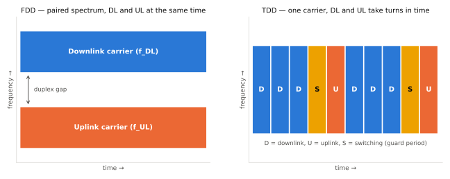

# 듀플렉싱 (FDD / TDD)

!!! spec "스펙 · 릴리즈"
    LTE 프레임 타입: TS 36.211 §4 (Type 1 FDD, Type 2 TDD, Type 3 LAA) · NR 슬롯 포맷: TS 38.213 §11.1, TS 38.211 §4.3.2

    밴드별 듀플렉스 모드: TS 36.101 Table 5.5-1, TS 38.101-1 Table 5.2-1 · SBFD: Rel-18 연구, Rel-19 규격화

!!! basic "한눈에 보기"
    기지국과 단말이 서로 주고받으려면 **보내는 방향(하향 DL)과 받는 방향(상향 UL)을 나누는 방법**이 필요합니다.

    - **FDD**: 주파수를 두 개 씁니다. 하나는 하향 전용, 하나는 상향 전용. 전화처럼 동시에 말하고 들을 수 있습니다.
    - **TDD**: 주파수 하나를 시간으로 나눕니다. 무전기처럼 번갈아 보냅니다. 대신 DL/UL 비율을 트래픽에 맞게 정할 수 있습니다.

    낮은 주파수(예: 800 MHz, 1.8 GHz)는 주로 FDD, 3.5 GHz나 mmWave 같은 새 대역은 대부분 TDD입니다.

<figure markdown>

<figcaption>FDD는 짝을 이룬(paired) 두 주파수를 동시에, TDD는 한 주파수(unpaired)를 시간으로 나누어 씁니다. S는 하향→상향 전환 구간입니다.</figcaption>
</figure>

## 비교 { .l2 }

| 항목 | FDD | TDD |
|---|---|---|
| 스펙트럼 | 짝(paired) 대역 필요, 사이에 duplex gap | 짝이 없는(unpaired) 단일 대역 |
| DL/UL 비율 | 대칭 고정 (대역폭이 같으면 1:1) | 설정 가능 (예: DL 위주 4:1) |
| 지연 | 언제든 송신 가능 → 짧음 | UL 기회를 기다려야 함 → HARQ·스케줄링 지연 증가 |
| 채널 상호성 | 없음 (DL/UL 주파수 다름) | 있음 → SRS로 DL 채널 추정 (Massive MIMO에 유리) |
| 하드웨어 | 듀플렉서 필터 필요 | 송수신 전환 스위치, 가드 구간 |
| 동기 요구 | 셀 간 동기 불필요 | **인접 셀·사업자 간 시간 동기 필수** (DL이 이웃의 UL을 간섭) |

## 전환 구간 { .l2 }

TDD에서 하향에서 상향으로 바꿀 때는 **보호 구간(GP)**이 필요합니다.

- 멀리 있는 단말의 상향 신호가 기지국에 늦게 도착하므로, 단말은 미리 앞당겨 보냅니다(**Timing Advance**). GP는 이 왕복 지연을 흡수합니다.
- 먼 기지국의 하향 신호가 늦게 도착해 이웃 기지국의 상향 수신을 방해하지 않도록 여유를 둡니다.

GP가 길수록 셀 반경이 커질 수 있지만 그만큼 오버헤드입니다. GP 1 µs당 셀 반경 약 150 m (왕복 300 m)입니다.

## LTE와 NR의 TDD 구성 { .l2 }

| | LTE TDD | NR TDD |
|---|---|---|
| 구성 단위 | 서브프레임(1 ms) | 심볼 |
| 설정 방법 | UL/DL configuration 0–6 + 특수 서브프레임 구성 0–10 | `tdd-UL-DL-ConfigurationCommon` (주기, DL 슬롯/심볼 수, UL 슬롯/심볼 수) + 단말별 설정 + 동적 SFI |
| 전환 주기 | 5 ms 또는 10 ms | 0.5 – 10 ms (2.5 ms 패턴 흔함) |
| 예 | Config 2: DSUDD DSUDD | 30 kHz, DDDSU (2.5 ms) |

자세한 표는 [LTE 프레임 구조](../lte/phy/frame-structure.md)에서 다룹니다.

??? expert "전문가 노트 — 변형 듀플렉스 방식"
    **SDL / SUL.** 하향 전용(Supplementary Downlink, 예: Band 32/75 L-band)이나 상향 전용(Supplementary Uplink, NR n80–n86 등) 대역을 다른 캐리어와 묶어 씁니다.
    SUL은 3.5 GHz TDD 셀의 상향 커버리지 한계를 낮은 주파수 상향으로 보완합니다.

    **Half-duplex FDD (HD-FDD).** 저가 단말(LTE-M, NB-IoT, NR RedCap 일부)은 듀플렉서를 없애고 송수신을 번갈아 합니다. 전환 시간(guard subframe/symbol)이 필요합니다.

    **동적 TDD와 CLI.** NR은 슬롯 포맷을 DCI 2_0(SFI)으로 동적으로 바꿀 수 있지만, 인접 셀이 서로 다른 방향이면 **기지국–기지국, 단말–단말 교차 링크 간섭(CLI)**이 생깁니다.
    Rel-16에서 CLI 측정(SRS-RSRP, CLI-RSSI)과 원격 간섭 관리(RIM, 대기 덕팅으로 수백 km 밖 기지국 간섭)가 도입되었습니다.

    **SBFD (Sub-Band Full Duplex).** 같은 TDD 캐리어 안에서 일부 부대역은 DL, 일부는 UL로 **동시에** 쓰는 방식입니다(기지국만 전이중, 단말은 반이중).
    상향 기회를 늘려 지연과 커버리지를 개선합니다. Rel-18에서 연구, **Rel-19에서 규격화**되었습니다. 기지국에는 자기 간섭 제거와 부대역 간 격리가 필요합니다.

    **LTE TDD-FDD CA (Rel-12)** 와 NR의 FDD+TDD CA·DC는 서로 다른 듀플렉스 캐리어를 묶을 때 HARQ 타이밍 기준 셀을 정하는 규칙이 별도로 있습니다.

## 관련 페이지

- [LTE 프레임 구조](../lte/phy/frame-structure.md)
- [NR 슬롯 포맷과 TDD 패턴](../nr/phy/slot-format.md)
- [HARQ](harq.md)
