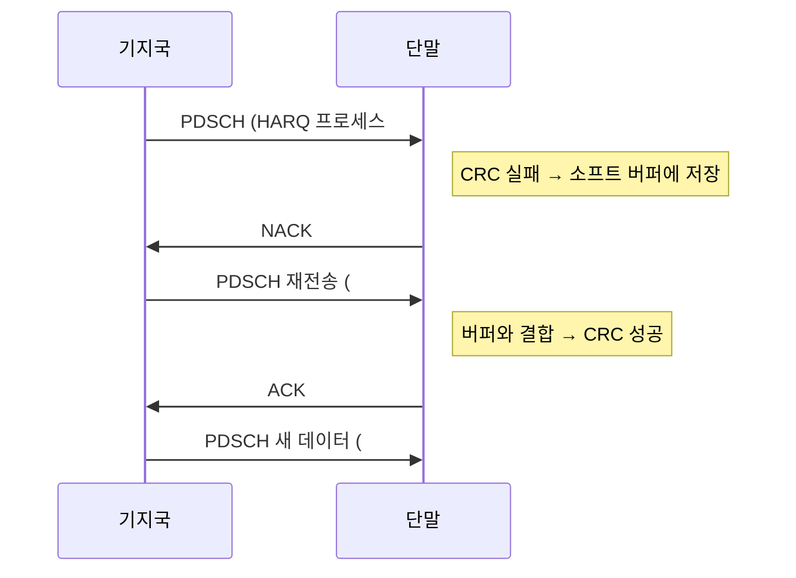
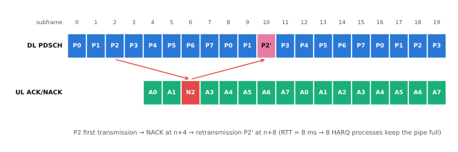

# HARQ

!!! spec "스펙 · 릴리즈"
    LTE: TS 36.321 §5.3.2 (DL HARQ), §5.4.2 (UL HARQ) · TS 36.213 §7.3, §8 (타이밍, HARQ 프로세스 수) · TS 36.306 (소프트 버퍼)

    NR: TS 38.321 §5.3.2, §5.4.2 · TS 38.213 §9 (HARQ-ACK 코드북) · TS 38.214 §5.1 (K0/K1)

!!! basic "한눈에 보기"
    무선 채널에서는 패킷이 깨지는 일이 흔합니다. **HARQ**는 두 가지를 합친 기술입니다.

    1. **재전송(ARQ)**: 받은 쪽이 "잘 받았다(ACK)" 또는 "깨졌다(NACK)"를 알려 주고, 깨졌으면 다시 보냅니다.
    2. **오류 정정(FEC)**: 깨진 패킷을 버리지 않고 저장했다가, 재전송된 것과 **합쳐서(soft combining)** 디코딩합니다.

    깨진 패킷도 정보가 일부 들어 있으므로, 합칠수록 성공 확률이 올라갑니다.
    그리고 ACK를 기다리는 동안 놀지 않도록 **여러 개의 HARQ 프로세스**를 번갈아 돌립니다.

## 동작 원리 { .l2 }

- **HARQ 프로세스 ID**: 어느 "칸"의 데이터인지
- **NDI (New Data Indicator)**: 이전 값에서 바뀌면(toggle) 새 데이터, 그대로면 재전송
- **RV (Redundancy Version)**: 재전송 때 순환 버퍼의 어느 부분을 보낼지

## 결합 방식 { .l2 }

| 방식 | 재전송 내용 | 이득 | 사용 |
|---|---|---|---|
| Chase Combining (CC) | 첫 전송과 **같은 비트** | 에너지 누적 (SNR 이득) | 개념 설명용, RV 고정 시 |
| Incremental Redundancy (IR) | **다른 패리티 비트** (다른 RV) | 에너지 + 코딩 이득 (실효 코딩률 감소) | LTE, NR 기본 |

## 왜 프로세스가 여러 개인가 { .l2 }

송신 → 수신 처리 → ACK/NACK 송신 → 송신기 처리까지 걸리는 왕복 시간(RTT) 동안 같은 프로세스는 다시 쓸 수 없습니다.
LTE FDD는 RTT가 8 ms이므로 **8개 프로세스**를 번갈아 써서 매 서브프레임 전송을 이어 갑니다.

<figure markdown>

<figcaption>LTE FDD 하향: 서브프레임 n의 PDSCH에 대한 ACK/NACK은 n+4에 상향으로 보내고, 가장 빠른 재전송은 n+8입니다. 프로세스 P2가 NACK을 받아 서브프레임 10에서 재전송됩니다.</figcaption>
</figure>

## LTE와 NR 비교 { .l2 }

| 항목 | LTE | NR |
|---|---|---|
| DL HARQ | 비동기, 적응형 (프로세스 ID를 DCI로 지시) | 비동기, 적응형 |
| UL HARQ | **동기식** (FDD: 고정 n+8), PHICH로 ACK/NACK | **비동기**, PHICH 없음 — 재전송은 항상 DCI로 지시 |
| 피드백 타이밍 | FDD 고정 n+4, TDD 표로 정해짐 | 유연: DCI의 **K1** (PDSCH→HARQ-ACK 슬롯 간격) |
| 최대 프로세스 수 | FDD 8, TDD 최대 15 (DL) | 최대 16 (Rel-17 NTN: 32) |
| 재전송 단위 | TB 전체 | TB 또는 **CBG** (코드 블록 그룹) |

??? expert "전문가 노트 — 타이밍, 코드북, 소프트 버퍼"
    **LTE TDD 최대 DL HARQ 프로세스 수 (TS 36.213 Table 7-1)**

    | UL/DL config | 0 | 1 | 2 | 3 | 4 | 5 | 6 |
    |---|---|---|---|---|---|---|---|
    | DL 프로세스 | 4 | 7 | 10 | 9 | 12 | 15 | 6 |
    | UL 프로세스 (Table 8-1) | 7 | 4 | 2 | 3 | 2 | 1 | 6 |

    TDD는 DL 서브프레임 여러 개의 ACK/NACK을 하나의 UL 서브프레임에 모아 보내므로 **bundling** 또는 **multiplexing**(PUCCH format 1b with channel selection, format 3)이 필요합니다.

    **LTE UL 비적응 재전송.** PHICH로 NACK만 받으면 단말은 같은 자원·같은 MCS로 다음 RV(0→2→3→1)를 보냅니다. DCI 0을 받으면 그 내용대로 적응 재전송합니다.
    최대 전송 횟수는 `maxHARQ-Tx`(RRC)로 설정합니다.

    **NR HARQ-ACK 코드북 (TS 38.213 §9.1).**
    - **Type-1 (semi-static)**: 가능한 모든 PDSCH 수신 기회에 대해 비트를 미리 할당. 크기가 고정이라 견고하지만 오버헤드가 큼
    - **Type-2 (dynamic)**: DCI의 **DAI(Downlink Assignment Index)** 카운터로 실제 스케줄된 PDSCH만 보고. DCI를 놓쳐도 DAI 공백으로 검출
    - **Type-3 (one-shot, Rel-16)**: 모든 프로세스의 상태를 한 번에 보고 (NR-U에서 LBT 실패 대비)

    **CBG 재전송.** 큰 TB(수십 개 CB)에서 CB 하나만 깨져도 전체를 재전송하는 낭비를 줄이기 위해, CB를 최대 8개 그룹으로 묶어 그룹별 ACK/NACK을 보냅니다(`maxCodeBlockGroupsPerTransportBlock`). DCI의 CBGTI 필드로 재전송할 그룹을 지시합니다.

    **소프트 버퍼.** 단말은 디코딩 실패한 LLR을 저장할 메모리가 제한되어 있습니다.
    LTE는 UE 카테고리별 총 소프트 채널 비트 수(예: Cat 4는 1,827,072)를 프로세스 수로 나눠 TB당 버퍼 \(N_{IR}\)를 정합니다. NR은 LBRM으로 순환 버퍼 크기를 제한합니다.

    **HARQ 비활성화 (Rel-17 NTN).** 위성 RTT가 수십~수백 ms라 프로세스를 늘려도 부족하므로, 프로세스별로 HARQ 피드백을 끄고 블라인드 재전송이나 RLC ARQ에 의존할 수 있게 했습니다.

## 관련 페이지

- [채널 코딩](channel-coding.md) — 순환 버퍼와 RV
- [LTE PCFICH·PHICH](../lte/phy/pcfich-phich.md)
- [LTE 스케줄링](../lte/procedures/scheduling.md)
