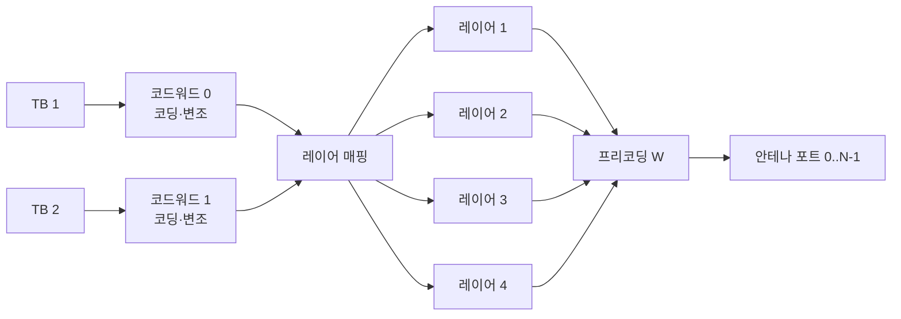

# MIMO 기초

!!! spec "스펙 · 릴리즈"
    LTE: TS 36.211 §6.3.3–6.3.4 (레이어 매핑, 프리코딩), TS 36.213 §7.1–7.2 (전송 모드, CSI) · NR: TS 38.211 §7.3.1.3–7.3.1.4, TS 38.214 §5.2 (CSI, 코드북)

    LTE Rel-8 (DL 4×4) → Rel-10 (DL 8×8, UL 4×4) · NR Rel-15 (DL 8 레이어, UL 4 레이어) → Rel-16/17/18 (Type II 코드북 확장)

!!! basic "한눈에 보기"
    **MIMO**(Multiple-Input Multiple-Output)는 송신·수신 양쪽에 안테나를 여러 개 두는 기술입니다. 안테나가 많으면 세 가지 이득을 얻을 수 있습니다.

    1. **다이버시티**: 같은 데이터를 여러 경로로 보내서, 한 경로가 페이딩돼도 다른 경로로 받습니다. → 신뢰성 ↑
    2. **공간 다중화**: 서로 다른 데이터를 같은 시간·같은 주파수에 동시에 보냅니다(레이어). → 속도 ↑
    3. **빔포밍**: 에너지를 특정 방향으로 모읍니다. → 커버리지 ↑ ([빔포밍](beamforming.md))

    "4×4 MIMO"는 송신 안테나 4개, 수신 안테나 4개라는 뜻이고, 최대 4개 레이어(4배 속도)를 동시에 보낼 수 있습니다.

## 시스템 모델 { .l2 }

\[
\mathbf{y} = \mathbf{H}\,\mathbf{W}\,\mathbf{x} + \mathbf{n}
\]

| 기호 | 크기 | 의미 |
|---|---|---|
| \(\mathbf{x}\) | \(\nu \times 1\) | 레이어 심볼 (\(\nu\) = 랭크, 레이어 수) |
| \(\mathbf{W}\) | \(N_t \times \nu\) | 프리코딩 행렬 |
| \(\mathbf{H}\) | \(N_r \times N_t\) | 채널 행렬 (각 송수신 안테나 쌍의 복소 이득) |
| \(\mathbf{y}\) | \(N_r \times 1\) | 수신 신호 |

동시에 보낼 수 있는 레이어 수는 \(\min(N_t, N_r)\)와 채널 행렬의 **랭크(rank)**로 제한됩니다.
가시선만 있는 환경처럼 경로들이 비슷하면 랭크가 낮아지고, 다중경로가 풍부하면 높아집니다.

## 코드워드, 레이어, 안테나 포트 { .l2 }

- **코드워드**: 독립적으로 부호화된 데이터 덩어리. 최대 2개 (각자 MCS, HARQ ACK 따로)
- **레이어**: 공간적으로 분리된 스트림. 코드워드 하나가 레이어 여러 개로 나뉠 수 있음
- **안테나 포트**: 수신기 입장에서 구분되는 논리적 안테나. 참조신호로 정의됨 (물리 안테나 수와 다를 수 있음)

| | LTE | NR |
|---|---|---|
| DL 최대 레이어 | 8 (Rel-10) | 8 |
| UL 최대 레이어 | 4 (Rel-10) | 4 (Rel-18: 8Tx 단말 지원) |
| 코드워드 수 | 랭크 1: 1개, 랭크 2+: 2개 | 레이어 1–4: 1개, 5–8: 2개 |

## CSI 피드백 { .l2 }

기지국이 좋은 프리코딩을 고르려면 채널을 알아야 합니다. 단말이 측정해서 보고하는 값이 **CSI**입니다.

| 보고 항목 | 의미 |
|---|---|
| **RI** (Rank Indicator) | 지금 채널에서 몇 개 레이어가 적당한지 |
| **PMI** (Precoding Matrix Indicator) | 코드북 중 어느 프리코딩 행렬이 좋은지 |
| **CQI** (Channel Quality Indicator) | 그 랭크·PMI로 보내면 어떤 MCS가 가능한지 |

TDD에서는 상·하향 채널이 같다는 **채널 상호성(reciprocity)**을 이용해서, 단말의 SRS로 기지국이 직접 하향 채널을 추정할 수도 있습니다.

## SU-MIMO와 MU-MIMO { .l2 }

- **SU-MIMO**: 레이어 여러 개를 한 단말에게 → 단말 안테나 수가 한계
- **MU-MIMO**: 레이어들을 서로 다른 단말에게 → 기지국 안테나(예: 64T64R Massive MIMO)를 최대로 활용. 단말 간 간섭을 줄이려면 정밀한 CSI가 필요

??? expert "전문가 노트 — 용량, 프리코딩, 수신기"
    **MIMO 용량.** 송신기가 채널을 모를 때(등전력):

    \[
    C = \log_2 \det\!\Big(\mathbf{I}_{N_r} + \frac{\rho}{N_t}\mathbf{H}\mathbf{H}^H\Big) = \sum_{i=1}^{r} \log_2\!\Big(1 + \frac{\rho}{N_t}\lambda_i\Big)
    \]

    \(\lambda_i\)는 \(\mathbf{H}\mathbf{H}^H\)의 고유값입니다. 고SNR에서 용량은 \(\min(N_t,N_r)\)에 비례해 늘어납니다(다중화 이득).
    송신기가 채널을 알면 SVD \(\mathbf{H} = \mathbf{U}\boldsymbol{\Sigma}\mathbf{V}^H\)에서 \(\mathbf{W} = \mathbf{V}\)로 프리코딩하고 water-filling 전력 할당을 하는 것이 최적입니다. 코드북 PMI는 이 \(\mathbf{V}\)의 양자화된 근사입니다.

    **수신기 종류.** ZF(채널 역행렬, 잡음 증폭), **MMSE**(실무 기본), MMSE-IRC(셀 간 간섭 공분산까지 고려, LTE Rel-11 성능 요구사항), ML/sphere decoding(최적, 복잡도 높음).
    단말 성능 요구사항(TS 36.101/38.101-4)은 MMSE-IRC 수준을 가정한 시험이 많습니다.

    **LTE 코드북.** 2포트·4포트 코드북(4포트는 Householder 변환 기반 16개), 8포트는 Rel-10 **이중 코드북** \(W = W_1 W_2\)
    (\(W_1\): 광대역·장기 빔 그룹, \(W_2\): 부대역·단기 선택/위상 보정).

    **NR 코드북.** Type I(단일 패널/다중 패널, 빔 선택형, 저해상도) / Type II(여러 빔의 선형 결합, 진폭·위상 양자화, MU-MIMO용 고해상도).
    Rel-16 eType II는 주파수 영역 압축(DFT 기저), Rel-17은 포트 선택형 확장, Rel-18은 고속 이동 단말을 위한 **도플러(시간 영역) 압축**을 추가했습니다.
    Rel-18/19의 AI/ML CSI 압축 연구도 이 흐름의 연장입니다. → [무선 인터페이스 AI/ML](../advanced5g/ai-ml.md)

    **레이어 매핑 예 (LTE, 2 CW, 4 레이어).** 코드워드 0 → 레이어 0, 1 / 코드워드 1 → 레이어 2, 3. 각 코드워드의 심볼을 레이어에 번갈아 분배합니다.

## 관련 페이지

- [빔포밍](beamforming.md)
- [LTE 전송 모드 (TM1–10)](../lte/advanced/transmission-modes.md)
- [LTE CQI·PMI·RI](../lte/measurement/csi.md)
