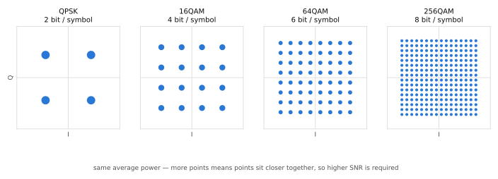

# 디지털 변조 (QAM)

!!! spec "스펙 · 릴리즈"
    LTE: TS 36.211 §7.1 (변조 매퍼) · NR: TS 38.211 §5.1 · EVM 요구사항: TS 36.104 / 38.104 (기지국), 36.101 / 38.101 (단말)

    256QAM: LTE DL Rel-12, LTE UL Rel-14, NR Rel-15 · 1024QAM: LTE DL Rel-15, NR DL Rel-17

!!! basic "한눈에 보기"
    변조는 비트를 전파의 **진폭과 위상**에 싣는 방법입니다. 가로축(I)과 세로축(Q) 평면에 점을 찍고, 점 하나가 여러 비트를 뜻하게 합니다.

    - **QPSK**: 점 4개 → 한 번에 2비트
    - **16QAM**: 점 16개 → 4비트
    - **64QAM**: 점 64개 → 6비트
    - **256QAM**: 점 256개 → 8비트

    점이 많을수록 한 번에 많이 보내지만, 점 사이가 좁아져서 잡음에 약해집니다.
    그래서 기지국은 단말의 채널 상태를 보고 **좋으면 높은 변조, 나쁘면 낮은 변조**를 고릅니다(링크 적응).

## 성상도 { .l2 }

<figure markdown>

<figcaption>평균 전력을 같게 맞춘 QPSK, 16QAM, 64QAM, 256QAM 성상도. 점 개수가 4배가 될 때마다 점 간격은 약 절반이 됩니다.</figcaption>
</figure>

| 변조 | 비트/심볼 \(Q_m\) | 정규화 계수 | 최소 점 간격 (평균 전력 1) | 필요 SNR 대략 (코딩 포함) |
|---|---|---|---|---|
| π/2-BPSK | 1 | \(1/\sqrt{2}\) | 1.414 | 매우 낮음 (커버리지 한계용) |
| QPSK | 2 | \(1/\sqrt{2}\) | 1.414 | −5 ~ 10 dB |
| 16QAM | 4 | \(1/\sqrt{10}\) | 0.632 | 8 ~ 16 dB |
| 64QAM | 6 | \(1/\sqrt{42}\) | 0.309 | 14 ~ 22 dB |
| 256QAM | 8 | \(1/\sqrt{170}\) | 0.153 | 20 ~ 28 dB |
| 1024QAM | 10 | \(1/\sqrt{682}\) | 0.077 | 28 dB 이상 |

필요 SNR은 코딩률에 따라 크게 달라지는 참고값입니다. 정확한 동작 범위는 CQI 표와 MCS 표가 정합니다.

## Gray 매핑 { .l2 }

이웃한 두 점의 비트 패턴은 **딱 1비트만 다르게** 배치합니다. 잡음 때문에 옆 점으로 잘못 판정해도 비트 오류는 1개로 끝납니다.
LTE와 NR의 변조 매퍼는 모두 Gray 매핑입니다. 예를 들어 16QAM에서 앞 두 비트는 I/Q 부호(사분면), 뒤 두 비트는 안쪽/바깥쪽 진폭을 정합니다.

## 지원 현황 { .l2 }

| | LTE DL | LTE UL | NR DL | NR UL |
|---|---|---|---|---|
| π/2-BPSK | — | — | — | ✔ (DFT-s-OFDM 전용) |
| QPSK · 16QAM · 64QAM | ✔ Rel-8 | ✔ Rel-8 (64QAM은 Cat 5 등) | ✔ | ✔ |
| 256QAM | ✔ Rel-12 | ✔ Rel-14 | ✔ Rel-15 | ✔ Rel-15 |
| 1024QAM | ✔ Rel-15 | — | ✔ Rel-17 (FR1) | — |

??? expert "전문가 노트 — 매핑 수식, LLR, EVM"
    **16QAM 매핑 (TS 38.211 §5.1.4).** 비트 \(b(4i), \dots, b(4i+3)\)에 대해

    \[
    d(i) = \frac{1}{\sqrt{10}}\Big\{(1-2b(4i))\big[2-(1-2b(4i+2))\big] + j(1-2b(4i+1))\big[2-(1-2b(4i+3))\big]\Big\}
    \]

    짝수 비트는 I축, 홀수 비트는 Q축에 대응하고, 첫 비트 쌍이 부호를 정합니다. 64QAM/256QAM은 같은 구조를 단계적으로 중첩한 형태입니다.

    **연판정(soft) 복조.** 수신기는 0/1을 바로 정하지 않고 비트별 **LLR(Log-Likelihood Ratio)**을 계산해서 디코더에 넘깁니다.

    \[
    LLR(b_k) = \ln\frac{P(b_k=0\,|\,y)}{P(b_k=1\,|\,y)} \approx \frac{1}{\sigma^2}\Big(\min_{s\in S_k^1}|y-hs|^2 - \min_{s\in S_k^0}|y-hs|^2\Big)
    \]

    (max-log 근사). Turbo/LDPC 디코더 성능은 LLR의 품질에 크게 좌우됩니다.

    **EVM 요구사항 (기지국, TS 36.104 / 38.104).** 송신기 왜곡이 고차 변조를 망치지 않도록 정한 한계입니다.

    | 변조 | EVM 한계 |
    |---|---|
    | QPSK | 17.5 % |
    | 16QAM | 12.5 % |
    | 64QAM | 8 % |
    | 256QAM | 3.5 % |
    | 1024QAM (NR FR1) | 2.5 % |

    EVM 3.5%는 SNR로 약 29 dB에 해당합니다(\(SNR \approx -20\log_{10} EVM\)). 수신 SNR이 아무리 좋아도 송신 EVM이 이보다 나쁘면 256QAM을 쓸 수 없습니다.

    **π/2-BPSK.** 연속된 심볼의 위상을 90°씩 돌려서 위상이 180° 반전되는 순간을 없앱니다. 스펙트럼 정형(spectrum shaping)과 함께 쓰면 PAPR이 매우 낮아져 상향 커버리지 한계 지역에서 유리합니다.

## 관련 페이지

- [채널 코딩](channel-coding.md) — 변조와 함께 MCS를 이루는 요소
- [LTE TBS와 MCS](../lte/phy/tbs-mcs.md)
- [LTE CQI·PMI·RI](../lte/measurement/csi.md)
