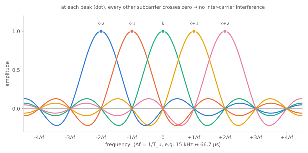
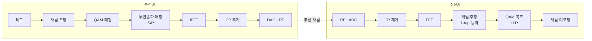
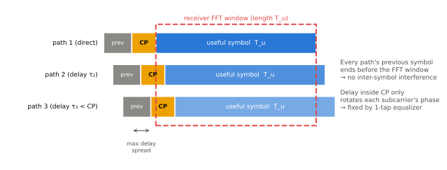

# OFDM 원리

!!! spec "스펙 · 릴리즈"
    LTE: TS 36.211 §6.12 (DL OFDM 기저대역 신호 생성) · NR: TS 38.211 §5.3 (OFDM 기저대역 신호 생성)

    적용: LTE Rel-8~, NR Rel-15~ (6G에서도 OFDM 계열 유지가 유력)

!!! basic "한눈에 보기"
    넓은 도로 하나를 고속으로 달리면 작은 돌멩이(다중경로 반사파) 하나에도 크게 흔들립니다.
    **OFDM**은 넓은 대역을 수백~수천 개의 **좁은 부반송파(subcarrier)**로 쪼개서, 각 부반송파는 천천히 데이터를 실어 보냅니다.

    - 각 부반송파가 느리기 때문에 심볼 하나가 길어져서 반사파 지연에 덜 민감합니다.
    - 부반송파들은 서로 겹치지만 수학적으로 **직교(orthogonal)**해서 서로 간섭하지 않습니다.
    - 심볼 앞에 **CP(Cyclic Prefix)**라는 보호 구간을 붙여 반사파가 다음 심볼을 망치지 않게 합니다.
    - 송신은 IFFT, 수신은 FFT 한 번으로 끝나서 구현이 간단합니다.

    LTE와 NR 모두 OFDM을 기본 파형으로 씁니다.

## 왜 OFDM인가 { .l2 }

20 MHz 대역을 단일 반송파로 보내면 심볼 길이는 약 50 ns입니다. 도심의 다중경로 지연은 수 µs이므로, 한 심볼이 뒤따르는 수십 개 심볼과 겹칩니다(**심볼 간 간섭, ISI**). 이를 없애려면 매우 긴 등화기(equalizer)가 필요합니다.

OFDM은 같은 20 MHz를 15 kHz 간격 부반송파 1200개로 나눕니다. 그러면 심볼 길이가 66.7 µs가 되어 지연 수 µs는 심볼 길이의 몇 %에 불과합니다. 이 정도 지연은 짧은 CP로 흡수할 수 있습니다.

| 관점 | 단일 반송파 (광대역) | OFDM |
|---|---|---|
| 심볼 길이 | 짧음 (ns 단위) | 김 (수십 µs) |
| 다중경로 대응 | 긴 시간 영역 등화기 | CP + 부반송파별 1-tap 등화 |
| 주파수 선택적 페이딩 | 전체 신호가 왜곡 | 일부 부반송파만 영향 → 코딩·스케줄링으로 회피 |
| 자원 할당 | 시간 분할만 | 시간 × 주파수 2차원 (사용자별 부반송파 묶음) |
| 약점 | — | 높은 PAPR, 주파수 오프셋·위상 잡음에 민감 |

## 직교 부반송파 { .l2 }

부반송파 간격을 \( \Delta f = 1/T_u \) (\(T_u\) = 유효 심볼 길이)로 맞추면, 각 부반송파의 스펙트럼(sinc 모양)은 **다른 부반송파의 중심 주파수에서 정확히 0**이 됩니다.
그래서 스펙트럼이 겹쳐도 각 중심에서 샘플링하면 자기 신호만 남습니다.

<figure markdown>

<figcaption>인접한 부반송파 5개의 스펙트럼. 각 부반송파의 피크(점)에서 나머지 네 개는 모두 0을 지납니다.</figcaption>
</figure>

## 송수신 구조 { .l2 }

1. QAM 심볼들을 각 부반송파에 하나씩 올립니다(주파수 영역).
2. IFFT로 한 번에 시간 영역 신호로 바꿉니다.
3. 심볼 끝부분을 복사해 앞에 붙입니다(CP).
4. 수신기는 CP를 버리고 FFT를 하면 각 부반송파의 값이 다시 나옵니다. 채널 영향은 부반송파마다 **복소수 하나를 곱한 것**으로 단순해집니다.

## Cyclic Prefix { .l2 }

<figure markdown>

<figcaption>지연된 경로들의 이전 심볼은 모두 FFT 창이 시작하기 전에 끝납니다. 지연이 CP보다 짧으면 심볼 간 간섭이 없습니다.</figcaption>
</figure>

CP는 심볼 뒷부분을 앞에 복사한 것입니다. 그래서 지연된 신호도 FFT 창 안에서는 원래 신호를 **순환 이동(cyclic shift)**한 것처럼 보입니다. 순환 이동은 주파수 영역에서 위상 회전일 뿐이라, 파일럿(참조신호)으로 추정해서 보정할 수 있습니다.

CP는 데이터를 싣지 않으므로 오버헤드입니다. LTE normal CP는 약 4.7 µs로 심볼의 약 7%입니다.

| 시스템 | 부반송파 간격 | 유효 심볼 \(T_u\) | Normal CP | Extended CP |
|---|---|---|---|---|
| LTE | 15 kHz | 66.67 µs | 5.21 µs (첫 심볼) / 4.69 µs | 16.67 µs |
| NR μ=1 | 30 kHz | 33.33 µs | 약 2.34 µs | — |
| NR μ=3 | 120 kHz | 8.33 µs | 약 0.59 µs | — |

!!! tip "CP 길이와 셀 크기"
    CP보다 지연이 긴 반사파는 간섭이 됩니다. 그래서 산악·해상처럼 지연이 큰 환경이나 MBSFN(여러 셀이 같은 신호 송신)에서는 Extended CP를 씁니다.
    NR에서 부반송파 간격을 키우면 CP도 같이 짧아지므로, 높은 SCS는 지연 확산이 작은 작은 셀(mmWave)에 맞습니다.

## LTE의 OFDM 파라미터 { .l2 }

| 채널 대역폭 | 1.4 MHz | 3 MHz | 5 MHz | 10 MHz | 15 MHz | 20 MHz |
|---|---|---|---|---|---|---|
| RB 수 | 6 | 15 | 25 | 50 | 75 | 100 |
| 사용 부반송파 | 72 | 180 | 300 | 600 | 900 | 1200 |
| 일반적인 FFT 크기 | 128 | 256 | 512 | 1024 | 1536 | 2048 |
| 샘플링 레이트 (MHz) | 1.92 | 3.84 | 7.68 | 15.36 | 23.04 | 30.72 |
| 점유 대역 비율 | 77% | 90% | 90% | 90% | 90% | 90% |

20 MHz 캐리어에서 실제 전송 대역은 100 RB × 180 kHz = 18 MHz이고, 나머지 2 MHz는 인접 채널 간섭을 막는 보호 대역입니다.
NR은 필터링 요구사항을 다듬어 점유율을 최대 약 98%까지 높였습니다(예: 30 kHz SCS, 100 MHz → 273 RB = 98.3 MHz).

??? expert "전문가 노트 — 수식과 실무 이슈"
    **기저대역 신호.** \(N\)개 부반송파의 OFDM 심볼은 다음과 같습니다(CP 구간 포함).

    \[
    s(t) = \sum_{k=-N/2}^{N/2-1} X_k \, e^{j 2\pi k \Delta f (t - T_{CP})}, \qquad 0 \le t < T_{CP} + T_u
    \]

    이산 시간으로 쓰면 \(x[n] = \mathrm{IFFT}\{X_k\}\)이고, 수신 측에서 CP를 제거한 뒤
    \(Y_k = H_k X_k + W_k\) (부반송파별 평탄 채널) 이 성립합니다. 단, 지연 확산 < CP, 채널이 한 심볼 동안 변하지 않는다는 가정이 필요합니다.

    **LTE의 DC 부반송파.** LTE 하향은 DC 부반송파를 비워 두고(직류 성분 누설 회피) 양쪽에 부반송파를 배치합니다. 상향은 DC를 비우지 않고 **7.5 kHz(반 부반송파) 주파수 이동**을 적용합니다(TS 36.211 §5.6).
    NR은 DC를 따로 비우지 않으며, 단말이 자기 DC 위치를 `txDirectCurrentLocation`으로 보고합니다.

    **ICI 원인.** 직교성은 수신기의 주파수가 정확히 맞을 때만 성립합니다.
    - 주파수 오프셋(CFO): 발진기 오차. 부반송파 간격의 몇 %만 틀려도 SINR이 떨어집니다.
    - 도플러 확산: 고속 이동 시 부반송파마다 퍼짐 → 부반송파 간격을 키우면 상대적으로 강해짐
    - 위상 잡음: 고주파(FR2)에서 심각 → NR이 FR2에서 120 kHz 이상 SCS와 **PTRS**를 쓰는 이유

    **PAPR.** 많은 부반송파가 우연히 같은 위상으로 더해지면 순간 전력이 평균보다 10 dB 이상 커집니다.
    전력 증폭기의 선형 구간을 넓게 잡아야 하므로 효율이 떨어집니다. 단말 상향에서 이 문제를 줄이기 위해 LTE는 SC-FDMA를 씁니다.
    → [OFDMA와 DFT-s-OFDM](ofdma-scfdma.md)

    **스펙트럼 누설.** 직사각형 창의 OFDM은 sinc 형태 사이드로브가 천천히 줄어듭니다. 실제 구현은 윈도잉(WOLA)이나 필터링으로 대역 밖 방사를 줄이고, 3GPP는 그 방법이 아니라 **결과(ACLR, SEM, EVM)**만 규격으로 정합니다.

## LTE ↔ NR 비교

| 항목 | LTE | NR |
|---|---|---|
| 부반송파 간격 | 15 kHz 고정 (MBSFN 7.5 kHz, NB-IoT 3.75 kHz 예외) | 15 · 30 · 60 · 120 · 240(SSB) · 480 · 960 kHz |
| 최대 부반송파 수/캐리어 | 1200 | 3300 (275 RB × 12) |
| 하향 파형 | CP-OFDM | CP-OFDM |
| 상향 파형 | SC-FDMA (DFT-s-OFDM) | CP-OFDM 또는 DFT-s-OFDM 선택 |
| DC 처리 | DL DC 비움, UL 7.5 kHz 이동 | 별도 처리 없음 |

## 관련 페이지

- [OFDMA와 DFT-s-OFDM](ofdma-scfdma.md)
- [무선 전파와 채널](radio-channel.md)
- [LTE 프레임 구조](../lte/phy/frame-structure.md)
- [NR Numerology](../nr/phy/numerology.md)
