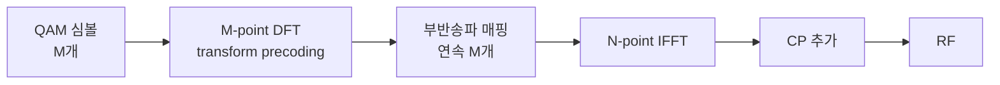
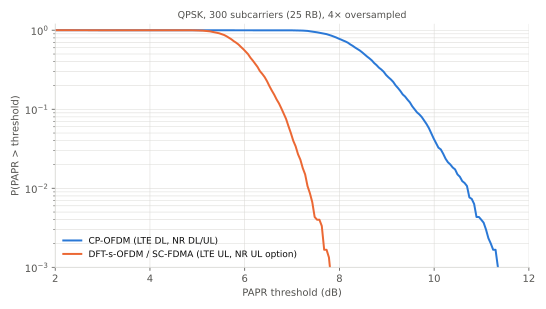

# OFDMA와 DFT-s-OFDM (SC-FDMA)

!!! spec "스펙 · 릴리즈"
    LTE UL SC-FDMA: TS 36.211 §5.3.3 (transform precoding), §5.6 · NR transform precoding: TS 38.211 §6.3.1.4 · NR UL 파형 설정: TS 38.331 `transformPrecoder`

    LTE Rel-8~ (UL은 SC-FDMA만) · NR Rel-15~ (UL CP-OFDM / DFT-s-OFDM 선택)

!!! basic "한눈에 보기"
    **OFDMA**는 OFDM의 부반송파들을 여러 사용자에게 나눠 주는 다중 접속 방식입니다. 시간과 주파수로 된 격자에서 사용자마다 다른 칸을 배정합니다.

    단말이 OFDM으로 송신하면 순간 전력이 들쭉날쭉(높은 **PAPR**)해서, 배터리 효율이 나쁜 큰 증폭기가 필요합니다.
    그래서 LTE 상향은 데이터에 **DFT를 한 번 더 걸어** 신호를 단일 반송파처럼 만든 **SC-FDMA**(= DFT-spread OFDM)를 씁니다.
    PAPR이 2~3 dB 줄어서 단말이 더 멀리, 더 오래 송신할 수 있습니다.

## OFDMA — 2차원 자원 할당 { .l2 }

기지국은 매 스케줄링 단위(LTE 1 ms, NR 슬롯)마다 주파수 방향 자원 블록(RB)을 사용자에게 나눠 줍니다.

- 채널이 좋은 주파수 구간을 골라 줄 수 있습니다(**주파수 선택적 스케줄링**).
- 작은 패킷은 적은 RB, 큰 패킷은 많은 RB를 주면 됩니다.
- 사용자 간 경계에 보호 대역이 필요 없습니다(직교성).

## SC-FDMA 송신 구조 { .l2 }

OFDM 송신기 앞에 M-point DFT만 추가한 구조입니다. DFT로 펼친 뒤 IFFT로 되돌리므로, 결과 신호는 원래 QAM 심볼들이 시간 축에 하나씩 순서대로 놓인 **단일 반송파 신호**와 비슷해집니다.

<figure markdown>

<figcaption>CP-OFDM과 DFT-s-OFDM의 PAPR 분포(시뮬레이션). 확률 10⁻² 기준으로 DFT-s-OFDM이 약 3 dB 낮습니다. 그림 스크립트: <code>diagrams/scripts/basics.py</code></figcaption>
</figure>

| 항목 | OFDMA (CP-OFDM) | SC-FDMA (DFT-s-OFDM) |
|---|---|---|
| PAPR | 높음 | 낮음 (QPSK 기준 2–3 dB 이득) |
| 주파수 할당 | 자유 (떨어진 RB 가능) | **연속 RB** (LTE Rel-8 기준) |
| 수신기 | 부반송파별 등화 | 주파수 등화 후 IDFT (MMSE-FDE) |
| MIMO 다중 레이어 | 쉬움 | NR은 1 레이어만 |
| 쓰임 | LTE DL, NR DL/UL | LTE UL, NR UL(커버리지 한계 단말) |

## NR의 상향 파형 선택 { .l2 }

NR 상향은 두 파형을 모두 지원하고 기지국이 RRC로 정합니다.

- **CP-OFDM**: 셀 중심 단말. 다중 레이어 MIMO, 유연한 RB 할당
- **DFT-s-OFDM**: 셀 가장자리 단말. 1 레이어, 낮은 PAPR, π/2-BPSK 사용 가능

초기 접속 중의 Msg3 파형은 SIB1의 `msg3-transformPrecoder`로 알려 줍니다.

??? expert "전문가 노트 — DFT 크기 제약과 구현 이슈"
    **DFT 크기 제약.** 효율적인 DFT 구현을 위해 할당 RB 수 \(M_{RB}\)는 다음 형태여야 합니다(LTE TS 36.211 §5.3.3, NR TS 38.211 §6.3.1.4 동일).

    \[
    M_{RB} = 2^{\alpha_2}\cdot 3^{\alpha_3}\cdot 5^{\alpha_5}
    \]

    따라서 7, 11, 13, 14 RB 같은 값은 할당할 수 없습니다. 스케줄러가 이 제약을 지켜야 합니다.

    **LTE UL의 비연속 할당.** Rel-10에서 **clustered SC-FDMA**(UL resource allocation type 1, 클러스터 2개)가 도입되었습니다.
    PAPR 이득 일부를 포기하고 스케줄링 유연성을 얻습니다. 또 Rel-10부터 PUCCH와 PUSCH 동시 전송도 가능해졌습니다.

    **NR DFT-s-OFDM의 DMRS.** transform precoding이 켜지면 DMRS도 낮은 PAPR 시퀀스(Zadoff-Chu 기반 low-PAPR 시퀀스, π/2-BPSK일 때는 별도 시퀀스)를 쓰고,
    DMRS와 데이터를 같은 심볼에 섞지 않습니다. 또한 PTRS는 DFT 이전에 블록 단위로 삽입합니다(pre-DFT PTRS).

    **최대 전력 감소(MPR).** 단말은 PAPR이 높은 설정(CP-OFDM, 고차 변조, 가장자리 RB 할당)일수록 최대 송신 전력을 줄일 수 있도록 허용됩니다(TS 38.101-1 §6.2.2).
    같은 단말이라도 DFT-s-OFDM + QPSK 쪽이 실효 송신 전력이 더 높아 커버리지가 넓습니다.

## 관련 페이지

- [OFDM 원리](ofdm.md)
- [LTE PUSCH](../lte/phy/pusch.md)
- [LTE 리소스 그리드](../lte/phy/resource-grid.md)
