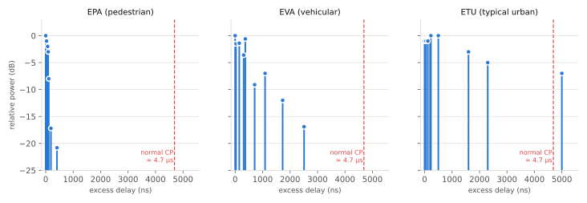

# 무선 전파와 채널

!!! spec "스펙 · 릴리즈"
    LTE 시험 채널: TS 36.101 Annex B (EPA/EVA/ETU) · NR 채널 모델: TR 38.901 (UMa/UMi/RMa/InH, TDL/CDL) · 시스템 평가: TR 36.873 (3D 채널)

!!! basic "한눈에 보기"
    기지국에서 나간 전파는 단말에 도착하기까지 세 가지 이유로 약해지고 일그러집니다.

    1. **경로 손실(path loss)** — 멀어질수록, 주파수가 높을수록 약해집니다. (몇 km 단위의 큰 변화)
    2. **음영(shadowing)** — 건물·언덕에 가려 약해집니다. (수십~수백 m 단위의 변화)
    3. **다중경로 페이딩(fading)** — 반사된 여러 전파가 더해지면서 서로 보강되거나 상쇄됩니다. (파장 단위, 몇 cm 이동에도 변화)

    여기에 단말이 움직이면 **도플러 효과**로 주파수가 조금 바뀌고, 채널이 시간에 따라 빠르게 변합니다.
    LTE와 NR의 참조신호, CP, HARQ, 링크 적응은 모두 이 문제를 이겨내기 위한 장치입니다.

## 수신 전력 모델 { .l2 }

\[
P_{RX}\,[\text{dBm}] = P_{TX} + G_{TX} + G_{RX} - PL(d, f) - X_\sigma + 20\log_{10}|h(t,f)|
\]

| 항 | 의미 | 크기 |
|---|---|---|
| \(PL(d,f)\) | 거리·주파수에 따른 평균 손실 | 100–150 dB (매크로셀) |
| \(X_\sigma\) | 음영 (로그 정규 분포) | 표준편차 4–8 dB |
| \(|h|\) | 소규모 페이딩 | 순간적으로 −20 ~ −30 dB까지 떨어짐 |

**자유 공간 손실**(가시선, 장애물 없음):

\[
FSPL\,[\text{dB}] = 32.45 + 20\log_{10} f_{\text{MHz}} + 20\log_{10} d_{\text{km}}
\]

주파수가 두 배가 되면 6 dB 더 잃습니다. 2 GHz에서 1 km 떨어지면 약 98.5 dB, 28 GHz에서는 약 121.4 dB입니다.
mmWave가 커버리지가 좁은 이유이며, 높은 안테나 이득(빔포밍)으로 보상합니다.

## 다중경로와 지연 확산 { .l2 }

같은 신호가 여러 경로로 시간차를 두고 도착합니다. 각 경로의 지연과 세기를 나타낸 것이 **전력 지연 프로파일(PDP)**입니다.
3GPP는 LTE 단말 성능 시험용으로 세 가지 대표 프로파일을 정의합니다.

<figure markdown>

<figcaption>TS 36.101 Annex B.2의 EPA/EVA/ETU 프로파일. 빨간 점선은 LTE normal CP(약 4.7 µs). ETU의 마지막 경로(5 µs)는 CP를 약간 넘습니다.</figcaption>
</figure>

| 모델 | 경로 수 | 최대 지연 | RMS 지연 확산 | 시험에 쓰는 도플러 |
|---|---|---|---|---|
| EPA (Extended Pedestrian A) | 7 | 410 ns | 43 ns | 5 Hz |
| EVA (Extended Vehicular A) | 9 | 2510 ns | 357 ns | 5, 70 Hz |
| ETU (Extended Typical Urban) | 9 | 5000 ns | 991 ns | 70, 300 Hz |

시험 조건은 "EVA70"처럼 모델 이름 + 최대 도플러(Hz)로 씁니다.

## 코히어런스 대역폭과 코히어런스 시간 { .l2 }

| 개념 | 정의 | 근사식 | 설계 영향 |
|---|---|---|---|
| 코히어런스 대역폭 \(B_c\) | 채널이 거의 같다고 볼 수 있는 주파수 폭 | \(B_c \approx \dfrac{1}{5\sigma_\tau}\) | 참조신호를 주파수 방향으로 얼마나 촘촘히 둘지 |
| 코히어런스 시간 \(T_c\) | 채널이 거의 같다고 볼 수 있는 시간 | \(T_c \approx \dfrac{0.423}{f_D}\) | 참조신호를 시간 방향으로 얼마나 자주 둘지, CSI 보고 주기 |
| 최대 도플러 \(f_D\) | 이동에 따른 주파수 이동 | \(f_D = \dfrac{v}{c} f_c\) | 부반송파 간격 선택 |

예: ETU(\(\sigma_\tau\) ≈ 1 µs) → \(B_c\) ≈ 200 kHz ≈ 1 RB 남짓. LTE CRS가 주파수 방향으로 6 부반송파(90 kHz)마다 있는 이유입니다.

예: 2 GHz, 120 km/h → \(f_D\) ≈ 222 Hz → \(T_c\) ≈ 1.9 ms. 1 ms 서브프레임 안에서 채널이 크게 변할 수 있습니다.

!!! tip "페이딩 종류 정리"
    - **주파수 선택적 페이딩**: 신호 대역 > \(B_c\). 대역 안에서 일부만 깊게 페이딩됩니다. OFDM + 주파수 스케줄링으로 대응합니다.
    - **평탄 페이딩**: 신호 대역 < \(B_c\). 각 OFDM 부반송파는 평탄 페이딩을 겪습니다.
    - **빠른 페이딩**: 심볼 길이 > \(T_c\). 고속 이동, 고주파에서 발생합니다.
    - **Rayleigh vs Rician**: 가시선 경로가 없으면 Rayleigh, 강한 가시선 경로가 있으면 Rician(K-factor로 표현)입니다.

??? expert "전문가 노트 — TR 38.901 채널 모델"
    NR 시스템 평가는 TR 38.901(0.5–100 GHz)을 씁니다.

    **시나리오별 경로 손실 (LOS, \(f_c\) GHz, \(d_{3D}\) m, breakpoint 이전)**

    | 시나리오 | LOS 경로 손실 | 음영 σ |
    |---|---|---|
    | UMa (Urban Macro, 25 m 안테나) | \(28.0 + 22\log_{10} d_{3D} + 20\log_{10} f_c\) | 4 dB |
    | UMi-Street Canyon (10 m) | \(32.4 + 21\log_{10} d_{3D} + 20\log_{10} f_c\) | 4 dB |
    | InH-Office | \(32.4 + 17.3\log_{10} d_{3D} + 20\log_{10} f_c\) | 3 dB |

    NLOS 식은 LOS 값과 NLOS 전용 식 중 큰 값을 씁니다(예: UMa NLOS \(13.54 + 39.08\log_{10} d_{3D} + 20\log_{10} f_c - 0.6(h_{UT}-1.5)\), σ = 6 dB).

    **TDL과 CDL.**
    - **TDL(Tapped Delay Line)**: 지연·전력만 있는 탭 모델. TDL-A/B/C(NLOS), TDL-D/E(LOS). 링크 레벨 시험에 사용합니다.
    - **CDL(Clustered Delay Line)**: 각 클러스터에 도래각/출발각(AoA/AoD, ZoA/ZoD)까지 있어 **빔포밍·MIMO 평가**에 씁니다. CDL-A~E.
    - 둘 다 지연을 정규화해서 제공하므로 원하는 RMS 지연 확산(예: 30 ns, 100 ns, 300 ns)으로 스케일링합니다.

    **고주파 특성.** 38.901에는 산소 흡수(60 GHz 부근 약 15 dB/km), 사람·차량에 의한 차단(blockage) 모델,
    공간 일관성(spatial consistency) 절차가 포함되어 FR2 시뮬레이션에 필요한 요소를 다룹니다.

    **Rel-19 ISAC 채널 모델.** 통신과 센싱 통합을 평가하기 위해 38.901에 표적 반사(RCS), 센싱 경로를 포함하는 모델 확장이 연구되었습니다. → [6G 후보 기술](../sixg/key-technologies.md)

## 관련 페이지

- [OFDM 원리](ofdm.md) — CP가 지연 확산을 흡수하는 방식
- [MIMO 기초](mimo.md) — 다중경로를 오히려 이용하는 방법
- [LTE 참조신호](../lte/phy/reference-signals.md)
