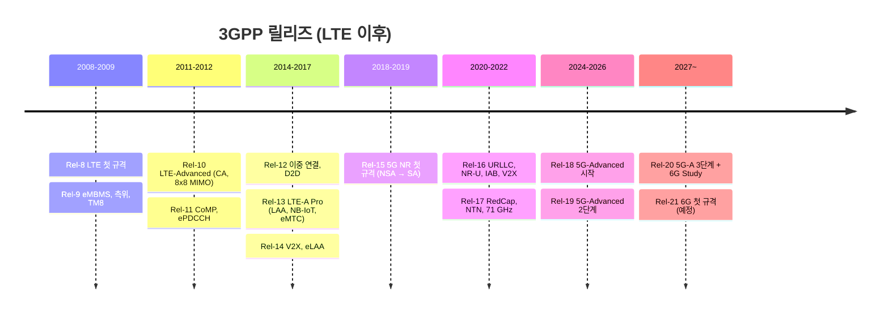

# 3GPP와 릴리즈 타임라인

!!! spec "참고 문서"
    TR 21.908 ~ 21.918 (릴리즈별 기능 요약 "Release Description"), 3GPP 공식 사이트의 Releases 페이지

!!! basic "한눈에 보기"
    **3GPP**는 전 세계 통신사·장비 업체·단말 업체가 모여 이동통신 규격을 만드는 단체입니다.
    규격은 **릴리즈(Release)** 단위로 묶어서 냅니다. 스마트폰 운영체제 버전처럼 Rel-8, Rel-9 … 순서로 기능이 추가됩니다.

    - LTE는 **Rel-8**에서 시작했습니다.
    - 5G NR은 **Rel-15**에서 시작했습니다.
    - **Rel-18**부터는 "5G-Advanced"라고 부릅니다.
    - 6G 연구는 **Rel-20**에서 시작했고, 6G 규격 자체는 **Rel-21**부터 만들어집니다.

## 3GPP 조직 { .l2 }

규격 작업은 세 개의 TSG(Technical Specification Group)가 나누어 맡고, 각 TSG 아래에 WG(Working Group)가 있습니다.

| TSG | 담당 | 주요 WG |
|---|---|---|
| **RAN** (Radio Access Network) | 무선 접속망 | RAN1 물리계층 · RAN2 L2/RRC · RAN3 RAN 인터페이스 · RAN4 RF 성능 · RAN5 단말 시험 |
| **SA** (Service & System Aspects) | 서비스 요구사항, 시스템 구조, 보안 | SA1 요구사항 · SA2 아키텍처 · SA3 보안 · SA5 운용관리 |
| **CT** (Core Network & Terminals) | 핵심망 프로토콜, 단말 | CT1 NAS · CT3 정책/과금 인터페이스 · CT4 핵심망 프로토콜 |

새 기능은 보통 **Study Item(SI)** → 기술 보고서(TR) → **Work Item(WI)** → 기술 규격(TS) 순서로 만들어집니다.

## 릴리즈 타임라인 { .l2 }

| 릴리즈 | 동결 시점(약) | 세대 | 주요 기능 |
|---|---|---|---|
| Rel-8 | 2008-12 | LTE | OFDMA/SC-FDMA, 최대 20 MHz, 4×4 MIMO, EPC, All-IP |
| Rel-9 | 2009-12 | LTE | eMBMS, LTE 측위(PRS, OTDOA), TM8(이중 레이어 빔포밍), 공공경보(PWS) |
| Rel-10 | 2011-03 | LTE-Advanced | **캐리어 집성(CA)** 최대 5CC/100 MHz, DL 8×8 · UL 4×4 MIMO, TM9, CSI-RS, 릴레이, eICIC |
| Rel-11 | 2012-09 | LTE-Advanced | **CoMP**, ePDCCH, TM10, 다중 TA 그룹, FeICIC |
| Rel-12 | 2015-03 | LTE-Advanced | 스몰셀 on/off, **이중 연결(DC)**, 256QAM(DL), D2D(ProSe), Cat-0 MTC, FDD-TDD CA |
| Rel-13 | 2016-03 | LTE-A Pro | **LAA**(비면허 대역 DL), **eMTC(Cat-M1)**, **NB-IoT**, FD-MIMO, 최대 32CC |
| Rel-14 | 2017-06 | LTE-A Pro | **C-V2X**, eLAA(UL), FeMBMS, 짧은 TTI 준비 |
| Rel-15 | 2018-06 (SA) | **5G NR** | NR 첫 규격, NSA(2017-12 early drop) → SA → late drop(2019-03), 5GC, LTE sTTI |
| Rel-16 | 2020-07 | 5G | URLLC/IIoT, TSN, **NR-U**, **IAB**, NR V2X, 측위, 2-step RACH, CHO/DAPS |
| Rel-17 | 2022-06 | 5G | **RedCap**, **NTN**, FR2-2(52.6–71 GHz), MBS, 사이드링크 향상, 커버리지 향상 |
| Rel-18 | 2024-06 | **5G-Advanced** | AI/ML 공중 인터페이스(연구), 네트워크 에너지 절감, NCR, LTM, XR, eRedCap |
| Rel-19 | 2025-12 ~ 2026 | 5G-Advanced | AI/ML 빔 관리·측위 정규화, Ambient IoT, NTN 확장, 에너지 절감 2단계 |
| Rel-20 | 2027 (예정) | 5G-A + 6G Study | 5G-Advanced 3단계, **6G Study Item** (2025-06 시작) |
| Rel-21 | 2028–2029 (예정) | **6G** | 6G 첫 정규 규격 — 2030년 전후 상용화 목표 |

!!! warning "동결 시점에 대해"
    동결(freeze)은 Stage 1(요구사항) → Stage 2(구조) → Stage 3(프로토콜) → ASN.1 순서로 단계별로 일어나므로 "몇 년 몇 월"은 대략적인 값입니다.
    Rel-19 이후 일정은 3GPP 회의에서 조정될 수 있습니다. 최신 일정은 3GPP 공식 사이트에서 확인하세요.

??? expert "전문가 노트 — 동결 단계와 버전 번호"
    - **Stage 3 freeze** 이후에는 새 기능을 추가하지 않고 버그 수정(Change Request, CR)만 받습니다.
    - **ASN.1 freeze**는 RRC 같은 프로토콜의 메시지 구조를 고정하는 시점입니다. 이 시점이 지나야 단말·장비 업체가 상호운용 구현을 시작할 수 있습니다.
    - 규격 버전 번호 `V18.3.0`에서 첫 숫자 **18**이 릴리즈입니다. 승인 전 초안은 1.x / 2.x 버전으로 시작하고, 승인되면 릴리즈 번호로 올라갑니다.
    - NR Rel-15는 **early drop(NSA, 2017-12) / main(SA, 2018-06) / late drop(Option 4·7 등, 2019-03)** 세 번에 나뉘어 동결되었습니다.
      그래서 Rel-15 규격 안에서도 "late drop 기능"인지 확인해야 하는 경우가 있습니다.
    - 기능이 릴리즈 X에 들어갔다고 해서 바로 상용화되지는 않습니다. 단말 칩셋 지원, 망 장비 지원, 사업자 활성화가 모두 필요하므로 보통 2–3년이 걸립니다.

## 관련 페이지

- [스펙 문서 읽는 법](reading-specs.md)
- [5G-Advanced 개요](../advanced5g/index.md)
- [3GPP 6G 일정](../sixg/3gpp-6g-timeline.md)
