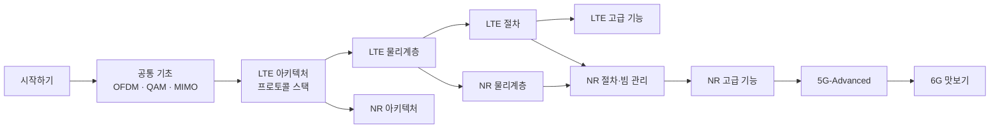

# 학습 로드맵

!!! basic "한눈에 보기"
    수준과 목적에 따라 읽는 순서를 추천합니다. 각 페이지 안에서도 기초 → 중급 → 전문가 순서로 깊어지므로,
    처음에는 기초 부분만 읽고 넘어가도 됩니다.

## 경로 1 — 처음 공부하는 사람 { .l1 }

목표: 기지국과 단말이 어떻게 연결되고 데이터가 오가는지 큰 그림을 잡기

1. [이동통신 세대의 진화](generations.md)
2. [OFDM 원리](../basics/ofdm.md) → [디지털 변조](../basics/modulation.md) → [듀플렉싱](../basics/duplexing.md)
3. [LTE 아키텍처](../lte/architecture/overview.md) → [LTE 프로토콜 스택](../lte/protocol/overview.md)
4. [LTE 프레임 구조](../lte/phy/frame-structure.md)
5. [LTE Attach 절차](../lte/procedures/attach.md)
6. [LTE vs NR 비교](../reference/lte-vs-nr.md)

## 경로 2 — 신입 엔지니어 · 전공자 { .l2 }

목표: 로그(RRC 메시지, DCI)를 보고 무슨 일이 일어나는지 해석하기

1. 공통 기초 전체
2. LTE 물리계층 전체 (프레임 → 리소스 그리드 → 채널별 페이지)
3. LTE 절차 전체 (셀 탐색 → 랜덤 액세스 → Attach → 핸드오버)
4. LTE 측정 이벤트와 처리량 계산
5. NR은 LTE와 달라진 점 중심으로 (Numerology, BWP, SSB, CORESET)

## 경로 3 — 현업 전문가 { .l3 }

목표: 스펙 디테일, 릴리즈별 변화, 경계 조건 확인

- 각 페이지의 **전문가 노트**와 **스펙 박스**를 레퍼런스로 활용
- [3GPP 스펙 인덱스](../reference/spec-index.md)에서 원문 위치를 확인
- [5G-Advanced](../advanced5g/index.md) Rel-18~20 기능 동향
- [6G 후보 기술](../sixg/key-technologies.md)
