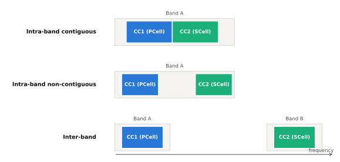
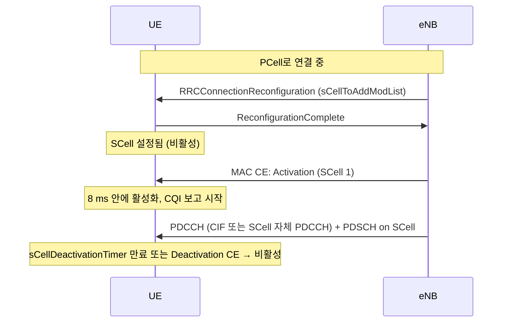

# 캐리어 집성 (CA)

!!! spec "스펙 · 릴리즈"
    개요: TS 36.300 §5.5, §7.5 · MAC (활성화, 다중 TA): TS 36.321 §5.13–5.14 · CA RF·밴드 조합: TS 36.101 §5.5A, §5.6A · UCI: TS 36.213 §10.1

    Rel-10 (최대 5 CC, 100 MHz) → Rel-11 다중 TA·TDD 다른 구성 → Rel-12 TDD-FDD CA·DC → Rel-13 최대 32 CC·PUCCH on SCell, LAA

!!! basic "한눈에 보기"
    LTE 캐리어 하나는 최대 20 MHz입니다. 더 빠르게 하려면 **여러 캐리어를 묶어서** 한 단말에게 동시에 주면 됩니다. 이것이 **캐리어 집성(Carrier Aggregation)**입니다.

    - 묶이는 캐리어 하나하나를 **CC (Component Carrier)**라고 합니다.
    - 단말과 RRC 연결을 맺고 제어를 담당하는 주 셀은 **PCell**, 추가로 붙는 셀은 **SCell**입니다.
    - 각 CC는 그 자체로 완전한 LTE 캐리어라서, CA를 모르는 단말도 각 CC를 그대로 쓸 수 있습니다(하위 호환).

    광고에서 보던 "LTE-A 300 Mbps", "4CA", "5CA"가 바로 이것입니다.

## CA 유형 { .l2 }

<figure markdown>

<figcaption>같은 밴드 안에서 붙은 CC(intra-band contiguous), 같은 밴드 안에서 떨어진 CC(intra-band non-contiguous), 다른 밴드의 CC(inter-band).</figcaption>
</figure>

| 유형 | 예 | 단말 RF 관점 |
|---|---|---|
| Intra-band contiguous | CA_3C (1.8 GHz 20+20 MHz) | 수신기 하나로 넓게 받을 수 있음 |
| Intra-band non-contiguous | CA_3A-3A | 대역 내 간섭·IMD 고려 |
| Inter-band | CA_1A-3A-5A-7A | 밴드별 RF 경로, 하모닉·혼변조 간섭 검토 필요 |

### 밴드 조합 표기 (TS 36.101)

`CA_1A-3C-7A` = 밴드 1 CC 1개 + 밴드 3 연속 CC 2개 + 밴드 7 CC 1개.

| 대역폭 클래스 | 집성 RB 수 | 최대 CC |
|---|---|---|
| A | ≤ 100 | 1 |
| B | ≤ 100 | 2 |
| C | 100 < N ≤ 200 | 2 |
| D | 200 < N ≤ 300 | 3 |
| E | 300 < N ≤ 400 | 4 |
| F | 400 < N ≤ 500 | 5 |

## PCell과 SCell { .l2 }

| 항목 | PCell | SCell |
|---|---|---|
| RRC 연결·NAS·보안 | ✔ | — |
| 셀 탐색·SIB 수신 | ✔ | 필요한 SI는 전용 RRC로 받음 |
| PUCCH | ✔ (Rel-13부터 PUCCH SCell 추가 가능) | — |
| RLF 감시 | ✔ | — |
| 활성화 | 항상 활성 | **MAC CE로 활성/비활성** |
| 변경 방법 | 핸드오버 | RRC로 추가·해제, MAC으로 켜고 끄기 |

## 최대 속도 계산 예 { .l2 }

| 구성 | 계산 | 최대 DL |
|---|---|---|
| 1 CC 20 MHz, 2×2, 64QAM | 150 Mbps | 150 Mbps |
| 2 CC (20+20), 2×2, 64QAM | 2 × 150 | 300 Mbps |
| 3 CC, 2×2, 256QAM | 3 × 약 195 | 약 585 Mbps |
| 5 CC, 4×4 일부 + 256QAM | 조합에 따라 | 약 1 Gbps (Cat 16) |

??? expert "전문가 노트 — 교차 캐리어 스케줄링, 다중 TA, DC"
    **교차 캐리어 스케줄링.** SCell의 PDSCH/PUSCH를 PCell(또는 다른 셀)의 PDCCH로 지시합니다. DCI에 **CIF(Carrier Indicator Field) 3비트**가 추가됩니다. 간섭이 큰 셀(HetNet 매크로 아래 피코)의 제어 영역을 피하거나, 제어 영역이 없는 셀을 지원할 때 씁니다. SCell PDSCH 시작 심볼은 `pdsch-Start`로 알립니다.

    **SCell 활성화 타이밍.** Activation CE를 서브프레임 \(n\)에 받으면 \(n+8\)까지 CSI 보고를 시작하고, 늦어도 \(n+24\)(또는 \(n+34\), 측정 상태에 따라)까지 완전히 활성화합니다(TS 36.133 §7.7).

    **다중 TA (Rel-11).** 밴드가 다르면 경로(리피터, RRH 위치)가 달라 TA가 다를 수 있습니다. **TAG(Timing Advance Group)**별로 TA를 관리하고, SCell TAG는 PDCCH order로 SCell에서 RA를 시켜 TA를 얻습니다.

    **CA 단말 능력.** `supportedBandCombination`에 밴드 조합마다 DL/UL 클래스와 MIMO 레이어 수가 들어갑니다. 조합 수가 수천 개가 되어 Rel-13 이후 `requestedFrequencyBands`로 망이 필요한 밴드만 요청하는 필터링을 씁니다.

    **UL CA.** 상향 CA는 단말 전력·혼변조 문제로 지원이 제한적입니다. 2UL CA는 PCell+SCell 동시 PUSCH이며 총 전력 \(P_{CMAX}\)를 나눠 씁니다.

    **이중 연결 (DC, Rel-12).** 이상적이지 않은 백홀(X2 지연 수~수십 ms)로 연결된 두 eNB(MeNB, SeNB)에 동시에 연결합니다.
    - MCG(마스터 셀 그룹, PCell) + SCG(세컨더리 셀 그룹, **PSCell** — PUCCH 있음)
    - 베어러 유형: MCG bearer, SCG bearer, **split bearer** (MeNB PDCP에서 분기)
    - CA와 달리 **MAC과 스케줄러가 기지국별로 독립**
    - 이 구조가 그대로 5G NSA **EN-DC**(MeNB = LTE, SgNB = NR)가 되었습니다. → [CA와 DC](../../nr/advanced/ca-dc.md)

## 관련 페이지

- [LAA·eLAA](laa.md)
- [PUCCH와 UCI](../phy/pucch.md) — CA의 ACK 포맷
- [처리량 계산](../measurement/throughput.md)
- [NR CA와 DC](../../nr/advanced/ca-dc.md)
