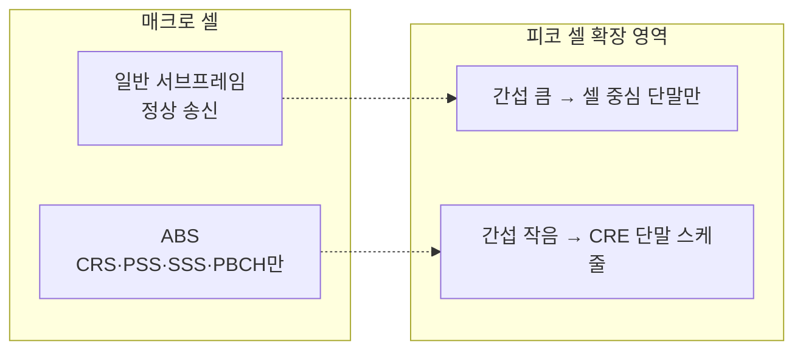

# CoMP와 eICIC

!!! spec "스펙 · 릴리즈"
    eICIC: TS 36.300 §16.1.5, TS 36.423 (ABS 정보), TS 36.331 `measSubframePattern` · CoMP: TR 36.819 (연구), TS 36.213 §7.1.9–7.1.10 (TM10, QCL), §7.2 (CSI 프로세스)

    Rel-8 ICIC → Rel-10 eICIC → Rel-11 FeICIC·CoMP → Rel-12 eCoMP (비이상 백홀)

!!! basic "한눈에 보기"
    재사용 1 LTE 망에서 셀 가장자리 단말은 **이웃 셀 간섭** 때문에 속도가 크게 떨어집니다. 이를 해결하는 두 갈래가 있습니다.

    - **eICIC (간섭 회피)**: 큰 셀(매크로)이 **잠깐 조용히** 해서 작은 셀(피코) 가장자리 단말이 숨 쉴 틈을 줍니다. 시간을 나눠 쓰는 방식입니다.
    - **CoMP (협력 송수신)**: 이웃 셀들이 **팀으로 협력**합니다. 간섭을 피하도록 빔을 조정하거나, 아예 여러 셀이 같이 데이터를 보내 간섭을 신호로 바꿉니다.

## eICIC — 시간 영역 간섭 조정 { .l2 }

| 요소 | 내용 |
|---|---|
| **ABS (Almost Blank Subframe)** | 매크로가 PDSCH/PDCCH를 보내지 않는 서브프레임. CRS 등 필수 신호만 남김 (MBSFN 서브프레임으로 설정하면 CRS도 거의 없음) |
| ABS 패턴 | FDD 40비트(40 ms), TDD 구성별 20/60/70비트 비트맵 — X2 Load Information으로 교환 |
| **CRE (Cell Range Expansion)** | 피코 셀 선택에 바이어스(예: +6 ~ +9 dB) → 더 많은 단말이 피코에 붙음 (부하 분산) |
| 측정 제한 | `measSubframePattern`으로 ABS에서만 RRM/RLM/CSI 측정 → 실제 상황에 맞는 측정 |

## CoMP 방식 { .l2 }

| 방식 | 데이터 공유 | 동작 | 이득 |
|---|---|---|---|
| **CS/CB** (협력 스케줄링·빔포밍) | 아니오 | 셀끼리 서로에게 간섭 적은 빔·자원 선택 | 간섭 감소 |
| **DPS** (동적 지점 선택) | 예 | 서브프레임마다 가장 좋은 한 지점이 송신 | 선택 다이버시티 |
| **JT** (공동 송신) | 예 | 여러 지점이 같은 데이터를 동시에 송신 | 간섭 → 신호 |
| JR (UL 공동 수신) | 예 | 여러 지점이 받은 신호 결합 | UL 가장자리 이득 (표준 영향 적음) |

### CoMP 시나리오 (TR 36.819)

| 시나리오 | 구성 |
|---|---|
| 1 | 같은 사이트 내 섹터 간 (intra-site) |
| 2 | 매크로 + 고출력 RRH (서로 다른 PCI) |
| 3 | 매크로 + 저출력 RRH, **서로 다른 PCI** |
| 4 | 매크로 + 저출력 RRH, **같은 PCI** (공유 셀) |

??? expert "전문가 노트 — TM10과 CSI 프로세스"
    **CSI 프로세스.** TM10 단말은 최대 4개의 CSI 프로세스를 가지며, 각 프로세스 = **NZP CSI-RS 자원**(신호 측정) + **CSI-IM 자원**(간섭 측정)의 조합입니다.
    예: 프로세스 1 = TP1 신호 + TP2 송신 중 간섭, 프로세스 2 = TP1 신호 + TP2 뮤트 시 간섭 → 기지국은 두 CQI로 협력 이득을 계산합니다.

    **CSI-IM.** ZP CSI-RS 위치(모든 협력 셀이 비움 또는 특정 셀만 송신)에서 간섭+잡음만 측정합니다. LTE에서 처음 도입된 "명시적 간섭 측정 자원"이며 NR의 CSI-IM으로 이어졌습니다.

    **QCL Type B와 PQI.** DPS로 송신 지점이 바뀌면 DMRS의 지연·도플러 특성이 바뀝니다. 단말은 PQI가 가리키는 CSI-RS와 DMRS가 QCL이라고 가정하고 채널 추정 파라미터를 가져옵니다. 이 개념이 NR의 **TCI state**로 일반화되었습니다.

    **백홀 요구.** JT/DPS는 지점 간 데이터·CSI 공유가 수 ms 이내여야 하므로 사실상 **이상적 백홀(광 fronthaul, C-RAN)**이 필요합니다. Rel-12 **eCoMP(inter-eNB CoMP)**는 X2로 CoMP Hypothesis와 Benefit Metric을 교환해 비이상 백홀에서 CS/CB를 하도록 했습니다.

    **FeICIC (Rel-11).** ABS에도 남는 매크로 **CRS 간섭**을 단말이 제거(CRS-IC)하고, 저전력 ABS(완전히 끄지 않고 전력을 낮춤)를 허용했습니다. 단말은 `neighCellsCRS-Info`로 간섭 셀의 CRS 정보를 받습니다.

    **실무 평가.** eICIC는 HetNet 피코 배치와 함께 일부 상용화되었고, CoMP JT는 C-RAN 환경에서 제한적으로 쓰였습니다. 다중 지점 협력 개념은 NR **Multi-TRP**(Rel-16/17)로 계승되었습니다.

## 관련 페이지

- [셀룰러 개념과 간섭](../../basics/cellular-concept.md)
- [전송 모드 (TM1–10)](transmission-modes.md)
- [참조신호](../phy/reference-signals.md)
- [NR TCI와 QCL](../../nr/beam/tci-qcl.md)
