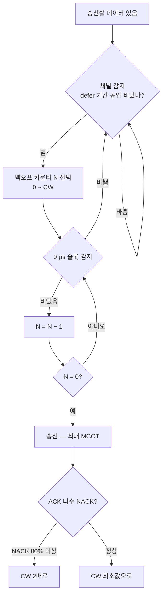

# LAA · eLAA

!!! spec "스펙 · 릴리즈"
    채널 접속 절차: TS 36.213 §15 (LBT) · 프레임 타입 3: TS 36.211 §4.3 · DRS: §6.11A · 밴드 46 (5150–5925 MHz): TS 36.101 · 연구: TR 36.889 (Rel-13), TR 36.789

    LAA (DL) Rel-13 → eLAA (UL) Rel-14 → FeLAA Rel-15 (자율 UL, 부분 서브프레임 확장) · 관련: LWA/LWIP Rel-13

!!! basic "한눈에 보기"
    **LAA(Licensed Assisted Access)**는 Wi-Fi가 쓰는 **5 GHz 비면허 대역**을 LTE의 추가 캐리어로 쓰는 기술입니다.

    - 비면허 대역은 누구나 쓸 수 있지만, **다른 사용자(Wi-Fi)와 공평하게 나눠 써야** 합니다.
    - 그래서 LTE도 Wi-Fi처럼 **"먼저 들어 보고 비어 있으면 보내기(LBT)"** 규칙을 따릅니다.
    - 연결 제어는 항상 **면허 대역 PCell**이 맡고, 비면허 캐리어는 **SCell**로만 붙습니다(CA). 그래서 "Licensed Assisted"입니다.

    Rel-13은 하향만, Rel-14 eLAA부터 상향도 지원합니다.

## LBT (Listen Before Talk) { .l2 }

에너지 감지 임계값(20 MHz 기준 대략 −72 dBm)보다 크면 "바쁨"으로 판단합니다.

### 채널 접속 우선순위 클래스 (DL, TS 36.213 Table 15.1.1-1)

| 클래스 \(p\) | \(m_p\) | CW 범위 | MCOT | 트래픽 예 |
|---|---|---|---|---|
| 1 | 1 | 3 – 7 | 2 ms | 시그널링, VoIP |
| 2 | 1 | 7 – 15 | 3 ms | 영상 |
| 3 | 3 | 15 – 63 | 8 또는 10 ms | 일반 데이터 |
| 4 | 7 | 15 – 1023 | 8 또는 10 ms | 백그라운드 |

Defer 기간 \(T_d = 16\,\mu s + m_p \times 9\,\mu s\). 우선순위가 높을수록 빨리 접속하지만 짧게만 점유합니다.

## LTE 측의 변화 { .l2 }

| 요소 | 내용 |
|---|---|
| 프레임 타입 3 | 고정 D/U 패턴 없음, LBT 성공 시점부터 전송 |
| 부분 서브프레임 | 채널 확보가 서브프레임 경계와 어긋나도 전송 (ending partial = DwPTS 길이, Rel-14 starting partial) |
| **DRS** (Discovery RS) | PSS/SSS/CRS(+CSI-RS)를 짧게(최대 1 ms) 주기적으로 보냄 — 짧은 LBT(25 µs)로 전송 가능 |
| CRS 없음 | LBT 실패 시 신호가 없으므로 단말은 CRS 존재를 서브프레임마다 검출 |
| 측정 | RSSI, 채널 점유율(Channel Occupancy) 보고 |

??? expert "전문가 노트 — UL LBT, 공존, 이후 기술"
    **eLAA UL (Rel-14).** 기지국 grant를 받은 단말도 송신 전 LBT를 해야 합니다.
    - **Type 1** (Cat 4, 랜덤 백오프) 또는 **Type 2** (25 µs 단일 감지, 기지국 MCOT 안에서 공유할 때)
    - grant와 PUSCH 사이 LBT 실패 가능성 때문에 **다중 서브프레임 grant**(DCI 0B/4B), **2단계 grant**(트리거 A + C-PDCCH 트리거 B)를 도입
    - PUSCH 자원은 **interlace**(10개 PRB를 10 PRB 간격으로 분산) — 비면허 대역 점유 대역폭(OCB, 80% 이상) 규제 충족

    **공존 평가.** 3GPP는 "LAA가 Wi-Fi에 주는 영향이 Wi-Fi 하나를 추가했을 때보다 크지 않아야 한다"는 공정성 기준으로 평가했습니다(TR 36.889). 결과적으로 LBT Cat 4와 CW 조정이 필수가 되었습니다.

    **LWA / LWIP (Rel-13).** 비면허 대역을 **Wi-Fi 그대로** 쓰는 방식입니다. LWA는 PDCP 수준에서 WLAN 경로로 분기(eNB가 WLAN AP와 Xw 인터페이스), LWIP는 IP 수준 IPsec 터널로 연동합니다.

    **MulteFire.** LTE를 비면허 대역에서 면허 앵커 없이 단독 운용하려는 산업 연합 규격입니다(3GPP 아님). 이 개념은 3GPP **NR-U 단독(standalone) 모드**(Rel-16)로 이어졌습니다. → [NR-U](../../nr/advanced/nr-u.md)

    **6 GHz.** Rel-16 NR-U는 5 GHz와 6 GHz(5925–7125 MHz, 국가별) 대역을 모두 다룹니다.

## 관련 페이지

- [캐리어 집성 (CA)](carrier-aggregation.md)
- [프레임 구조](../phy/frame-structure.md) — 프레임 타입 3
- [NR-U](../../nr/advanced/nr-u.md)
