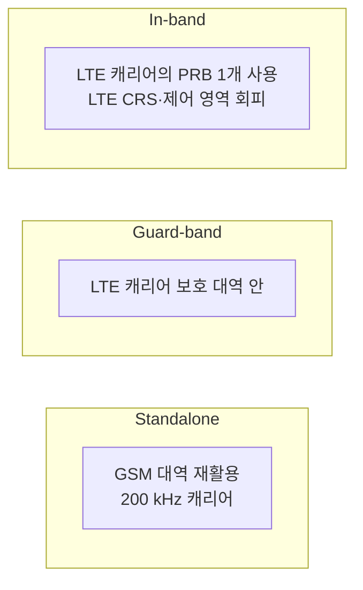

# LTE-M과 NB-IoT

!!! spec "스펙 · 릴리즈"
    eMTC: TS 36.211 §6.8B (MPDCCH), TS 36.213 §6.2, 7.1.11 (반복, CE 모드) · NB-IoT: TS 36.211 §10, TS 36.213 §16 · 단말 카테고리: TS 36.306 · CIoT 핵심망: TS 23.401 §4.3.17

    Rel-12 Cat-0 → Rel-13 **Cat-M1, Cat-NB1** → Rel-14 Cat-M2, Cat-NB2 → Rel-15 저전력 향상 → Rel-16 NR 공존, Rel-17 NTN IoT

!!! basic "한눈에 보기"
    스마트폰이 아니라 **센서, 계량기, 위치 추적기** 같은 사물을 연결하려면 다른 조건이 필요합니다.

    - **값싼 칩** (단말 가격 수 달러)
    - **배터리 10년**
    - **지하실, 건물 깊숙이**까지 닿는 커버리지
    - 속도는 느려도 됨

    3GPP는 이를 위해 LTE 기반 IoT 기술 두 가지를 만들었습니다.

    | | **LTE-M (eMTC, Cat-M1)** | **NB-IoT (Cat-NB1)** |
    |---|---|---|
    | 대역폭 | 1.4 MHz | **180 kHz** (LTE RB 1개) |
    | 속도 | 약 1 Mbps | 수십 kbps |
    | 이동성·음성 | 핸드오버, VoLTE 가능 | 거의 정지, 음성 불가 |
    | 용도 | 웨어러블, 차량 추적, 알람 | 계량기, 주차 센서, 농업 센서 |

## 비교 { .l2 }

| 항목 | Cat-1 (참고) | Cat-M1 (Rel-13) | Cat-M2 (Rel-14) | Cat-NB1 (Rel-13) | Cat-NB2 (Rel-14) |
|---|---|---|---|---|---|
| 단말 대역폭 | 20 MHz | 1.4 MHz (6 PRB) | 5 MHz | 180 kHz | 180 kHz |
| 최대 DL / UL | 10 / 5 Mbps | 약 1 / 1 Mbps | 약 4 / 7 Mbps | 약 26 / 62 kbps | 약 127 / 159 kbps |
| 듀플렉스 | FD-FDD, TDD | FD/HD-FDD, TDD | 〃 | **HD-FDD** (Rel-15 TDD) | 〃 |
| 수신 안테나 | 2 | **1** | 1 | 1 | 1 |
| 최대 송신 전력 | 23 dBm | 23 / 20 dBm | 23 / 20 dBm | 23 / 20 dBm (Rel-14: 14 dBm) | 〃 |
| 커버리지 (MCL) | 약 144 dB | **약 156 dB** | 〃 | **약 164 dB** | 〃 |
| 이동성 | 핸드오버 | 핸드오버 | 핸드오버 | 셀 재선택만 | 〃 |
| 음성 | VoLTE | VoLTE (CE 모드 A) | 〃 | — | — |

## 커버리지 향상의 비결: 반복 { .l2 }

같은 데이터를 **수십~수천 번 반복** 전송하고 수신기가 모두 결합합니다. 반복 2배당 약 3 dB 이득입니다.

| 기술 | 최대 반복 |
|---|---|
| LTE-M CE 모드 A | PDSCH/PUSCH 32회 |
| LTE-M CE 모드 B | PDSCH/PUSCH **2048회** |
| NB-IoT NPDSCH | 2048회 |
| NB-IoT NPUSCH | 128회 |

대가는 지연과 전송 시간입니다. 극한 커버리지에서는 수 초 동안 송신해야 수십 바이트를 보낼 수 있습니다.

## NB-IoT 배치 모드 { .l2 }

## 절전 기능 { .l2 }

| 기능 | 원리 | 효과 |
|---|---|---|
| **PSM** (Rel-12) | 활성 시간(T3324) 후 다음 TAU까지 완전 수면 | 수일~수백 일 동안 도달 불가, 최소 전력 |
| **eDRX** (Rel-13) | Idle DRX를 최대 43분(LTE-M) / 2.9시간(NB-IoT)으로 확장 | 도달 가능성과 전력의 절충 |
| **WUS** (Rel-15) | 페이징 전 짧은 웨이크업 신호 → 대상이 아니면 PDCCH 감시 생략 | 페이징 전력 감소 |
| EDT (Rel-15) | Msg3에 데이터 실어 보내고 연결 없이 종료 | 작은 데이터 전송 전력 감소 |
| CP CIoT 최적화 | NAS 메시지에 데이터 탑재 | DRB 설정 생략 |

??? expert "전문가 노트 — 채널 구조 세부"
    **LTE-M 협대역(narrowband).** 시스템 대역을 6 PRB 단위 narrowband로 나누고, MPDCCH/PDSCH/PUSCH가 narrowband 사이를 **주파수 호핑**합니다. 단말 RF 재조정 시간(retuning, 최대 2 심볼)을 위해 가드 구간이 필요합니다. 기존 PDCCH 영역은 쓰지 않고(1.4 MHz 단말은 전체 대역 PDCCH를 못 받음) **MPDCCH**(ePDCCH 기반, DCI 6-x)를 씁니다.

    **NB-IoT 하향 채널.**
    - NPSS: 서브프레임 5, NSSS: 짝수 프레임 서브프레임 9, NPBCH: 서브프레임 0 (640 ms TTI)
    - NPDCCH / NPDSCH: 나머지 서브프레임, DCI N0/N1/N2
    - NRS (협대역 참조신호): 2포트
    - In-band 모드에서는 LTE의 CRS·제어 영역(최대 3 심볼)을 피해 매핑

    **NB-IoT 상향 채널.**
    - **NPRACH**: **단일 톤, 3.75 kHz 부반송파**, 심볼 그룹 단위 주파수 호핑(톤 위치로 TA 추정). Rel-15 1.25 kHz 형식 추가(최대 120 km 셀)
    - **NPUSCH format 1** (데이터): 단일 톤(3.75 kHz 또는 15 kHz, π/2-BPSK·π/4-QPSK) 또는 다중 톤(3, 6, 12 톤, QPSK)
    - **NPUSCH format 2** (HARQ-ACK): 단일 톤 반복
    - 자원 단위(RU) = 톤 수 × 슬롯 수 조합 (예: 1 톤 × 16 슬롯 @15 kHz = 8 ms)
    - 단일 톤 + π/2-BPSK는 PAPR이 거의 0 dB라 저가 증폭기로 최대 출력 가능

    **HARQ.** NB-IoT는 Rel-13에서 HARQ 프로세스 1개(Rel-14 Cat-NB2: 2개), 비동기, 반이중이라 처리량이 낮습니다.

    **NR 시대의 LPWA.** NR에는 별도의 NB-IoT/LTE-M이 없습니다. 대신 Rel-16에서 **NR 캐리어 안에 LTE-M/NB-IoT를 공존**(자원 예약)하는 방법을 정의했고, 5GC에 연결하는 CIoT 5GS 최적화를 추가했습니다. NR 중저가 단말은 **RedCap**(Rel-17), 초저전력 무전원 단말은 **Ambient IoT**(Rel-19)가 이어받습니다.

## 관련 페이지

- [NAS (EMM·ESM)](../protocol/nas.md) — PSM, CIoT
- [DRX](../procedures/drx.md) — eDRX
- [NR RedCap](../../nr/advanced/redcap.md)
- [Ambient IoT](../../advanced5g/ambient-iot.md)
