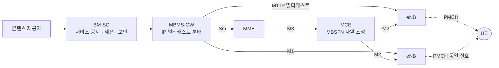

# eMBMS

!!! spec "스펙 · 릴리즈"
    구조: TS 23.246 · E-UTRAN MBMS: TS 36.300 §15 · PMCH·MBSFN RS: TS 36.211 §6.5, §6.10.2 · SC-PTM: TS 36.300 §15.10 (Rel-13) · 전송 방식: TS 26.346 (FLUTE, DASH)

    Rel-9 eMBMS → Rel-13 SC-PTM → Rel-14 FeMBMS (전용 캐리어, 수신 전용 모드) → Rel-16 LTE 기반 5G 지상파 방송 → Rel-17 NR MBS

!!! basic "한눈에 보기"
    같은 영상을 많은 사람이 동시에 볼 때(스포츠 중계, 재난 방송, 소프트웨어 업데이트) 각자에게 따로 보내면 자원이 낭비됩니다.
    **eMBMS(evolved Multimedia Broadcast Multicast Service)**는 **한 번 보내서 여러 단말이 함께 받는** 방송·멀티캐스트 기술입니다.

    핵심 아이디어는 **MBSFN(Single Frequency Network)**입니다. 여러 셀이 **같은 시간에 똑같은 신호**를 보내면, 단말 입장에서는 이웃 셀 신호가 간섭이 아니라 **추가 다중경로 신호**가 되어 오히려 수신이 좋아집니다.

## 구조 { .l2 }

| 노드 | 역할 |
|---|---|
| BM-SC | 서비스 공지(USD), 세션 시작/종료, 콘텐츠 동기화(SYNC), FEC |
| MBMS-GW | eNB들로 IP 멀티캐스트 전달, MME에 세션 제어 |
| **MCE** | MBSFN 영역의 무선 자원(서브프레임, MCS) 결정 — 모든 eNB가 같은 설정을 써야 함 |

## MBSFN 서브프레임 { .l2 }

| 항목 | 내용 |
|---|---|
| 사용 가능한 서브프레임 | FDD: 1, 2, 3, 6, 7, 8 (최대 6/10) · TDD: 3, 4, 7, 8, 9 (구성에 따라) |
| 구조 | 앞 1–2 심볼은 일반 유니캐스트 제어 영역, 나머지가 PMCH |
| CP | **Extended CP (16.7 µs)** — 먼 셀의 신호까지 CP 안에 들어오도록 |
| 참조신호 | MBSFN RS (포트 4), 영역 내 모든 셀이 동일 |
| 채널 | MCCH(제어), MTCH(데이터) → MCH → **PMCH** |
| 변경 알림 | PDCCH (M-RNTI, DCI 1C) |

SIB13에 MBSFN 영역 정보와 MCCH 위치가, SIB2에 MBSFN 서브프레임 구성이 있습니다.

## SC-PTM (Rel-13) { .l2 }

MBSFN은 넓은 지역에 효율적이지만, 몇몇 셀에만 사용자가 있는 경우 낭비입니다. **SC-PTM(Single-Cell Point-to-Multipoint)**은 **셀 하나에서 일반 PDSCH로** 멀티캐스트합니다(G-RNTI로 스케줄링). 유연하고 지연이 짧아 IoT 펌웨어 업데이트, 공공 안전 그룹 통신에 적합합니다.

??? expert "전문가 노트 — FeMBMS와 5G 방송"
    **MBSFN 영역 크기와 CP.** 16.7 µs CP는 약 5 km 경로 차이까지 흡수합니다. 그보다 먼 셀 신호는 간섭이 되므로, 넓은 SFN에는 더 긴 CP가 필요합니다.

    **FeMBMS (Rel-14, enTV).**
    - **전용 MBMS 캐리어**: 100% 방송 서브프레임 가능 (유니캐스트 제어 영역 없음, CAS 서브프레임만 40 ms마다)
    - 새 numerology: **1.25 kHz 부반송파, CP 200 µs** → 고출력 고탑(HPHT) 송신소의 수십 km SFN
    - **수신 전용 모드(ROM)**: SIM·가입 없이 무료 방송 수신
    - Rel-16: 0.37 kHz(CP 300 µs)와 2.5 kHz(CP 100 µs, 이동 수신) numerology 추가 → ITU의 "5G 지상파 방송" 요구 충족

    **QoE와 전송.** 방송 구간은 HARQ 피드백이 없으므로 응용 계층 FEC(Raptor)와 FLUTE/DASH로 손실을 복구합니다. 단말은 MBMS 수신 중 유니캐스트로 누락 조각을 보충(file repair)할 수 있습니다.

    **NR MBS (Rel-17).** NR은 MBSFN 대신 **PTM(Point-to-Multipoint)** 전송(그룹 공통 PDCCH/PDSCH, G-RNTI)과 PTP를 동적으로 전환하고, Rel-17에서 RRC_CONNECTED 멀티캐스트 + HARQ 피드백, Rel-18에서 INACTIVE 상태 멀티캐스트 수신을 지원합니다.

## 관련 페이지

- [프레임 구조](../phy/frame-structure.md) — Extended CP
- [참조신호](../phy/reference-signals.md) — MBSFN RS
- [C-V2X](v2x.md)
