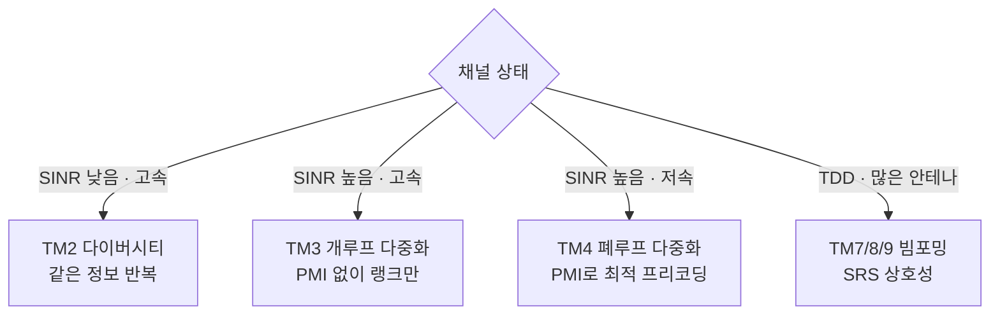

# 전송 모드 (TM1–10)

!!! spec "스펙 · 릴리즈"
    TS 36.213 §7.1 (Table 7.1-5: TM별 DCI·전송 방식), §7.2 (TM별 CSI 보고) · TS 36.211 §6.3.4 (프리코딩: 단일 포트, 전송 다이버시티, 공간 다중화)

    TM1–7 Rel-8 · TM8 Rel-9 · TM9 Rel-10 · TM10 Rel-11 · FD-MIMO (TM9/10 확장) Rel-13/14

!!! basic "한눈에 보기"
    LTE는 다중 안테나를 쓰는 방법을 **전송 모드(TM, Transmission Mode)** 10가지로 정리했습니다. 기지국은 단말마다 하나의 TM을 RRC로 설정합니다.

    - **TM1–2**: 안테나 1개 또는 다이버시티 (튼튼하게)
    - **TM3–6**: CRS 기반 MIMO (더 빠르게)
    - **TM7–10**: DMRS 기반 빔포밍과 고급 MIMO (더 똑똑하게)

    TM 숫자가 크다고 항상 좋은 것은 아닙니다. 단말·기지국 지원과 채널 상황에 맞는 TM을 고릅니다.

## 전송 모드 표 { .l2 }

| TM | 방식 | 레이어 | DCI | 복조 RS | CSI 피드백 | 주 용도 |
|---|---|---|---|---|---|---|
| **1** | 단일 안테나 (포트 0) | 1 | 1, 1A | CRS | CQI | 단일 안테나 셀 |
| **2** | 전송 다이버시티 (SFBC / SFBC+FSTD) | 1 | 1, 1A | CRS | CQI | 셀 가장자리, 고속, 폴백 |
| **3** | 개루프 공간 다중화 (Large-delay CDD) | 1–4 | 2A | CRS | CQI, RI | 고속 이동 MIMO |
| **4** | 폐루프 공간 다중화 | 1–4 | 2 | CRS | CQI, **PMI**, RI | 저속 MIMO |
| 5 | MU-MIMO | 1/단말 | 1D | CRS | CQI, PMI | (거의 미사용) |
| 6 | 폐루프 랭크 1 프리코딩 | 1 | 1B | CRS | CQI, PMI | 커버리지 |
| **7** | 단일 레이어 빔포밍 (포트 5) | 1 | 1 | UE-RS | CQI | TDD 빔포밍 (Rel-8) |
| **8** | 이중 레이어 빔포밍 (포트 7, 8) | 1–2 | 2B | DMRS | CQI (+PMI/RI) | TDD 빔포밍 (Rel-9) |
| **9** | 최대 8 레이어 (포트 7–14) | 1–8 | 2C | DMRS | CQI, PMI, RI (CSI-RS 기반) | LTE-A MIMO, FD-MIMO |
| **10** | CoMP (TM9 + 다중 CSI 프로세스) | 1–8 | 2D | DMRS | 프로세스별 CSI | CoMP, 다중 TRP |

모든 TM에서 **DCI 1A**는 폴백용으로 쓸 수 있습니다(CRS 기반 TM은 TM2 다이버시티, TM7–10은 단일 포트 7 등).

## 다이버시티 vs 다중화 { .l2 }

고속 이동에서는 PMI 보고가 금방 낡아서 폐루프의 이득이 사라집니다. 그래서 TM3가 상용망 기본값으로 널리 쓰였고, TM4는 저속 환경에 유리합니다.

??? expert "전문가 노트 — 프리코딩 수식과 TM 선택"
    **SFBC (2포트, TS 36.211 §6.3.4.3).** 인접 부반송파 두 개에 Alamouti 부호를 적용합니다.

    \[
    \begin{bmatrix} y^{(0)}(2i) & y^{(0)}(2i+1) \\ y^{(1)}(2i) & y^{(1)}(2i+1) \end{bmatrix} = \frac{1}{\sqrt2}\begin{bmatrix} x_0 & x_1 \\ -x_1^* & x_0^* \end{bmatrix}
    \]

    4포트는 SFBC를 포트 쌍 (0, 2)와 (1, 3)에 번갈아 적용하는 **SFBC+FSTD**입니다(포트 2/3 CRS가 적어서 비대칭).

    **Large-delay CDD (TM3).** \(y = W(i) D(i) U x\), \(D(i)\)는 부반송파마다 위상이 도는 대각 행렬, \(U\)는 DFT 행렬, \(W\)는 고정된 코드북 행렬 순환입니다. 모든 레이어가 모든 가상 안테나를 고르게 거쳐 레이어 간 품질이 같아지므로 **CQI 하나**로 충분합니다.

    **TM4 PMI.** 2포트 코드북: 랭크 1은 4개, 랭크 2는 2개(+ 항등 행렬은 TM3용). 4포트: 랭크별 16개(Householder \(W_n = I - 2u_nu_n^H/u_n^Hu_n\)). `codebookSubsetRestriction`으로 쓸 수 있는 PMI를 제한할 수 있습니다.

    **TM9 CSI.** CRS 대신 CSI-RS로 측정합니다. 8포트는 이중 코드북 \(W = W_1 W_2\). Rel-12에서 4포트 이중 코드북(`alternativeCodeBook`), Rel-13 FD-MIMO에서
    - **Class A** (non-precoded CSI-RS, 최대 16→Rel-14 32 포트, 2D 코드북 \(N_1, N_2, O_1, O_2\))
    - **Class B** (beamformed CSI-RS, CRI로 빔 선택)
    이 추가되었습니다. 이는 NR의 Type I 코드북과 CSI-RS 빔 관리로 직접 이어집니다.

    **TM10 QCL.** TM10은 PDSCH가 어느 지점(TRP)에서 오는지 단말에 알려 줘야 합니다. DCI 2D의 **PQI**(PDSCH RE Mapping and QCL Indicator) 2비트로 4개 파라미터 집합(CRS 위치, MBSFN, 시작 심볼, QCL된 CSI-RS) 중 하나를 고릅니다.
    - QCL Type A: 모든 포트가 같은 지점 (CRS·CSI-RS·DMRS QCL)
    - QCL Type B: DMRS가 지정된 CSI-RS와만 QCL (CoMP DPS)

    **실무 TM 선택.** 상용 FDD 망은 TM3(또는 TM4) 기본 + 단말 능력에 따라 TM9, TDD 8T8R 망은 TM8/TM9을 주로 씁니다. TM 변경은 RRC 재구성이 필요하므로 자주 바꾸지 않고, 순간 적응은 랭크와 DCI 1A 폴백으로 처리합니다.

## 관련 페이지

- [MIMO 기초](../../basics/mimo.md)
- [빔포밍](../../basics/beamforming.md)
- [CQI·PMI·RI](../measurement/csi.md)
- [참조신호](../phy/reference-signals.md)
- [CoMP와 eICIC](comp-eicic.md)
