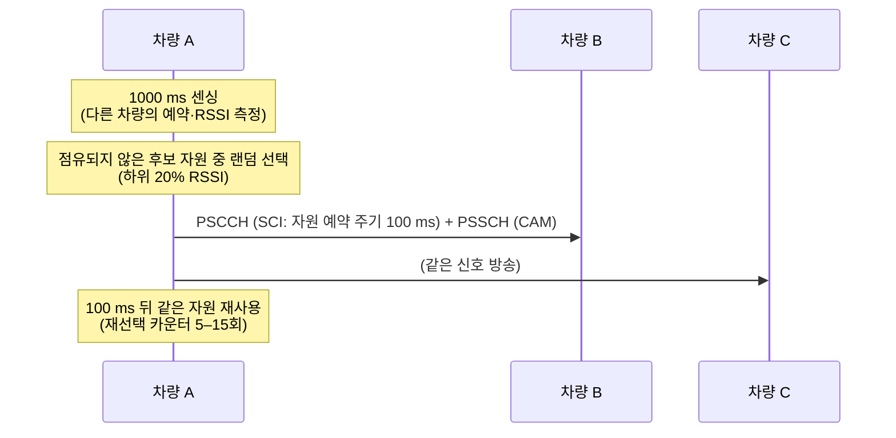

# C-V2X (LTE V2X)

!!! spec "스펙 · 릴리즈"
    사이드링크 물리계층: TS 36.211 §9, TS 36.213 §14 · V2X 구조: TS 23.285 · 요구사항: TS 22.185 · 5.9 GHz 밴드 47: TS 36.101

    Rel-12/13 D2D (ProSe) → **Rel-14 LTE V2X** → Rel-15 V2X 향상 → Rel-16 NR V2X (고급 서비스)

!!! basic "한눈에 보기"
    **V2X(Vehicle-to-Everything)**는 차량이 주변과 직접 정보를 주고받는 기술입니다.

    - **V2V**: 차량 ↔ 차량 (급정거 경고, 교차로 충돌 경고)
    - **V2I**: 차량 ↔ 신호등·도로 시설
    - **V2P**: 차량 ↔ 보행자 단말
    - **V2N**: 차량 ↔ 망(서버)

    LTE V2X는 두 경로를 씁니다.

    1. **PC5 (사이드링크)**: 기지국을 거치지 않고 **단말끼리 직접** 통신. 커버리지 밖에서도 동작, 지연이 짧음
    2. **Uu**: 일반 LTE처럼 기지국을 거침 (V2N, 넓은 범위 정보)

    차량은 초당 10회 정도 자기 위치·속도·방향을 담은 메시지(CAM/BSM)를 주변에 방송합니다.

## PC5 자원 할당 모드 { .l2 }

| 모드 | 자원 선택 | 커버리지 | 특징 |
|---|---|---|---|
| **Mode 3** | 기지국이 스케줄링 (DCI 5A) | 망 안 | 중앙 제어로 충돌 감소 |
| **Mode 4** | 단말이 **센싱 기반**으로 스스로 선택 | 망 안/밖 | 1초간 센싱 후 비어 있는 자원 예약 (SPS 성격) |

## 물리 채널 { .l2 }

| 채널 | 역할 |
|---|---|
| **PSCCH** | 사이드링크 제어 정보 (SCI format 1: MCS, 자원 예약, 우선순위) |
| **PSSCH** | 사이드링크 데이터 |
| PSBCH | 사이드링크 동기·방송 (SLSS와 함께) |
| PSDCH | 디스커버리 (D2D) |

LTE V2X는 PSCCH와 PSSCH를 **같은 서브프레임, 인접 RB**에 두어(서브채널 구조) 반이중 문제와 전력 효율을 개선했습니다.

## 고속 이동 대응 { .l2 }

상대 속도 최대 500 km/h, 5.9 GHz → 도플러 약 2.7 kHz. 이를 위해 사이드링크 서브프레임에 **DMRS를 4개**(LTE UL은 2개) 넣어 시간 방향 채널 추적을 강화했습니다.

??? expert "전문가 노트 — 동기, 혼잡 제어, NR V2X"
    **동기 소스 우선순위.** GNSS → eNB → 다른 단말의 SLSS 순으로 동기를 맞춥니다. 커버리지 밖에서도 GNSS로 전 차량이 같은 타이밍을 공유합니다.

    **혼잡 제어.** 단말은 **CBR(Channel Busy Ratio)**을 측정하고, 우선순위별로 허용된 **CR(Channel occupancy Ratio)** 한도를 지킵니다. 혼잡하면 MCS를 높이거나 전송 주기를 늘리고 전력을 낮춥니다.

    **Rel-15 향상.** 사이드링크 CA(최대 8 캐리어), 64QAM, 전송 다이버시티, 자원 선택 지연 단축(지연 20 ms → 짧은 예약), Mode 3/4 자원 풀 공유.

    **Uu 기반 V2X.** 하향은 SC-PTM/eMBMS로 지역 방송, 상향은 여러 SPS 설정(최대 8개, 주기 다양화)으로 V2X 메시지 주기를 맞춥니다.

    **NR V2X (Rel-16).** LTE V2X는 기본 안전 메시지(방송)용이고, **군집 주행, 원격 운전, 센서 공유** 같은 고급 서비스를 위해 NR 사이드링크가 만들어졌습니다.
    - **유니캐스트·그룹캐스트** + 사이드링크 HARQ 피드백(PSFCH)
    - Mode 1(기지국 스케줄) / Mode 2(자율 선택)
    - 같은 차량이 LTE V2X(기본 안전)와 NR V2X(고급)를 함께 쓰는 공존 구조(in-device coexistence)
    → [Sidelink와 NR V2X](../../nr/advanced/sidelink.md)

## 관련 페이지

- [Sidelink와 NR V2X](../../nr/advanced/sidelink.md)
- [LTE 스케줄링](../procedures/scheduling.md) — SPS
- [eMBMS](mbms.md)
