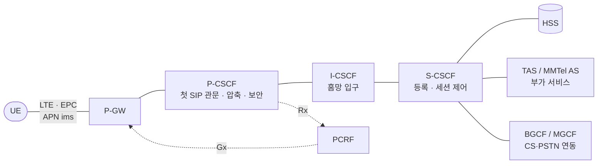
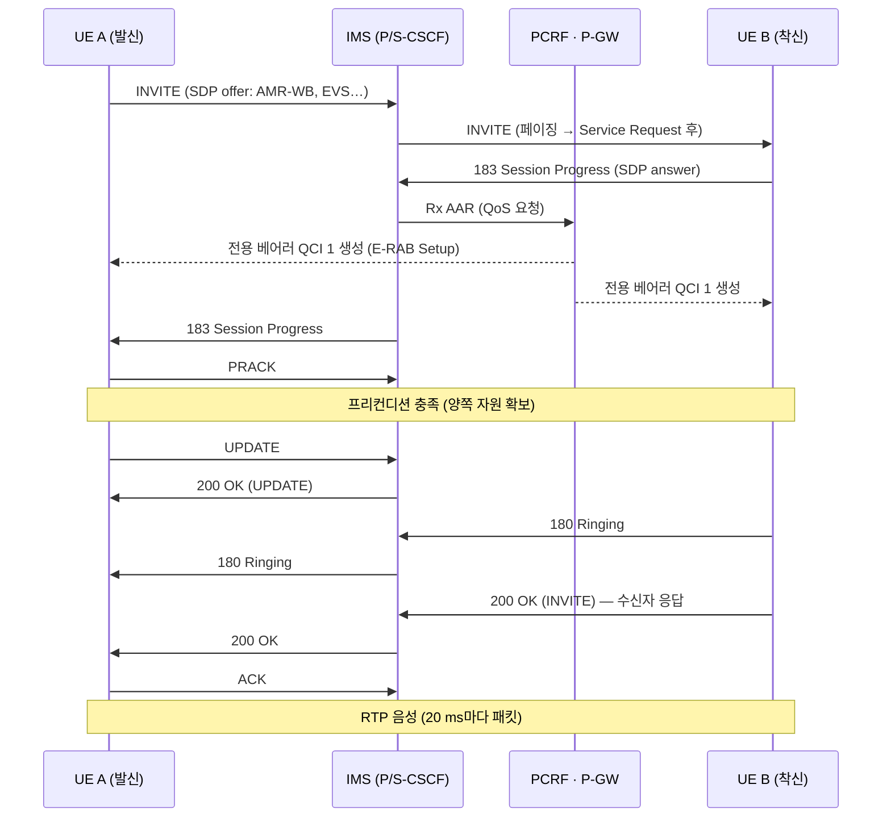

# VoLTE와 IMS

!!! spec "스펙 · 릴리즈"
    IMS 구조: TS 23.228 · VoLTE 프로파일: GSMA IR.92 · MMTel: TS 24.173 · SIP/SDP 절차: TS 24.229 · 코덱: TS 26.114 (AMR, AMR-WB, EVS) · SRVCC: TS 23.216 · CSFB: TS 23.272

    Rel-7/8 IMS → Rel-8 LTE (VoLTE) → Rel-12 EVS 코덱 → Rel-14 강화된 커버리지·ViLTE 최적화

!!! basic "한눈에 보기"
    LTE에는 전화 교환기(회선 교환망)가 없습니다. 그래서 음성통화도 **인터넷 전화처럼 IP 패킷**으로 보냅니다. 이것이 **VoLTE(Voice over LTE)**입니다.

    - 통화 제어는 **IMS**(IP Multimedia Subsystem)라는 별도의 시스템이 **SIP** 프로토콜로 처리합니다.
    - 음성 데이터는 **RTP** 패킷으로, 품질이 보장된 **QCI 1 전용 베어러**를 통해 전달됩니다.
    - 3G 음성보다 통화 연결이 빠르고(약 1–2초), HD 음질(AMR-WB, EVS)을 지원합니다.

    VoLTE가 없던 초기 LTE 단말은 전화가 오면 3G로 내려가서 받았습니다(**CSFB**).

## IMS 구조 { .l2 }

| 노드 | 역할 |
|---|---|
| **P-CSCF** | 단말이 처음 만나는 SIP 프록시. IPsec 보안 연계, SigComp, **Rx로 PCRF에 QoS 요청** |
| I-CSCF | HSS 조회로 담당 S-CSCF 선택 |
| **S-CSCF** | 등록(REGISTER) 처리, 인증, 세션 라우팅, iFC로 AS 호출 |
| TAS (MMTel AS) | 착신 전환, 통화 대기, 다자통화 등 부가 서비스 |
| MRF | 안내 방송, 회의 믹싱 |
| BGCF / MGCF / IMS-MGW | 일반 전화(PSTN)·3G CS 망과 연동 |

## VoLTE 베어러 구성 { .l2 }

| 베어러 | APN | QCI | RLC | 내용 |
|---|---|---|---|---|
| 기본 | ims | **5** | AM | SIP 시그널링 |
| 전용 (통화 중) | ims | **1** | UM | RTP/RTCP 음성 (GBR) |
| 전용 (영상통화) | ims | 2 | UM 또는 AM | 영상 (ViLTE) |

## 통화 연결 흐름 { .l2 }

## 무선 구간 최적화 { .l2 }

| 기능 | 효과 |
|---|---|
| **ROHC** | IP/UDP/RTP 헤더 40–60바이트 → 1–3바이트 |
| **SPS** | 20 ms 주기 자원 고정 → PDCCH 오버헤드 감소 |
| **C-DRX** (40 ms 주기 등) | 통화 중 배터리 절약 |
| **TTI bundling** | 셀 가장자리 상향 커버리지 확보 (4 서브프레임 반복) |
| RLC UM | 재전송 지연 없음 (늦은 음성은 쓸모 없음) |
| Jitter buffer | 단말에서 패킷 도착 시간 변동 흡수 |

## 코덱 { .l2 }

| 코덱 | 대역 | 비트레이트 | 비고 |
|---|---|---|---|
| AMR-NB | 협대역 (300–3400 Hz) | 4.75 – 12.2 kbps | 3G 음성과 동일 |
| **AMR-WB** | 광대역 (50–7000 Hz) | 6.6 – 23.85 kbps | "HD Voice", 12.65 kbps 흔함 |
| **EVS** (Rel-12) | 초광대역·전대역 (최대 20 kHz) | 5.9 – 128 kbps | 채널 인지 모드(CAM), 패킷 손실에 강함 |

??? expert "전문가 노트 — 커버리지, SRVCC, 긴급 호"
    **VoLTE 용량.** 20 MHz 셀에서 VoLTE 동시 통화는 이론적으로 수백 건입니다. 실제 병목은 PDCCH(SPS가 아니면 패킷마다 DCI), PUCCH, 셀 가장자리 상향 전력입니다.

    **링크 버짓.** AMR-WB 12.65 kbps 상향은 TTI bundling + 낮은 MCS + 3 PRB 정도로, 셀 가장자리 MAPL(최대 허용 경로 손실)이 3G 음성과 비슷하거나 약간 좋게 설계됩니다. EVS 채널 인지 모드는 수신 측에서 이전 프레임의 부분 중복을 이용해 패킷 손실 10%에서도 품질을 유지합니다.

    **SRVCC (Single Radio Voice Call Continuity).** LTE 커버리지가 끝날 때 진행 중인 VoLTE를 3G/2G CS로 넘깁니다.
    MeasurementReport (B2) → eNB HO Required (SRVCC 지시) → MME가 **Sv**로 MSC Server에 PS-to-CS 요청 → MSC가 IMS 세션 전환(STN-SR) + 3G 자원 준비 → HO Command.
    eSRVCC(Rel-10)는 방문망의 ATCF/ATGW가 미디어 경로를 앵커링해서 전환 시 음성 중단을 300 ms 이하로 줄입니다. Rel-11 vSRVCC(영상), Rel-12 rSRVCC(3G → LTE 역방향).

    **CSFB (Circuit Switched Fallback).** VoLTE 전 단계 해법. combined attach로 MSC에 등록 → 착신 시 SGs 페이징 → Extended Service Request → RRC Release with redirection(또는 PS HO) → 3G에서 CS 통화. 연결 지연이 1–3초 늘고, 통화 중 데이터가 3G 속도로 떨어집니다.

    **긴급 호.** 단말은 Emergency PDN(`EPS attach type = emergency` 또는 PDN 요청 type emergency)을 열고 SIP INVITE에 urn:service:sos를 씁니다. 인증 없이(USIM 없음 포함, 사업자 정책) 접속을 허용할 수 있습니다. 위치 정보는 E-SMLC·LPP로 얻습니다.

    **VoNR.** 5G SA에서는 같은 IMS를 쓰고 5QI 1 QoS 플로우로 음성을 전달하는 **VoNR**을 씁니다. NSA에서는 음성이 LTE(VoLTE)로 갑니다. SA 초기에는 **EPS Fallback**(NR → LTE로 넘겨 VoLTE 수행)을 씁니다.

## 관련 페이지

- [베어러와 QoS](../architecture/bearer-qos.md)
- [PDCP](../protocol/pdcp.md) — ROHC
- [DRX](../procedures/drx.md)
- [핸드오버](../procedures/handover.md) — SRVCC
