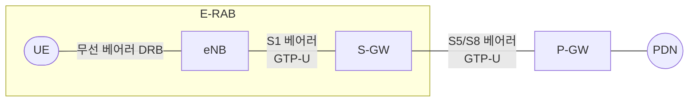

# 베어러와 QoS

!!! spec "스펙 · 릴리즈"
    EPS 베어러: TS 23.401 §4.7 · QCI 표: TS 23.203 Table 6.1.7 · E-UTRAN QoS: TS 36.300 §13

    Rel-8~ (Rel-12 MCPTT QCI 65–70, Rel-14 V2X QCI 75/79, Rel-15 저지연 QCI 80, 82–85)

!!! basic "한눈에 보기"
    **베어러(bearer)**는 단말과 인터넷 게이트웨이(P-GW) 사이에 만든 **QoS가 정해진 데이터 통로**입니다.

    - 단말이 망에 붙으면 **기본(default) 베어러**가 하나 생깁니다. 인터넷 접속용, 품질 보장 없음.
    - 음성통화(VoLTE)처럼 품질이 중요한 서비스는 **전용(dedicated) 베어러**를 따로 만듭니다.
    - 각 베어러에는 **QCI**라는 등급 번호가 붙고, 기지국은 이 번호를 보고 스케줄링 우선순위를 정합니다.

    고속도로에 일반 차로와 버스 전용 차로가 있는 것과 비슷합니다.

## EPS 베어러 구조 { .l2 }

| 구간 | 이름 | 식별 |
|---|---|---|
| UE – eNB | 데이터 무선 베어러 (DRB) | DRB ID, LCID (3–10) |
| eNB – S-GW | S1 베어러 | TEID |
| UE – S-GW | E-RAB = DRB + S1 베어러 | E-RAB ID (= EBI) |
| S-GW – P-GW | S5/S8 베어러 | TEID |
| UE – P-GW | **EPS 베어러** | EBI (5–15) |

EBI는 4비트이고 5–15만 쓰므로 단말 하나는 최대 **11개 EPS 베어러**를 가질 수 있습니다(Rel-8 단말은 DRB 최대 8개).

## QoS 파라미터 { .l2 }

| 파라미터 | 의미 |
|---|---|
| **QCI** | QoS 등급 (자원 유형, 우선순위, 지연 예산, 패킷 손실률을 묶은 번호) |
| **ARP** | 자원이 부족할 때 베어러 생성·선점 우선순위 (1–15, 선점 가능/취약 플래그) |
| **GBR / MBR** | GBR 베어러의 보장 비트레이트 / 최대 비트레이트 |
| **APN-AMBR** | APN 하나에 속한 모든 non-GBR 베어러 합의 최대 비트레이트 (P-GW 집행) |
| **UE-AMBR** | 단말의 모든 non-GBR 베어러 합의 최대 비트레이트 (eNB 집행) |
| **TFT** | 어떤 IP 패킷을 이 베어러로 보낼지 정하는 패킷 필터 (5-tuple 등) |

## 표준 QCI { .l2 }

| QCI | 유형 | 우선순위 | 지연 예산 | 패킷 손실률 | 대표 서비스 |
|---|---|---|---|---|---|
| 1 | GBR | 2 | 100 ms | 10⁻² | VoLTE 음성 |
| 2 | GBR | 4 | 150 ms | 10⁻³ | 영상통화 (ViLTE) |
| 3 | GBR | 3 | 50 ms | 10⁻³ | 실시간 게임, V2X 메시지 |
| 4 | GBR | 5 | 300 ms | 10⁻⁶ | 버퍼링 스트리밍 영상 |
| 5 | Non-GBR | 1 | 100 ms | 10⁻⁶ | **IMS 시그널링 (SIP)** |
| 6 | Non-GBR | 6 | 300 ms | 10⁻⁶ | 영상(버퍼링), TCP 서비스 |
| 7 | Non-GBR | 7 | 100 ms | 10⁻³ | 음성/영상 라이브, 대화형 게임 |
| 8 | Non-GBR | 8 | 300 ms | 10⁻⁶ | TCP 서비스 (프리미엄 가입자 기본 베어러) |
| 9 | Non-GBR | 9 | 300 ms | 10⁻⁶ | **기본 베어러** (일반 인터넷) |

우선순위 숫자가 작을수록 높은 우선순위입니다. 지연 예산(PDB)은 단말과 PCEF(P-GW) 사이 전체 기준이며, 이 중 약 20 ms(QCI 1의 경우)는 핵심망 구간으로 가정합니다.

## VoLTE 단말의 베어러 예 { .l2 }

| 베어러 | APN | QCI | 내용 |
|---|---|---|---|
| 기본 | `internet` | 9 | 일반 데이터 |
| 기본 | `ims` | 5 | SIP 시그널링 |
| 전용 (통화 중에만) | `ims` | 1 | RTP 음성 (GBR, 예: AMR-WB 약 40 kbps) |

??? expert "전문가 노트 — 베어러 설정 흐름과 eNB 동작"
    **전용 베어러 생성 (망 주도).** P-CSCF(IMS) → Rx → PCRF → Gx(RAR) → P-GW → S5 Create Bearer Request → S-GW → S11 → MME → S1AP **E-RAB Setup Request** (NAS Activate Dedicated EPS Bearer Context Request 포함) → eNB가 RRCConnectionReconfiguration으로 DRB 추가.

    **eNB에서의 QCI 반영.** QCI는 무선 구간에서 직접 전달되지 않습니다. eNB가 QCI별 설정(PDCP discard timer, RLC 모드 AM/UM, 논리 채널 우선순위, prioritisedBitRate, 스케줄러 가중치)을 정해 DRB를 만듭니다.
    예: QCI 1 → RLC UM, ROHC, 짧은 discard timer, SPS 또는 TTI bundling 활성화

    **UL에서의 TFT.** 단말도 UL TFT를 받아서 상향 패킷을 어느 베어러로 보낼지 정합니다. 기본 베어러는 TFT가 없거나 match-all입니다.

    **추가 QCI (TS 23.203).**
    - 65, 66: MCPTT 음성 (GBR) · 69, 70: MCPTT 시그널링·데이터 (Non-GBR)
    - 75: V2X 메시지 (GBR) · 79: V2X (Non-GBR)
    - 80: 저지연 eMBB (AR) · 82–85: **Delay-critical GBR** (자원 유형 신설, 최대 데이터 버스트 크기 MDBV 포함)

    **5G로의 연결.** NR/5GC에서는 베어러 대신 **QoS 플로우**(QFI)를 쓰고, QCI 대신 **5QI**를 씁니다. 5QI 1–9 값은 QCI와 호환되게 정의되었습니다. → [QoS 플로우](../../nr/architecture/qos-flow.md)

## 관련 페이지

- [인터페이스 (Uu·S1·X2)](interfaces.md)
- [VoLTE와 IMS](../advanced/volte-ims.md)
- [Attach](../procedures/attach.md) — 기본 베어러가 만들어지는 과정
- [PDCP](../protocol/pdcp.md)
