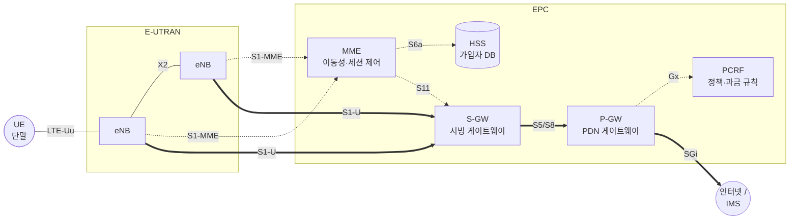

# E-UTRAN과 EPC

!!! spec "스펙 · 릴리즈"
    무선망 구조: TS 36.300 §4 · 핵심망 구조: TS 23.401 §4 (EPS 구조, 참조점) · 비3GPP 접속: TS 23.402

    Rel-8~ (Rel-12 이중 연결, Rel-14 CUPS로 S/P-GW 분리)

!!! basic "한눈에 보기"
    LTE 시스템 전체를 **EPS(Evolved Packet System)**라고 부르고, 두 부분으로 나뉩니다.

    - **E-UTRAN** (무선 접속망): 기지국 **eNB**들의 모임. 단말과 전파를 주고받고, 무선 자원을 관리합니다.
    - **EPC** (Evolved Packet Core, 핵심망): 가입자 인증, 이동성 관리, IP 주소 할당, 인터넷 연결을 맡습니다.

    EPC 안에서는 **제어(신호)**와 **데이터(사용자 트래픽)**가 다른 길로 갑니다.
    제어는 MME가 맡고, 데이터는 S-GW → P-GW를 거쳐 인터넷으로 나갑니다.

## 전체 구조 { .l2 }

실선 굵은 화살표(⇒)는 사용자 데이터 경로, 점선은 제어 신호 경로입니다.

## 3G와 비교 { .l2 }

| 항목 | 3G UMTS | LTE/EPS |
|---|---|---|
| 기지국 | NodeB (단순 송수신) | **eNB** (RRC, 스케줄링, 핸드오버 결정까지) |
| 기지국 제어기 | RNC | **없음** — 기능을 eNB와 MME로 분산 |
| 핵심망 | CS 도메인(MSC) + PS 도메인(SGSN, GGSN) | **PS만** (MME, S-GW, P-GW) |
| 음성 | 회선 교환 | VoLTE (IMS) 또는 CSFB(3G/2G로 전환) |
| 기지국 간 연결 | Iur (RNC 사이) | **X2** (eNB 직접) |

계층이 하나 줄어 지연이 짧아지고, 장비 수가 줄어 비용이 낮아졌습니다. 이를 **평평한(flat) 구조**라고 부릅니다.

## 기능 분담 { .l2 }

| 노드 | 주요 기능 |
|---|---|
| **eNB** | 무선 자원 관리(RRM), 스케줄링, 무선 베어러 제어, 연결 이동성(핸드오버 결정), 헤더 압축·암호화, MME 선택, 페이징 메시지 전송 |
| **MME** | NAS 시그널링·보안, 인증, Idle 단말 추적(TA 관리), 페이징 시작, S-GW/P-GW 선택, 베어러 관리, 로밍 |
| **S-GW** | 사용자 데이터 라우팅, eNB 간 핸드오버의 **이동성 앵커**, Idle 단말의 하향 데이터 버퍼링, 합법적 감청 |
| **P-GW** | **단말 IP 주소 할당**, 외부 PDN 연결, 패킷 필터링(TFT), 정책 집행(PCEF), 과금 |
| **HSS** | 가입자 정보, 인증 벡터 생성(AuC), 위치 등록 정보 |
| **PCRF** | QoS·과금 정책 결정 → P-GW에 규칙(PCC rule) 전달 |

??? expert "전문가 노트 — 구조의 변화와 실무 포인트"
    **CUPS (Rel-14, TS 23.214).** S-GW와 P-GW를 제어부(SGW-C, PGW-C)와 사용자부(SGW-U, PGW-U)로 나누고 **Sx 인터페이스(PFCP)**로 연결했습니다.
    사용자부를 엣지에 분산 배치할 수 있어 5GC의 SMF/UPF 분리로 이어졌습니다.

    **S5와 S8.** 같은 사업자 내 S-GW–P-GW는 S5, 로밍 시 방문망 S-GW와 홈망 P-GW 사이는 S8입니다(Home-routed). 로컬 브레이크아웃이면 방문망 P-GW를 씁니다.

    **MME 풀 / S1-flex.** eNB 하나가 여러 MME에 연결되어 부하 분산과 장애 대비를 합니다. 단말의 GUTI 안에 있는 MMEGI/MMEC로 담당 MME를 찾습니다.

    **기타 EPC 노드.**
    - **SGSN** (S3/S4): 2G/3G와의 이동성
    - **MSC/VLR** (SGs): CSFB, SMS over SGs
    - **PCRF** (Gx, Rx): IMS P-CSCF가 Rx로 음성 세션 QoS를 요청
    - **ePDG** (S2b): 비신뢰 Wi-Fi 접속(VoWiFi)
    - **SCEF** (Rel-13, T6a): NB-IoT 비IP 데이터 전달(NIDD)
    - **E-SMLC** (SLs): LTE 측위 서버

    **NSA(EN-DC)에서의 EPC.** 5G NSA Option 3x는 EPC를 그대로 쓰고, NR 기지국(en-gNB)은 X2로 eNB와, S1-U로 S-GW와 연결됩니다.
    단말 NAS는 여전히 EPS(24.301)입니다. → [NSA와 SA](../../nr/architecture/nsa-sa.md)

## 관련 페이지

- [네트워크 엔티티](entities.md)
- [인터페이스 (Uu·S1·X2)](interfaces.md)
- [베어러와 QoS](bearer-qos.md)
- [LTE 프로토콜 스택](../protocol/overview.md)
