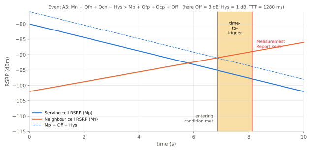
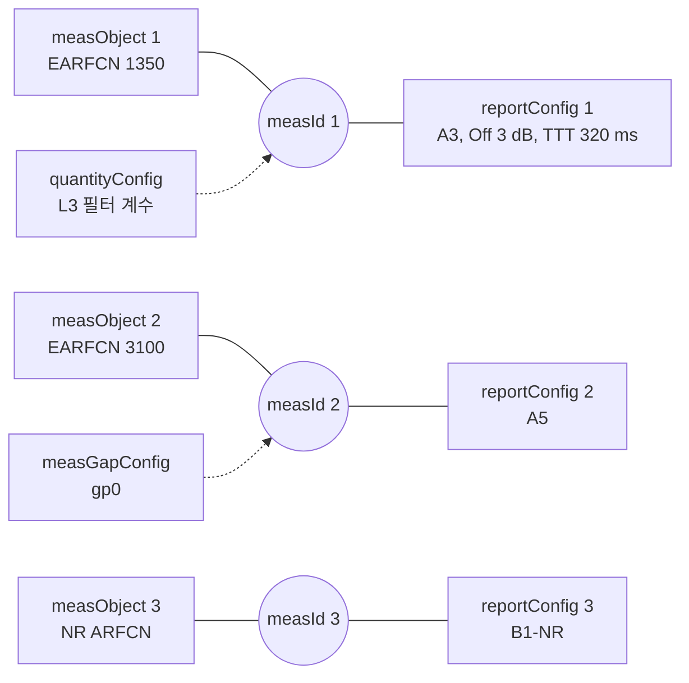

# 측정 이벤트

!!! spec "스펙 · 릴리즈"
    측정 설정·보고: TS 36.331 §5.5 (이벤트 정의 §5.5.4) · `MeasConfig`, `ReportConfigEUTRA`, `ReportConfigInterRAT` · 성능: TS 36.133

    Rel-8 A1–A5·B1–B2 → Rel-10 A6 → Rel-11 C1·C2 (CSI-RS) → Rel-14 V1·V2 (V2X) → Rel-15 H1·H2 (드론 고도), B1-NR·B2-NR (EN-DC)

!!! basic "한눈에 보기"
    연결 상태 단말은 기지국이 정한 **규칙(이벤트)**에 따라 주변 셀을 측정하고, 조건이 맞으면 보고합니다.

    - **A3**: "옆 셀이 지금 셀보다 3 dB 더 좋아졌어요" → 보통 **핸드오버** 계기
    - **A2**: "지금 셀이 많이 약해졌어요" → 다른 주파수 측정 시작
    - **B1**: "옆 시스템(예: 5G NR) 셀이 충분히 좋아요" → **5G 연결 추가**(EN-DC)

    모든 이벤트에는 **히스테리시스**(살짝 넘었다가 바로 돌아오는 것 무시)와 **Time-to-Trigger**(일정 시간 계속 만족해야 보고)가 있어서, 경계에서 핑퐁하는 것을 막습니다.

## 이벤트 목록 { .l2 }

| 이벤트 | 진입 조건 (요약) | 주 용도 |
|---|---|---|
| **A1** | 서빙 > 임계값 | 다른 주파수 측정 중지 (갭 해제) |
| **A2** | 서빙 < 임계값 | 다른 주파수 측정 시작 (갭 설정), 리디렉션 |
| **A3** | 이웃 > PCell + 오프셋 | **동일/다른 주파수 핸드오버** |
| **A4** | 이웃 > 임계값 | 부하 분산, SCell 후보 |
| **A5** | PCell < 임계값1 **그리고** 이웃 > 임계값2 | 다른 주파수 핸드오버 |
| A6 (Rel-10) | 이웃 > SCell + 오프셋 | SCell 교체 |
| **B1** | 다른 RAT 이웃 > 임계값 | **EN-DC NR 추가 (B1-NR)**, IRAT |
| **B2** | PCell < 임계값1 그리고 다른 RAT 이웃 > 임계값2 | SRVCC, 3G 핸드오버 |
| C1 / C2 (Rel-11) | CSI-RS 자원 기준 | CoMP |
| H1 / H2 (Rel-15) | 단말 고도 > / < 임계값 | 드론(공중 단말) |

## A3 이벤트 { .l2 }

\[
\text{진입: } M_n + O_{fn} + O_{cn} - Hys > M_p + O_{fp} + O_{cp} + Off
\]
\[
\text{이탈: } M_n + O_{fn} + O_{cn} + Hys < M_p + O_{fp} + O_{cp} + Off
\]

| 기호 | 의미 | RRC 필드 |
|---|---|---|
| \(M_n, M_p\) | 이웃 / PCell 측정값 (L3 필터 후 RSRP 또는 RSRQ) | `triggerQuantity` |
| \(O_{fn}, O_{fp}\) | 주파수별 오프셋 | `offsetFreq` (measObject) |
| \(O_{cn}, O_{cp}\) | **셀별 오프셋 (CIO)** | `cellIndividualOffset` |
| \(Hys\) | 히스테리시스 (0–15 dB, 0.5 dB 단위) | `hysteresis` |
| \(Off\) | A3 오프셋 (−15 ~ 15 dB, 0.5 dB 단위) | `a3-Offset` |

<figure markdown>

<figcaption>이웃 셀 RSRP가 서빙 + Off + Hys 선을 넘는 순간(진입 조건) 이후 TTT 동안 조건이 계속 유지되면 측정 보고가 나갑니다.</figcaption>
</figure>

## 측정 설정 구조 { .l2 }

**measId = measObject(무엇을) × reportConfig(언제·어떻게)**. 같은 측정 대상에 여러 보고 규칙을 붙일 수 있습니다.

| reportConfig 주요 필드 | 의미 |
|---|---|
| `triggerType` | event / periodical |
| `timeToTrigger` | 0, 40, 64, 80, 100, 128, 160, 256, 320, 480, 512, 640, 1024, 1280, 2560, 5120 ms |
| `reportInterval` | 이후 반복 보고 간격 (120 ms – 60 min) |
| `reportAmount` | 반복 횟수 (1 – infinity) |
| `maxReportCells` | 한 보고에 담을 최대 셀 수 (1–8) |
| `reportQuantity` | 보고할 측정량 (트리거 양만 / RSRP+RSRQ 모두) |

??? expert "전문가 노트 — 파라미터 튜닝과 특수 동작"
    **s-Measure.** PCell RSRP가 `s-Measure`보다 좋으면 이웃 셀 측정을 생략해도 됩니다(배터리 절약). 값이 너무 높으면 측정을 거의 안 하게 되어 핸드오버가 늦어질 수 있습니다.

    **TTT 선택.** 고속 이동은 짧은 TTT(40–100 ms) + 작은 hysteresis, 저속·핑퐁 지역은 긴 TTT(320–640 ms). CIO는 특정 셀 쌍만 경계를 옮겨 부하를 나누는 데 씁니다(MLB).

    **블랙리스트·화이트리스트.** measObject의 `blackCellsToAddModList`(PCI 범위)로 특정 셀을 보고에서 제외합니다. Rel-13 `whiteCellsToAddModList`도 있습니다.

    **reportCGI.** 미지의 PCI 셀의 ECGI를 읽어 보고하게 해서 ANR에 씁니다. 단말은 해당 셀의 SIB1을 읽기 위해 자율 갭(autonomous gap)을 씁니다.

    **EN-DC 측정 (Rel-15).** LTE `MeasObjectNR`(SSB 주파수, SMTC, 부반송파 간격)와 `ReportConfigInterRAT`의 **B1-NR**(NR 셀 SS-RSRP > 임계값)이 SgNB 추가의 트리거입니다. B1 임계값이 5G 연결률과 체감 품질의 핵심 튜닝 포인트입니다.

    **이벤트와 RSRQ.** 부하가 큰 셀에서는 RSRP는 좋지만 RSRQ가 나쁜 상황이 생깁니다. A2/A5에 RSRQ 트리거를 함께 쓰면 "신호는 세지만 혼잡한" 셀에서 벗어나는 데 유리합니다.

## 관련 페이지

- [RSRP·RSRQ·SINR](rsrp-rsrq.md)
- [핸드오버](../procedures/handover.md)
- [NR 측정 이벤트와 갭](../../nr/measurement/events-gaps.md)
