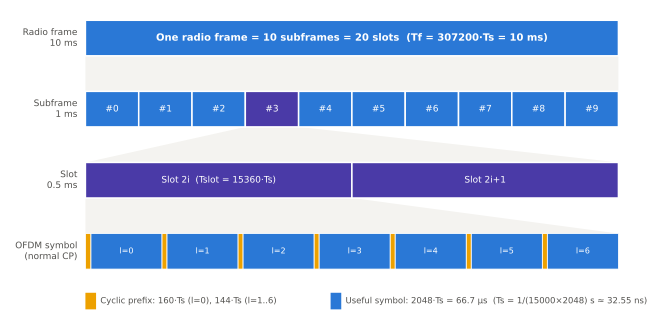
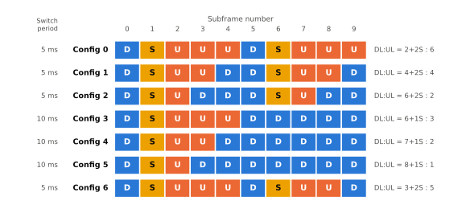

# 프레임 구조

!!! spec "스펙 · 릴리즈"
    TS 36.211 §4 (프레임 구조), §4.1 Type 1 (FDD), §4.2 Type 2 (TDD), §4.3 Type 3 (LAA, Rel-13) · §6.2.3 (슬롯 구조) · 타이밍: TS 36.211 §8.1, TS 36.213 §4.2.3

    Rel-8~ (Rel-11 특수 서브프레임 9, Rel-14 특수 서브프레임 10, Rel-15 sTTI)

!!! basic "한눈에 보기"
    LTE의 시간은 **달력처럼** 나뉘어 있습니다.

    - **무선 프레임 (radio frame)** = 10 ms. 번호(SFN)가 0–1023까지 돌아갑니다.
    - **서브프레임 (subframe)** = 1 ms. 프레임 하나에 10개. **스케줄링의 기본 단위(TTI)**입니다.
    - **슬롯 (slot)** = 0.5 ms. 서브프레임 하나에 2개.
    - **OFDM 심볼** = 약 71.4 µs. 슬롯 하나에 7개 (Normal CP 기준).

    FDD는 하향·상향 주파수가 따로 있어서 모든 서브프레임이 양방향으로 쓰입니다.
    TDD는 서브프레임마다 하향(D), 상향(U), 전환용 특수(S) 중 하나로 정해집니다.

## 시간 단위 { .l2 }

LTE의 모든 시간은 기본 단위 \(T_s\)의 정수배로 정의됩니다.

\[
T_s = \frac{1}{15000 \times 2048}\ \text{s} \approx 32.55\ \text{ns}
\]

(15 kHz 부반송파 간격 × 2048-point FFT = 30.72 MHz 샘플링 주기)

| 단위 | 길이 | \(T_s\) 단위 |
|---|---|---|
| 무선 프레임 \(T_f\) | 10 ms | 307200 |
| 하프 프레임 | 5 ms | 153600 |
| 서브프레임 | 1 ms | 30720 |
| 슬롯 \(T_{slot}\) | 0.5 ms | 15360 |
| 유효 심볼 \(T_u\) | 66.67 µs | 2048 |

<figure markdown>

<figcaption>무선 프레임 → 서브프레임 → 슬롯 → OFDM 심볼. 슬롯의 첫 심볼만 CP가 조금 더 길어서(160 Ts) 7개 심볼이 정확히 0.5 ms에 들어갑니다.</figcaption>
</figure>

## CP 길이 { .l2 }

| 구성 | 부반송파 간격 | 슬롯당 심볼 | CP 길이 (\(T_s\)) | CP 길이 (µs) |
|---|---|---|---|---|
| **Normal CP** | 15 kHz | 7 | 160 (l=0), 144 (l=1–6) | 5.21 / 4.69 |
| **Extended CP** | 15 kHz | 6 | 512 | 16.67 |
| Extended CP (MBSFN 전용) | 7.5 kHz | 3 | 1024 | 33.33 |

검산: Normal CP 슬롯 = 160 + 2048 + 6 × (144 + 2048) = **15360 Ts** ✔

## 프레임 타입 1 — FDD { .l2 }

- 10개 서브프레임 모두 DL(하향 반송파)과 UL(상향 반송파)에서 동시에 사용
- 동기신호: 서브프레임 0과 5, PBCH: 서브프레임 0
- HARQ: PDSCH(n) → ACK/NACK(n+4), UL grant(n) → PUSCH(n+4) → PHICH(n+8)

## 프레임 타입 2 — TDD { .l2 }

5 ms 하프 프레임 두 개로 구성되고, 서브프레임마다 방향이 정해집니다. **UL/DL configuration** 7가지가 있습니다(SIB1의 `tdd-Config`).

<figure markdown>

<figcaption>TDD UL/DL configuration 0–6 (TS 36.211 Table 4.2-2). 전환 주기가 5 ms인 구성은 서브프레임 6도 특수 서브프레임입니다. 서브프레임 0, 5는 항상 DL, 서브프레임 1은 항상 S, 2는 항상 UL입니다.</figcaption>
</figure>

### 특수 서브프레임

DL → UL 전환을 위해 하나의 서브프레임을 세 부분으로 나눕니다.

- **DwPTS**: 하향 부분. PDCCH와(길면) PDSCH, PSS 전송
- **GP**: 보호 구간. 셀 반경(왕복 지연)과 기지국 간 간섭을 흡수
- **UpPTS**: 상향 부분. 짧은 PRACH(format 4), SRS만 전송 가능

| 특수 서브프레임 구성 (Normal CP) | DwPTS | GP | UpPTS | 비고 |
|---|---|---|---|---|
| 0 | 3 | 10 | 1 | GP 최대 → 큰 셀 |
| 1 | 9 | 4 | 1 | |
| 2 | 10 | 3 | 1 | |
| 3 | 11 | 2 | 1 | |
| 4 | 12 | 1 | 1 | |
| 5 | 3 | 9 | 2 | |
| 6 | 9 | 3 | 2 | |
| 7 | 10 | 2 | 2 | 널리 쓰임 (10:2:2) |
| 8 | 11 | 1 | 2 | |
| 9 (Rel-11) | 6 | 6 | 2 | TD-SCDMA 공존 |

단위: OFDM 심볼. 구성 10(Rel-14)은 UpPTS를 늘려 상향 용량을 보강하는 구성입니다.

!!! tip "GP와 셀 반경"
    GP 1 심볼 ≈ 71.4 µs → 왕복 거리 약 21.4 km → 셀 반경 약 **10.7 km**.
    10:2:2 (구성 7)는 GP 2 심볼로 약 21 km까지 지원합니다(실제로는 기지국 간 간섭 여유를 위해 더 작게 운용).

??? expert "전문가 노트 — 타이밍, SFN, 프레임 타입 3"
    **상향 타이밍.** 단말의 UL 프레임 \(i\)는 DL 프레임 \(i\)보다 \((N_{TA} + N_{TA,offset}) \cdot T_s\) 먼저 시작합니다.
    \(N_{TA,offset}\) = 0 (FDD), **624** (TDD, 약 20.3 µs) — TDD에서 기지국이 수신→송신 전환할 시간을 확보합니다.

    **SFN과 H-SFN.** SFN은 10비트(0–1023, 주기 10.24 s)입니다. MIB에는 상위 8비트만 있고 하위 2비트는 PBCH의 40 ms 주기 안의 위치로 알아냅니다.
    Rel-13에서 eDRX용 **H-SFN**(Hyper SFN, 10비트, SIB1에 포함)이 추가되어 최대 1024 × 10.24 s ≈ 2.9시간 주기를 셀 수 있습니다.

    **DwPTS의 PDSCH.** DwPTS가 3 심볼인 구성 0, 5에서는 PDSCH를 보낼 수 없습니다. 그 외 구성에서 DwPTS PDSCH의 TBS는 PRB 수를 \(\lfloor N'_{PRB} \times 0.75 \rfloor\)로 줄여서 구합니다(구성 9, 10은 0.375).

    **프레임 타입 3 (LAA, Rel-13).** 비면허 대역 SCell 전용입니다. 고정된 D/U 패턴 없이 **LBT(Listen Before Talk)** 후 채널을 확보한 서브프레임에서 전송합니다.
    채널 점유 시작·끝이 서브프레임 경계와 맞지 않을 수 있어 **부분 서브프레임**(ending partial: DwPTS 길이, Rel-14 starting partial: 두 번째 슬롯부터)을 지원합니다. Rel-14 eLAA부터 UL도 가능합니다.

    **sTTI (Rel-15).** 지연 단축을 위해 TTI를 2/3 심볼(subslot) 또는 1 슬롯(7 심볼)으로 줄이는 기능입니다. sPDCCH, sPDSCH, sPUCCH, sPUSCH와 DCI 7-x 포맷이 추가되었습니다. 상용화는 제한적이었고, 같은 목표는 NR의 미니슬롯과 유연한 numerology로 이어졌습니다.

    **eIMTA (Rel-12).** TDD UL/DL 구성을 DCI format 1C(eIMTA-RNTI)로 10–80 ms 단위로 동적으로 바꾸는 기능입니다. HARQ 타이밍은 기준 구성(reference configuration)을 따릅니다.

## LTE ↔ NR 비교

| 항목 | LTE | NR |
|---|---|---|
| 프레임 / 서브프레임 | 10 ms / 1 ms | 10 ms / 1 ms (동일) |
| 슬롯 길이 | 0.5 ms 고정 | 1 ms / 2^μ (μ=0–6) |
| 슬롯당 심볼 | 7 (Normal CP) | 14 (Normal CP) |
| 스케줄링 단위 | 서브프레임 (1 ms) | 슬롯 또는 미니슬롯 (2, 4, 7 심볼) |
| TDD 패턴 | 7가지 고정 구성 | 심볼 단위로 자유롭게 설정 |
| 기본 시간 단위 | \(T_s\) ≈ 32.55 ns | \(T_c\) ≈ 0.509 ns (\(T_s = 64\,T_c\)) |

## 관련 페이지

- [리소스 그리드](resource-grid.md)
- [듀플렉싱 (FDD/TDD)](../../basics/duplexing.md)
- [NR Numerology와 프레임 구조](../../nr/phy/numerology.md)
