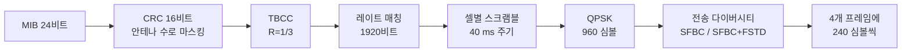

# PBCH와 MIB

!!! spec "스펙 · 릴리즈"
    TS 36.211 §6.6 (PBCH) · TS 36.212 §5.3.1 (BCH 전송 채널 처리) · TS 36.331 §6.2.2 (`MasterInformationBlock`)

    Rel-8~ (Rel-13 eMTC용 SIB1-BR 스케줄링 필드, PBCH 반복)

!!! basic "한눈에 보기"
    동기신호로 셀을 찾은 단말이 가장 먼저 읽는 정보가 **MIB(Master Information Block)**입니다. MIB는 **PBCH**라는 방송 채널로 전송됩니다.

    MIB에는 딱 필요한 것만 들어 있습니다.

    - 셀의 **하향 대역폭** (6 ~ 100 RB)
    - **PHICH 설정** (PDCCH 영역을 해석하는 데 필요)
    - **시스템 프레임 번호(SFN)**

    MIB를 읽어야 PDCCH를 해석할 수 있고, PDCCH를 해석해야 SIB1을 읽을 수 있습니다.

## MIB 내용 { .l2 }

| 필드 | 비트 | 값 |
|---|---|---|
| `dl-Bandwidth` | 3 | n6, n15, n25, n50, n75, n100 |
| `phich-Config` — `phich-Duration` | 1 | normal (1 심볼) / extended (3 심볼) |
| `phich-Config` — `phich-Resource` | 2 | Ng = 1/6, 1/2, 1, 2 |
| `systemFrameNumber` | 8 | SFN의 상위 8비트 |
| `schedulingInfoSIB1-BR-r13` | 5 | eMTC용 SIB1-BR 스케줄링 (0이면 미지원) |
| `systemInfoUnchanged-BR-r15` 등 | 1 | eMTC SI 변경 여부 |
| spare | 나머지 | — |
| **합계** | **24** | |

## 시간·주파수 위치 { .l2 }

- **서브프레임 0의 두 번째 슬롯, 첫 4 심볼** (Normal CP 기준 l = 0–3)
- **중앙 72 부반송파** (6 RB)
- 같은 MIB를 **40 ms 동안 4번** 나누어 보냄 (각 10 ms 조각만으로도 디코딩 가능)

[리소스 그리드](resource-grid.md#실제-서브프레임-0의-모습) 페이지의 서브프레임 0 그림에서 노란색 영역입니다.

## 처리 과정 { .l2 }

| 단계 | 값 |
|---|---|
| 페이로드 + CRC | 24 + 16 = 40비트 |
| 부호화 후 | 120비트 |
| 레이트 매칭 후 | 1920비트 (Normal CP) / 1728비트 (Extended CP) |
| 프레임당 RE | 72 × 4 − 48(4포트 CRS 예약) = **240 RE** |

??? expert "전문가 노트 — 블라인드 검출 정보"
    **CRS 포트 수 검출.** CRC 16비트를 송신 안테나 포트 수에 따라 다른 마스크로 XOR합니다.

    | CRS 포트 | CRC 마스크 |
    |---|---|
    | 1 | 0x0000 |
    | 2 | 0xFFFF |
    | 4 | 0x5555 (0101…) |

    단말은 세 가설로 디코딩해 CRC가 맞는 것으로 **안테나 포트 수**를 알아냅니다. PBCH 자체는 4포트 CRS 위치를 비워 두고 매핑하므로 포트 수를 몰라도 RE 위치는 같습니다.

    **SFN 하위 2비트.** 스크램블 시퀀스가 SFN mod 4 = 0인 프레임에서 초기화되므로, 단말은 4개 위상 가설로 디스크램블해서 성공한 위상으로 하위 2비트를 얻습니다. 결과적으로 MIB의 8비트 + 2비트 = 10비트 SFN.

    **결합 디코딩.** 신호가 약하면 4개 조각을 소프트 결합해 최대 약 6 dB 이득을 얻습니다. 다만 결합할 조각의 40 ms 경계를 모르기 때문에 경계 가설을 함께 시험해야 합니다.

    **MIB 변경.** 대역폭과 PHICH 설정은 사실상 고정이고, 바뀌는 것은 SFN뿐입니다. 그래서 단말은 SFN만 필요할 때 이전에 알던 내용과 비교해 빠르게 검증할 수 있습니다.

    **eMTC PBCH 반복 (Rel-13).** 커버리지 향상(CE)을 위해 서브프레임 0 외에 서브프레임 9(FDD)나 5(TDD)에도 PBCH 심볼을 반복 전송하는 옵션이 있습니다.

## LTE ↔ NR 비교

| 항목 | LTE PBCH | NR PBCH |
|---|---|---|
| 부호 | TBCC | Polar |
| 페이로드 | 24비트 MIB | 32비트 (MIB 24 + 타이밍 8) |
| 대역 | 72 부반송파 | 240 부반송파 (SSB 안) |
| 복조 기준신호 | CRS | PBCH 전용 DMRS |
| TTI | 40 ms | 80 ms |
| 추가 정보 | 안테나 포트 수 (CRC 마스크) | SSB 인덱스, 하프 프레임, CORESET#0 위치 |

## 관련 페이지

- [동기신호 (PSS·SSS)](pss-sss.md)
- [PCFICH·PHICH](pcfich-phich.md)
- [셀 탐색과 시스템 정보](../procedures/cell-search.md)
- [NR SSB 구조](../../nr/phy/ssb.md)
