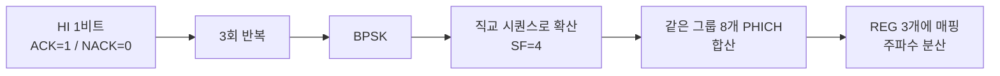

# PCFICH · PHICH

!!! spec "스펙 · 릴리즈"
    TS 36.211 §6.7 (PCFICH), §6.9 (PHICH) · TS 36.212 §5.3.4 (CFI 부호화), §5.3.5 (HI 부호화) · TS 36.213 §9.1.2 (PHICH 자원 할당)

    Rel-8~ (Rel-11 ePDCCH 사용 시에도 PCFICH 유지)

!!! basic "한눈에 보기"
    LTE 하향 서브프레임의 앞부분(1–3 심볼)은 **제어 영역**입니다. 여기에는 세 가지 채널이 섞여 있습니다.

    - **PCFICH**: "이번 서브프레임 제어 영역은 몇 심볼이다(CFI)"를 알려줍니다. 단말은 이걸 먼저 읽어야 PDCCH가 어디까지인지 압니다.
    - **PHICH**: 단말이 보낸 상향 데이터(PUSCH)를 **잘 받았는지(ACK/NACK)** 알려 줍니다.
    - **PDCCH**: 스케줄링 정보(DCI). → [PDCCH와 DCI](pdcch-dci.md)

## PCFICH { .l2 }

| 항목 | 값 |
|---|---|
| 정보 | CFI = 1, 2, 3 (2비트) |
| 부호화 | (32, 2) 블록 부호 → 32비트 |
| 변조 | QPSK → 16 심볼 |
| 자원 | **항상 첫 번째 심볼**, REG 4개(16 RE)를 대역 전체에 1/4 간격으로 분산 |
| 위치 결정 | 시작 위치가 PCI에 따라 이동 → 이웃 셀과 충돌 회피 |

| CFI | 제어 영역 심볼 수 (\(N_{RB} > 10\)) | 제어 영역 심볼 수 (\(N_{RB} \le 10\), 1.4 MHz) |
|---|---|---|
| 1 | 1 | 2 |
| 2 | 2 | 3 |
| 3 | 3 | 4 |

제어 영역이 길면 PDCCH 용량(동시 스케줄 단말 수)이 늘지만, PDSCH 자원이 줄어듭니다. 기지국은 서브프레임마다 CFI를 바꿀 수 있습니다.

## PHICH { .l2 }

| 항목 | Normal CP | Extended CP |
|---|---|---|
| 확산 계수 (SF) | 4 | 2 |
| 그룹당 PHICH 수 | 8 (직교 시퀀스 4 × I/Q 2) | 4 |
| 그룹당 RE | 12 (REG 3개) | 12 |

**PHICH 그룹 수** (FDD):

\[
N_{PHICH}^{group} = \begin{cases} \lceil N_g (N_{RB}^{DL}/8) \rceil & \text{Normal CP} \\ 2 \cdot \lceil N_g (N_{RB}^{DL}/8) \rceil & \text{Extended CP} \end{cases}, \qquad N_g \in \{1/6, 1/2, 1, 2\}
\]

예: 20 MHz, Ng = 1 → 13 그룹 → 최대 104개 PHICH.

**PHICH 구간**: `phich-Duration` normal이면 첫 심볼에만, extended이면 첫 3 심볼에 분산(셀 가장자리 신뢰도 ↑, 이때 CFI ≥ 3 강제).

## 타이밍 { .l2 }

FDD: 서브프레임 \(n\)의 PUSCH → 서브프레임 \(n+4\)의 PHICH. NACK이면 단말은 \(n+8\)에 **비적응 재전송**을 합니다(DCI 0을 받으면 그 지시를 우선).
TDD: UL/DL 구성별 표(TS 36.213 Table 9.1.2-1)로 정해집니다.

??? expert "전문가 노트 — PHICH 자원 매핑과 실무"
    **PHICH 인덱스 (TS 36.213 §9.1.2).** 단말은 자기 PUSCH의 **가장 낮은 PRB 인덱스** \(I_{PRB\_RA}^{lowest}\)와 DCI 0의 **DMRS 순환 이동** \(n_{DMRS}\)으로 PHICH 위치를 계산합니다.

    \[
    n_{PHICH}^{group} = (I_{PRB\_RA}^{lowest} + n_{DMRS}) \bmod N_{PHICH}^{group} + I_{PHICH} N_{PHICH}^{group}
    \]
    \[
    n_{PHICH}^{seq} = \left(\lfloor I_{PRB\_RA}^{lowest} / N_{PHICH}^{group} \rfloor + n_{DMRS}\right) \bmod 2N_{SF}^{PHICH}
    \]

    \(I_{PHICH}\)는 TDD config 0의 서브프레임 4, 9에서만 1입니다. UL MU-MIMO로 두 단말이 같은 PRB에서 시작하면 서로 다른 \(n_{DMRS}\)를 주어 PHICH 충돌을 피합니다.

    **PCFICH 디코딩 오류의 파급.** CFI를 잘못 읽으면 PDCCH 후보 위치가 모두 어긋나 그 서브프레임 전체를 놓칩니다. 그래서 PCFICH는 강한 부호(32,2)와 주파수 분산으로 보호되며, PCFICH 오류율 요구사항이 따로 있습니다(TS 36.101 §8.4).

    **CA와 cross-carrier scheduling.** SCell을 다른 셀의 PDCCH로 스케줄링하면, SCell PDSCH 시작 심볼을 PCFICH 대신 RRC(`pdsch-Start`)로 알려 줍니다.

    **ePDCCH와 PHICH.** Rel-11 ePDCCH를 써도 PHICH는 여전히 기존 제어 영역에 있습니다. Rel-13 eMTC/NB-IoT에서는 PHICH가 없고 UL HARQ는 모두 DCI로 처리합니다. NR도 PHICH가 없습니다.

## 관련 페이지

- [PDCCH와 DCI](pdcch-dci.md)
- [HARQ](../../basics/harq.md)
- [PUSCH](pusch.md)
