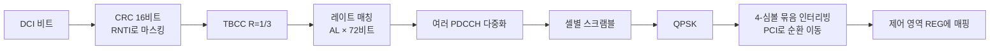

# PDCCH와 DCI

!!! spec "스펙 · 릴리즈"
    TS 36.211 §6.8 (PDCCH), §6.8A (ePDCCH) · TS 36.212 §5.3.3 (DCI 포맷과 부호화) · TS 36.213 §9.1.1 (탐색 공간), §7.1 (DCI 해석)

    Rel-8~ (Rel-10 DCI 2C·4, Rel-11 ePDCCH·2D, Rel-13 MPDCCH·NPDCCH, Rel-15 sPDCCH)

!!! basic "한눈에 보기"
    **PDCCH**는 기지국이 단말에게 보내는 **"지시서"**입니다. 지시서의 내용을 **DCI(Downlink Control Information)**라고 부릅니다.

    - "이번 서브프레임 RB 10–20에 너에게 데이터를 보냈다. 64QAM, HARQ 3번이다" (하향 할당)
    - "4 ms 뒤 RB 5–8로 상향 데이터를 보내라" (상향 grant)
    - "송신 전력을 1 dB 올려라" (전력 제어)

    단말은 자기 것이 어디 있는지 모르기 때문에, 정해진 후보 위치들을 **하나씩 다 디코딩해 봅니다(블라인드 디코딩)**. CRC가 자기 RNTI로 맞는 것이 자기 지시서입니다.

## 구조 { .l2 }

| 단위 | 크기 |
|---|---|
| REG | RE 4개 |
| **CCE** | REG 9개 = **RE 36개** = QPSK 72비트 |
| PDCCH | CCE 1, 2, 4, 8개 (**집성 레벨, AL**) |

채널이 나쁜 단말에게는 높은 AL(더 많은 CCE = 낮은 코딩률)로 보냅니다.

## 탐색 공간 { .l2 }

| 탐색 공간 | AL | 후보 수 | CCE 수 | 용도 |
|---|---|---|---|---|
| **Common** | 4 | 4 | 16 | SI, 페이징, RAR, 그룹 TPC (모든 단말이 봄) |
| | 8 | 2 | 16 | |
| **UE-specific** | 1 | 6 | 6 | C-RNTI 스케줄링 |
| | 2 | 6 | 12 | |
| | 4 | 2 | 8 | |
| | 8 | 2 | 16 | |

단말은 후보마다 DCI 크기 2가지를 시험하므로 Rel-8 기준 **최대 44회** 블라인드 디코딩을 합니다(공통 12 + 단말 전용 32). UL MIMO(TM2 UL)가 설정되면 단말 전용에 16회가 더해집니다.

## DCI 포맷 { .l2 }

| 포맷 | 용도 | 비고 |
|---|---|---|
| **0** | PUSCH 스케줄링 (단일 안테나) | 1A와 크기를 맞춤 (flag로 구분) |
| **1** | PDSCH, 1 코드워드 (TM1, 2, 7) | 자원 할당 Type 0/1 |
| **1A** | PDSCH 간략형, **폴백**, RA 시작(PDCCH order), SPS | Type 2 할당, 모든 TM에서 사용 가능 |
| 1B | 랭크 1 폐루프 프리코딩 (TM6) | |
| **1C** | 매우 간략: SI, 페이징, RAR, MCCH 변경 | 공통 탐색 공간 |
| 1D | MU-MIMO (TM5) | |
| **2** | 폐루프 공간 다중화 (TM4) | 2 코드워드 |
| 2A | 개루프 공간 다중화 (TM3) | |
| 2B | 이중 레이어 빔포밍 (TM8, Rel-9) | |
| 2C | 최대 8 레이어 (TM9, Rel-10) | |
| 2D | CoMP (TM10, Rel-11) | PQI 필드 |
| 3 / 3A | 그룹 TPC (PUCCH/PUSCH, 2비트/1비트) | TPC-RNTI |
| **4** | UL MIMO PUSCH (Rel-10) | |
| 5 | 사이드링크 (Rel-12) | |
| 6-0A/B, 6-1A/B, 6-2 | eMTC (MPDCCH, Rel-13) | |
| N0, N1, N2 | NB-IoT (NPDCCH, Rel-13) | |
| 7-0A/B, 7-1A~G | sTTI (Rel-15) | |

### 예: DCI 1A (FDD, C-RNTI)

| 필드 | 비트 |
|---|---|
| Format 0/1A 구분 flag | 1 |
| Localized/Distributed VRB flag | 1 |
| RB 할당 (RIV) | \(\lceil \log_2(N_{RB}(N_{RB}+1)/2) \rceil\) (20 MHz: 13) |
| MCS | 5 |
| HARQ 프로세스 번호 | 3 (TDD 4) |
| NDI | 1 |
| RV | 2 |
| PUCCH TPC | 2 |
| (TDD) DAI | 2 |
| **합계 (20 MHz FDD)** | **28 + 패딩 → 0과 같은 크기** |

??? expert "전문가 노트 — 해싱, ePDCCH, 디코딩 오류"
    **UE-specific 탐색 공간 시작점 (TS 36.213 §9.1.1).**

    \[
    Y_k = (A \cdot Y_{k-1}) \bmod D,\quad Y_{-1} = n_{RNTI},\ A = 39827,\ D = 65537,\ k = \lfloor n_s/2 \rfloor
    \]

    AL \(L\)의 후보 \(m\)의 CCE: \(L\{(Y_k + m) \bmod \lfloor N_{CCE,k}/L \rfloor\} + i\), \(i = 0..L-1\).
    서브프레임마다 시작점이 바뀌어 특정 단말들이 계속 충돌(blocking)하는 일을 줄입니다.

    **DCI 크기 맞춤.** 블라인드 디코딩 횟수를 줄이려고 DCI 0과 1A는 같은 크기로 패딩하고, 크기가 "모호한 크기"(특정 정보 비트 수)와 같아지면 0을 하나 더 붙입니다(TS 36.212 Table 5.3.3.1.2-1).

    **ePDCCH (Rel-11).** PDSCH 영역의 PRB 쌍(2/4/8개 집합)에 단말별 DMRS로 복조하는 제어 채널입니다.
    - 장점: 빔포밍 가능, 셀 간 간섭 조정(주파수 분리), 제어 용량 확장, CRS가 없는 NCT 대비
    - 단위: EREG(16개/PRB 쌍) → ECCE(EREG 4 또는 8)
    - Localized / Distributed 전송
    - NR PDCCH(CORESET)의 개념적 조상입니다.

    **오류 유형.**
    - **Missed detection**: 자기 PDCCH를 못 찾음 → DL이면 ACK/NACK 미전송(DTX), UL이면 PUSCH 미전송
    - **False alarm**: 16비트 CRC로 우연히 다른 PDCCH가 맞음 (확률 약 \(44 \times 2^{-16}\)) → 잘못된 PUSCH 송신 가능. 그래서 일부 필드(예: 1A의 reserved 값) 검사를 추가로 합니다.

    **PDCCH order.** DCI 1A의 특정 비트 패턴(RB 할당 전부 1)은 데이터 할당이 아니라 **"랜덤 액세스를 해라"** 명령입니다. 전용 프리앰블 인덱스와 PRACH 마스크를 담아 비경쟁 RA를 시작시킵니다(상향 동기 회복, 측위 등).

## LTE ↔ NR 비교

| 항목 | LTE PDCCH | NR PDCCH |
|---|---|---|
| 위치 | 서브프레임 앞 1–3(4) 심볼, 대역 전체 | **CORESET** (주파수·시간 설정 가능) |
| 크기 지시 | PCFICH | 없음 (RRC로 설정) |
| CCE | 9 REG × 4 RE = 36 RE | 6 REG × 12 RE (DMRS 3개 포함) |
| AL | 1, 2, 4, 8 | 1, 2, 4, 8, 16 |
| 부호 | TBCC, CRC 16 | Polar, CRC 24 |
| 복조 기준 | CRS | PDCCH DMRS (빔포밍 가능) |

## 관련 페이지

- [PCFICH·PHICH](pcfich-phich.md)
- [PDSCH](pdsch.md)
- [전송 모드 (TM1–10)](../advanced/transmission-modes.md)
- [NR CORESET과 Search Space](../../nr/phy/coreset-searchspace.md)
