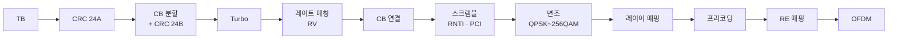

# PDSCH

!!! spec "스펙 · 릴리즈"
    TS 36.211 §6.3–6.4 (PDSCH 처리, 자원 매핑) · TS 36.212 §5.3.2 (DL-SCH) · TS 36.213 §7.1 (PDSCH 수신 절차), §5.2 (DL 전력 할당) · UE 카테고리: TS 36.306

    Rel-8~ (Rel-10 TM9, Rel-11 TM10, Rel-12 256QAM, Rel-15 1024QAM)

!!! basic "한눈에 보기"
    **PDSCH(Physical Downlink Shared Channel)**는 하향 **실제 데이터**가 실리는 채널입니다. 인터넷 데이터뿐 아니라 SIB, 페이징 메시지, RAR도 PDSCH로 전송됩니다.

    - 어디에, 어떤 방식으로 보냈는지는 같은 서브프레임의 **PDCCH(DCI)**가 알려 줍니다.
    - 제어 영역(1–3 심볼) 뒤부터 서브프레임 끝까지를 씁니다.
    - CRS, 동기신호, PBCH 자리는 피해서 매핑됩니다.
    - 단말은 수신 후 4 ms 뒤(FDD) PUCCH나 PUSCH로 ACK/NACK을 보냅니다.

## 처리 과정 { .l2 }

스크램블 시퀀스 초기값은 RNTI, 코드워드 번호, 슬롯 번호, PCI로 정해집니다. 그래서 이웃 셀 간섭이 백색화되고, 다른 단말의 데이터를 잘못 결합하는 일을 막습니다.

## PDSCH가 피해 가는 자원 { .l2 }

| 자원 | 조건 |
|---|---|
| 제어 영역 | 첫 CFI 심볼 (cross-carrier 스케줄링 SCell은 `pdsch-Start`) |
| CRS | 설정된 CRS 포트 위치 전부 |
| PSS, SSS | 서브프레임 0, 5의 중앙 6 RB (해당 PRB를 그 서브프레임에 할당한 경우 해당 심볼 제외) |
| PBCH | 서브프레임 0 슬롯 1의 중앙 6 RB, 첫 4 심볼 |
| UE-specific RS (DMRS) | TM7–10 |
| CSI-RS, ZP CSI-RS | TM9/10 단말은 레이트 매칭, 이전 TM은 펑처링 |
| MBSFN 서브프레임 | PMCH 영역 (TM9/10만 MBSFN 서브프레임에서 PDSCH 수신 가능) |

## 전송 모드와 안테나 포트 { .l2 }

| TM | 방식 | DCI | 복조 기준 |
|---|---|---|---|
| 1 | 단일 안테나 (포트 0) | 1, 1A | CRS |
| 2 | 전송 다이버시티 (SFBC) | 1, 1A | CRS |
| 3 | 개루프 공간 다중화 (CDD) | 2A | CRS |
| 4 | 폐루프 공간 다중화 | 2 | CRS |
| 5 | MU-MIMO | 1D | CRS |
| 6 | 랭크 1 폐루프 프리코딩 | 1B | CRS |
| 7 | 단일 레이어 빔포밍 (포트 5) | 1 | UE-RS |
| 8 | 이중 레이어 빔포밍 (포트 7, 8) | 2B | DMRS |
| 9 | 최대 8 레이어 (포트 7–14) | 2C | DMRS + CSI-RS |
| 10 | CoMP | 2D | DMRS + CSI-RS + CSI-IM |

모든 TM에서 DCI 1A는 **폴백**(TM2 또는 단일 포트)으로 쓸 수 있습니다. 자세한 내용은 [전송 모드](../advanced/transmission-modes.md)를 참고하세요.

## 하향 전력 할당 { .l2 }

기지국은 CRS RE의 전력(EPRE)을 기준으로, PDSCH RE 전력을 상대값으로 정합니다.

| 파라미터 | 의미 | 값 |
|---|---|---|
| `referenceSignalPower` (SIB2) | CRS RE 하나의 전력 | −60 ~ 50 dBm (예: 18.2 dBm) |
| \(P_A\) (RRC, 단말별) | CRS가 **없는** 심볼의 PDSCH EPRE / CRS EPRE \(= \rho_A\) | −6, −4.77, −3, −1.77, 0, 1, 2, 3 dB |
| \(P_B\) (SIB2) | CRS가 **있는** 심볼의 비율 \(\rho_B/\rho_A\) | 인덱스 0–3 |

16QAM 이상은 진폭 정보가 필요하므로 단말이 \(\rho_A\)를 알아야 정확히 복조할 수 있습니다.

??? expert "전문가 노트 — 카테고리, SPS, 레이트 매칭 세부"
    **UE 카테고리별 DL 능력 (TS 36.306, 대표 값)**

    | 카테고리 | DL 최대 TB 비트/TTI | 최대 레이어 | 대표 최대 속도 |
    |---|---|---|---|
    | 1 | 10,296 | 1 | 10 Mbps |
    | 3 | 102,048 | 2 | 100 Mbps |
    | 4 | 150,752 | 2 | 150 Mbps |
    | 5 | 299,552 | 4 | 300 Mbps |
    | 6 / 7 (Rel-10) | 301,504 | 2 or 4 | 300 Mbps (CA 포함) |
    | 8 (Rel-10) | 2,998,560 | 8 | 3 Gbps |

    Rel-12부터는 DL/UL 카테고리를 분리(`ue-CategoryDL`)해서 Cat 9 ~ Cat 26 등으로 확장했습니다. 실제 지원은 CA 조합(`supportedBandCombination`)이 결정합니다.

    **SPS (Semi-Persistent Scheduling).** VoLTE처럼 20 ms마다 작은 패킷이 오는 서비스에 PDCCH 오버헤드를 줄이기 위해, SPS C-RNTI로 한 번 활성화하면 주기(`semiPersistSchedIntervalDL`, 10–640 ms)마다 같은 자원을 씁니다. 재전송은 동적으로 스케줄링합니다.

    **소프트 버퍼와 레이트 매칭.** 순환 버퍼 크기 \(N_{cb} = \min(\lfloor N_{IR}/C \rfloor, K_w)\), \(N_{IR} = \lfloor N_{soft} / (K_C \cdot K_{MIMO} \cdot \min(M_{DL\_HARQ}, M_{limit})) \rfloor\).
    단말 카테고리의 소프트 채널 비트 \(N_{soft}\)가 작으면 고차 RV의 일부가 버퍼에 들어가지 못해 IR 이득이 줄어듭니다.

    **유효 코딩률 제한.** 계산된 유효 코딩률이 **0.930**을 넘으면 단말은 첫 전송 디코딩을 생략해도 됩니다(TS 36.213 §7.1.7). 스케줄러가 CFI·CSI-RS를 바꿔 RE가 줄었는데 MCS를 그대로 두면 이 상황이 생깁니다.

    **PDSCH 시작 위치와 MBSFN.** MBSFN 서브프레임에서는 제어 영역이 최대 2 심볼이고, TM9/10 단말만 나머지 영역에서 DMRS 기반 PDSCH를 받을 수 있습니다. 이를 이용해 CRS 오버헤드를 줄이는 구현이 있습니다.

## 관련 페이지

- [PDCCH와 DCI](pdcch-dci.md)
- [TBS와 MCS](tbs-mcs.md)
- [참조신호](reference-signals.md)
- [전송 모드 (TM1–10)](../advanced/transmission-modes.md)
- [처리량 계산](../measurement/throughput.md)
