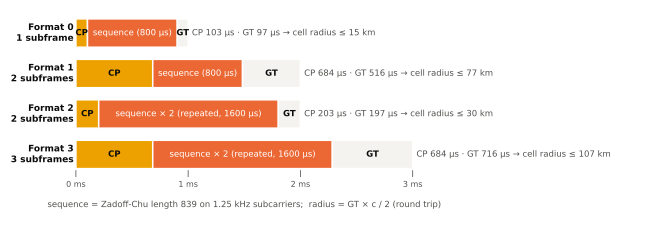

# PRACH

!!! spec "스펙 · 릴리즈"
    TS 36.211 §5.7 (PRACH: 포맷, 시퀀스, 자원) · TS 36.213 §6 (RA 절차의 물리계층) · TS 36.321 §5.1 (MAC RA) · RRC `PRACH-Config`, `RACH-ConfigCommon` (SIB2)

    Rel-8~ (Rel-13 eMTC CE 레벨별 PRACH, NB-IoT NPRACH)

!!! basic "한눈에 보기"
    **PRACH(Physical Random Access Channel)**는 단말이 기지국에 **처음 말을 거는** 채널입니다. 아직 상향 타이밍도 모르고 자원도 받지 않은 상태에서 쓸 수 있는 유일한 상향 채널입니다.

    - 단말은 64개의 **프리앰블**(특수한 시퀀스) 중 하나를 골라 보냅니다.
    - 기지국은 프리앰블을 검출하면서 **도착 시간 지연**을 재서, 단말이 앞으로 얼마나 앞당겨 보내야 하는지(**Timing Advance**) 알려 줍니다.
    - 단말 타이밍이 맞지 않은 상태이므로, 프리앰블 앞뒤에 긴 CP와 보호 시간(GT)이 있습니다.

## 프리앰블 포맷 { .l2 }

<figure markdown>

<figcaption>PRACH 포맷 0–3 (TS 36.211 Table 5.7.1-1). GT가 길수록 왕복 지연이 큰 먼 단말도 다음 서브프레임을 침범하지 않습니다.</figcaption>
</figure>

| 포맷 | 길이 | \(T_{CP}\) | \(T_{SEQ}\) | 최대 셀 반경 | 용도 |
|---|---|---|---|---|---|
| 0 | 1 ms | 3168 Ts (103 µs) | 24576 Ts (800 µs) | ~15 km | 일반 |
| 1 | 2 ms | 21024 Ts (684 µs) | 24576 Ts | ~77 km | 대형 셀 |
| 2 | 2 ms | 6240 Ts (203 µs) | 2 × 24576 Ts | ~30 km | 커버리지 향상 (반복) |
| 3 | 3 ms | 21024 Ts | 2 × 24576 Ts | ~100 km | 대형 셀 + 커버리지 |
| 4 | UpPTS | 448 Ts (14.6 µs) | 4096 Ts (133 µs) | ~1.4 km | TDD 소형 셀 |

## 시퀀스와 자원 { .l2 }

| 항목 | 포맷 0–3 | 포맷 4 |
|---|---|---|
| 시퀀스 | Zadoff-Chu, 길이 **839** | ZC 길이 139 |
| 부반송파 간격 | **1.25 kHz** | 7.5 kHz |
| 점유 대역 | 839 × 1.25 kHz ≈ 1.05 MHz → **6 RB** | 6 RB |
| 셀당 프리앰블 | **64개** (루트 시퀀스의 순환 이동으로 생성) | 64개 |

64개 프리앰블의 용도 분할:

```
| 경쟁 기반 그룹 A | 경쟁 기반 그룹 B (선택) | 비경쟁 (전용, 핸드오버·PDCCH order) |
 0 ……… sizeOfRA-PreamblesGroupA-1 …… numberOfRA-Preambles-1 ……………… 63
```

그룹 B는 Msg3가 크거나 채널이 좋은 단말이 골라서, 기지국이 더 큰 Msg3 grant를 줄 수 있게 합니다.

## 설정 파라미터 (SIB2) { .l2 }

| 파라미터 | 의미 |
|---|---|
| `prach-ConfigIndex` (0–63) | 포맷 + PRACH 기회가 있는 서브프레임 (예: 3 → 포맷 0, 모든 프레임의 서브프레임 1) |
| `prach-FreqOffset` | PRACH 6 RB의 시작 PRB |
| `rootSequenceIndex` (0–837) | 첫 번째 논리 루트 시퀀스 |
| `zeroCorrelationZoneConfig` (0–15) | 순환 이동 간격 \(N_{CS}\) |
| `highSpeedFlag` | 고속 이동용 제한 집합 사용 |
| `preambleInitialReceivedTargetPower` | 첫 시도 목표 수신 전력 (−120 ~ −90 dBm) |
| `powerRampingStep` | 재시도마다 전력 증가 (0, 2, 4, 6 dB) |
| `preambleTransMax` | 최대 시도 횟수 (3–200) |
| `ra-ResponseWindowSize` | RAR 대기 창 (2–10 서브프레임) |

??? expert "전문가 노트 — Ncs 설계와 검출"
    **순환 이동 간격 \(N_{CS}\).** 한 루트 시퀀스에서 \(\lfloor 839 / N_{CS} \rfloor\)개 프리앰블이 나옵니다. 64개를 채우지 못하면 다음 루트 시퀀스를 씁니다.
    \(N_{CS}\)는 **최대 왕복 지연 + 지연 확산**보다 커야 서로 다른 프리앰블로 오검출되지 않습니다.

    \[
    N_{CS} \cdot \frac{T_{SEQ}}{N_{ZC}} \ \ge\ \frac{2r}{c} + \tau_{ds}, \qquad \frac{T_{SEQ}}{N_{ZC}} = \frac{800\,\mu s}{839} \approx 0.954\,\mu s
    \]

    | zeroCorrelationZoneConfig | 0 | 1 | 2 | 3 | 4 | 5 | 6 | 7 | 8 | 9 | 10 | 11 | 12 | 13 | 14 | 15 |
    |---|---|---|---|---|---|---|---|---|---|---|---|---|---|---|---|---|
    | \(N_{CS}\) (비제한) | 0 | 13 | 15 | 18 | 22 | 26 | 32 | 38 | 46 | 59 | 76 | 93 | 119 | 167 | 279 | 419 |

    예: 반경 5 km, 지연 확산 5 µs → 33.3 + 5 = 38.3 µs → \(N_{CS} \ge 40.2\) → 46 (config 8) → 루트당 18개 → 루트 4개 필요.
    이웃 셀은 다른 `rootSequenceIndex`를 써야 프리앰블이 겹치지 않습니다(루트 계획).

    **고속 제한 집합.** 큰 도플러(고속철도)에서는 ZC 상관 피크가 \(\pm d_u\) 위치에 가짜 피크로 나타납니다. 제한 집합은 이 위치를 피하도록 순환 이동을 고르며, Rel-14에서 초고속(350 km/h 이상)용 Type B가 추가되었습니다.

    **검출과 TA.** 기지국은 주파수 영역에서 수신 신호와 루트 시퀀스를 곱한 뒤 IFFT로 PDP를 만들고, 각 \(N_{CS}\) 창에서 임계값을 넘는 피크로 프리앰블 ID와 지연을 구합니다. 지연 해상도는 약 0.52 µs(16 Ts) 단위로 RAR의 TA(11비트)에 담깁니다.

    **PRACH 전력.** \(P_{PRACH} = \min\{P_{CMAX},\ \text{PREAMBLE\_RECEIVED\_TARGET\_POWER} + PL\}\), 목표 전력 = 초기값 + DELTA_PREAMBLE(포맷별) + (시도 횟수 − 1) × ramping step.

## LTE ↔ NR 비교

| 항목 | LTE | NR |
|---|---|---|
| 시퀀스 길이 | 839, 139 | 839 (long), 139 (short), 571·1151 (NR-U, Rel-16) |
| 부반송파 간격 | 1.25 kHz, 7.5 kHz | 1.25, 5 kHz (long) / 15·30·60·120 kHz (short) |
| 포맷 | 0–4 | 0–3 (long), A1–A3, B1–B4, C0, C2 (short) |
| 빔 연동 | 없음 | **SSB ↔ RACH 기회 연동** (빔 정보 전달) |
| 2-step RA | 없음 | Rel-16 MsgA |

## 관련 페이지

- [랜덤 액세스 절차](../procedures/random-access.md)
- [MAC](../protocol/mac.md) — TA 유지
- [NR PRACH](../../nr/phy/prach.md)
