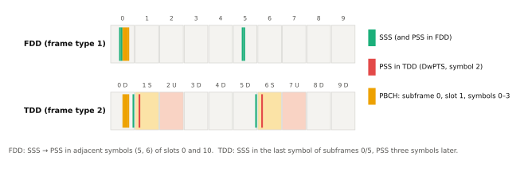
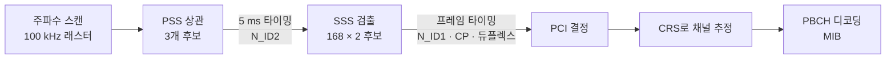

# 동기신호 (PSS · SSS)

!!! spec "스펙 · 릴리즈"
    TS 36.211 §6.11 (동기 신호: §6.11.1 PSS, §6.11.2 SSS) · 셀 탐색: TS 36.213 §4.1 · 성능: TS 36.133

    Rel-8~ (NB-IoT NPSS/NSSS: §10.2.7, Rel-13)

!!! basic "한눈에 보기"
    전원을 켠 단말은 주변에 어떤 셀이 있는지 전혀 모릅니다. 그래서 모든 셀이 **항상 같은 위치에서 보내는 신호**를 먼저 찾습니다. 그것이 동기신호입니다.

    - **PSS (Primary Synchronization Signal)**: 3가지 중 하나. 찾으면 **5 ms 타이밍**과 셀 ID의 일부(0, 1, 2 중 하나)를 알 수 있습니다.
    - **SSS (Secondary Synchronization Signal)**: 168가지 중 하나. 찾으면 **10 ms 프레임 경계**와 셀 ID의 나머지를 알 수 있습니다.

    둘을 합치면 **PCI (Physical Cell ID) = 3 × (SSS 번호) + (PSS 번호)**, 총 504개입니다.

## 셀 ID 구조 { .l2 }

\[
N_{ID}^{cell} = 3\,N_{ID}^{(1)} + N_{ID}^{(2)}, \qquad N_{ID}^{(1)} \in \{0,\dots,167\},\ N_{ID}^{(2)} \in \{0,1,2\}
\]

| 신호 | 시퀀스 | 길이 | 운반 정보 |
|---|---|---|---|
| PSS | Zadoff-Chu, 루트 \(u\) = 25, 29, 34 | 63 (가운데 1개 제외 → 62) | \(N_{ID}^{(2)}\), 5 ms 슬롯 타이밍 |
| SSS | 길이 31 m-시퀀스 두 개를 교차 배치 + 스크램블 | 62 | \(N_{ID}^{(1)}\), 서브프레임 0/5 구분 → 프레임 타이밍, CP 길이, FDD/TDD |

## 시간·주파수 위치 { .l2 }

- **주파수**: 대역폭과 상관없이 항상 **중앙 62 부반송파**(DC 제외), 양옆 5개씩은 비워 둠 → 중앙 6 RB(1.08 MHz)만 보면 됨
- **시간**: 10 ms에 두 번 (서브프레임 0, 5)

<figure markdown>

<figcaption>FDD에서는 SSS와 PSS가 슬롯 0·10의 마지막 두 심볼에 붙어 있고, TDD에서는 SSS가 서브프레임 0·5의 마지막 심볼, PSS가 서브프레임 1·6(DwPTS)의 세 번째 심볼에 있습니다.</figcaption>
</figure>

| | FDD | TDD |
|---|---|---|
| PSS | 슬롯 0, 10의 **마지막 심볼** | 서브프레임 1, 6의 **3번째 심볼** (DwPTS) |
| SSS | 슬롯 0, 10의 **끝에서 두 번째 심볼** | 슬롯 1, 11의 **마지막 심볼** |
| PSS–SSS 간격 | SSS 바로 다음 심볼 | SSS 뒤 3 심볼 |

단말은 PSS와 SSS의 **상대 위치**로 FDD/TDD를, 심볼 간격의 미세한 차이로 Normal/Extended CP를 구분합니다.

## 셀 탐색 순서 { .l2 }

??? expert "전문가 노트 — 시퀀스 생성과 검출"
    **PSS 시퀀스 (TS 36.211 §6.11.1.1).**

    \[
    d_u(n) = \begin{cases} e^{-j\pi u n(n+1)/63} & n = 0,\dots,30 \\ e^{-j\pi u (n+1)(n+2)/63} & n = 31,\dots,61 \end{cases}
    \]

    ZC 시퀀스의 \(n = 31\)(DC 위치) 원소를 빼고 62개를 DC 양옆에 놓습니다. 루트 29와 34는 합이 63이라 서로 복소 켤레(conjugate) 시퀀스이므로, 상관기 하나의 실수·허수부를 재조합해 두 루트를 동시에 검출하는 구현 기법이 있습니다. 시간 영역에서 ZC는 일정한 진폭을 가져 자기상관이 우수합니다.

    **SSS 시퀀스 (§6.11.2.1).** 짝수·홀수 위치에 길이 31 시퀀스를 번갈아 놓습니다.

    \[
    d(2n) = \begin{cases} s_0^{(m_0)}(n)\,c_0(n) & \text{서브프레임 0} \\ s_1^{(m_1)}(n)\,c_0(n) & \text{서브프레임 5} \end{cases}
    \qquad
    d(2n+1) = \begin{cases} s_1^{(m_1)}(n)\,c_1(n)\,z_1^{(m_0)}(n) & \text{서브프레임 0} \\ s_0^{(m_0)}(n)\,c_1(n)\,z_1^{(m_1)}(n) & \text{서브프레임 5} \end{cases}
    \]

    \(m_0, m_1\)은 \(N_{ID}^{(1)}\)에서 결정되는 순환 이동값이고, \(c_0, c_1\)은 \(N_{ID}^{(2)}\)에 의존하는 스크램블 시퀀스입니다. 서브프레임 0과 5에서 두 시퀀스의 순서가 바뀌므로 SSS 하나만 봐도 하프 프레임 위치를 알 수 있습니다.

    **검출 실무.**
    - **주파수 오프셋**: 초기 발진기 오차(수 ppm → 2 GHz에서 수 kHz)가 PSS 상관을 떨어뜨리므로, 여러 주파수 가설로 상관하거나 CP 상관으로 미리 보정합니다.
    - **PSS 루트 간 교차상관**과 **같은 PCI mod 3 이웃**은 PSS 검출을 어렵게 합니다(같은 PSS → 신호가 합쳐짐).
    - **SSS 코히어런트 검출**은 PSS로 추정한 채널을 씁니다. 그래서 PSS와 SSS가 가까이 있는 FDD 배치가 고속 이동에 유리합니다.
    - TS 36.133은 셀 식별 시간 요구사항(예: 동일 주파수 800 ms 수준, SINR −6 dB 조건)을 정합니다.

    **NB-IoT (Rel-13).** NPSS(서브프레임 5, 길이 11 ZC × 11 심볼, 커버 코드), NSSS(서브프레임 9, 짝수 프레임, 길이 131 ZC)를 쓰며 PCI는 같은 504개입니다.

## LTE ↔ NR 비교

| 항목 | LTE | NR |
|---|---|---|
| PCI 수 | 504 | 1008 (\(N_{ID}^{(1)}\) 0–335) |
| PSS 시퀀스 | ZC 63 (62 사용) | m-시퀀스 127 |
| SSS 시퀀스 | m-시퀀스 31 × 2 교차 | Gold 127 |
| 위치 | 캐리어 중앙 고정 | 캐리어 안 어디든 (GSCN 래스터), SSB로 PBCH와 묶음 |
| 주기 | 5 ms 고정 | SSB 주기 5–160 ms (초기 탐색 가정 20 ms) |
| 빔 | 단일 | SSB 버스트로 빔 스윕 (최대 64) |

## 관련 페이지

- [PBCH와 MIB](pbch.md)
- [셀 탐색과 시스템 정보](../procedures/cell-search.md)
- [NR SSB 구조](../../nr/phy/ssb.md)
