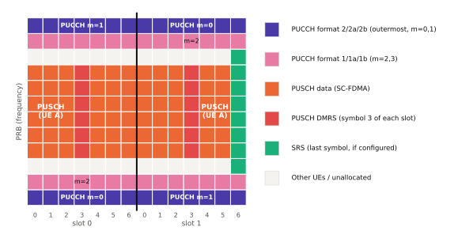

# PUCCH와 UCI

!!! spec "스펙 · 릴리즈"
    TS 36.211 §5.4 (PUCCH) · TS 36.212 §5.2.3 (UCI on PUCCH) · TS 36.213 §10 (UCI 절차, PUCCH 자원 결정) · §5.1.2 (PUCCH 전력 제어)

    Rel-8 (format 1/1a/1b/2/2a/2b) → Rel-10 (format 3, channel selection) → Rel-13 (format 4/5, 최대 32 CC)

!!! basic "한눈에 보기"
    **PUCCH(Physical Uplink Control Channel)**는 단말이 기지국에 **짧은 제어 정보(UCI)**를 보내는 채널입니다. 데이터(PUSCH) 자원이 없을 때도 언제든 보낼 수 있도록 **대역 양 끝**에 자리가 마련되어 있습니다.

    보내는 내용은 세 가지입니다.

    - **HARQ-ACK**: 하향 데이터 잘 받았는지 (ACK/NACK)
    - **SR**: 상향 자원을 달라는 요청
    - **CSI**: 채널 상태 보고 (CQI, PMI, RI)

    PUSCH를 보내는 서브프레임에는 UCI를 PUSCH 안에 함께 실어 보냅니다(Rel-10부터는 동시 전송도 가능).

## 자원 위치 { .l2 }

<figure markdown>

<figcaption>PUCCH는 대역 양 끝 RB를 쓰고, 슬롯 경계에서 반대편 끝으로 뛰어(slot hopping) 주파수 다이버시티를 얻습니다. 바깥쪽이 format 2 계열(CQI), 그 안쪽이 format 1 계열(ACK/SR)인 배치가 일반적입니다(TS 36.211 §5.4.3).</figcaption>
</figure>

PUCCH가 양 끝에 있으면 가운데 PUSCH 영역이 **연속**으로 남아 SC-FDMA 단일 반송파 특성을 유지할 수 있습니다.

## PUCCH 포맷 { .l2 }

| 포맷 | 내용 | 비트 | 변조 | 단말 다중화 | 릴리즈 |
|---|---|---|---|---|---|
| **1** | SR | 켜짐/꺼짐 | — | 순환 이동 × OCC | Rel-8 |
| **1a** | ACK 1비트 (+SR) | 1 | BPSK | 최대 36/RB (보통 12–18) | Rel-8 |
| **1b** | ACK 2비트 (2 CW 또는 TDD) | 2 | QPSK | 〃 | Rel-8 |
| **2** | CSI | 20 부호화 비트 (정보 최대 11) | QPSK | 순환 이동 12 | Rel-8 |
| 2a / 2b | CSI + ACK 1/2비트 (Normal CP) | 21 / 22 | QPSK + BPSK/QPSK | 〃 | Rel-8 |
| **3** | 다중 ACK (CA/TDD) | 최대 22 정보 비트 → 48 부호화 | QPSK, DFT-s-OFDM | OCC 5 | Rel-10 |
| **4** | 대용량 UCI | 수백 비트 (다중 PRB) | QPSK, TBCC | 1 | Rel-13 |
| **5** | 중용량 UCI | 1 PRB | QPSK | OCC 2 | Rel-13 |

## format 1 계열 슬롯 구조 (Normal CP) { .l2 }

```
심볼:   0    1    2    3    4    5    6
       데이터 데이터 RS   RS   RS  데이터 데이터
```

데이터 심볼 4개(길이 4 OCC), RS 심볼 3개(길이 3 OCC). 각 심볼에는 길이 12 기저 시퀀스의 순환 이동(CS)을 씁니다. CS 12개 × OCC 3개 = 최대 36개 단말이 한 RB를 공유할 수 있습니다(인접 CS 간격 \(\Delta_{shift}^{PUCCH}\)로 조절).

format 2 계열은 슬롯의 심볼 1, 5가 RS이고 나머지 5개가 데이터(5 QPSK × 2 슬롯 = 10 심볼 = 20비트)입니다.

## HARQ-ACK 자원 결정 { .l2 }

동적 스케줄링된 PDSCH의 ACK는 **그 PDSCH를 스케줄링한 PDCCH의 첫 CCE 번호**로 PUCCH 자원이 정해집니다(FDD).

\[
n_{PUCCH}^{(1)} = n_{CCE} + N_{PUCCH}^{(1)}
\]

PDCCH 하나가 CCE를 겹쳐 쓰지 않으므로 ACK 자원 충돌이 자동으로 피해집니다. \(N_{PUCCH}^{(1)}\)은 SR·SPS용 자원 다음부터 시작하는 오프셋(SIB2 `n1PUCCH-AN`)입니다.

??? expert "전문가 노트 — CA·TDD에서의 ACK, 동시 전송"
    **TDD ACK/NACK.** UL 서브프레임 하나가 DL 서브프레임 M개의 ACK를 책임집니다(예: config 2에서 M=4).
    - **Bundling**: M개 ACK를 AND해서 1–2비트로 압축 (오버헤드 적음, 하나라도 NACK이면 전부 재전송)
    - **Multiplexing (channel selection)**: format 1b의 여러 PUCCH 자원 중 어느 것을 골랐는지로 추가 정보 전달 (M ≤ 4)
    - DAI로 놓친 PDCCH를 검출

    **CA의 ACK.**
    - 2 CC: **format 1b with channel selection** (자원 2–4개 중 선택 + QPSK)
    - 3–5 CC: **format 3** (최대 10 FDD ACK 또는 20 TDD ACK + SR, RM(32,O) 이중 부호)
    - 6–32 CC (Rel-13): **format 4 / 5**

    format 3의 자원은 RRC로 4개를 미리 주고, SCell PDCCH의 TPC 필드를 **ARI(ACK/NACK Resource Indicator)**로 재해석해 그중 하나를 고릅니다.

    **PUCCH + PUSCH 동시 전송 (Rel-10).** `simultaneousPUCCH-PUSCH`가 설정되면 ACK는 PUCCH로, CSI는 PUSCH로 나눠 보낼 수 있습니다. 대신 상향이 비연속 할당이 되어 PAPR·MPR이 늘어납니다.

    **SRS와 충돌.** SRS가 설정된 서브프레임에서 `ackNackSRS-SimultaneousTransmission`이 켜지면 마지막 심볼을 비운 **shortened format 1a/1b**를 씁니다. 꺼져 있으면 SRS를 버립니다. CQI(format 2)와 SRS가 겹치면 SRS를 버립니다.

    **CQI 주기 보고.** `cqi-pmi-ConfigIndex`로 주기(2–160 ms)와 오프셋, `ri-ConfigIndex`로 RI 주기를 정합니다. 광대역 CQI/PMI, 부대역 CQI(대역폭 부분 BP 순환), RI가 정해진 순서로 돌아가며 보고됩니다. → [CQI·PMI·RI](../measurement/csi.md)

## 관련 페이지

- [PUSCH](pusch.md)
- [HARQ](../../basics/harq.md)
- [CQI·PMI·RI](../measurement/csi.md)
- [전력 제어](power-control.md)
