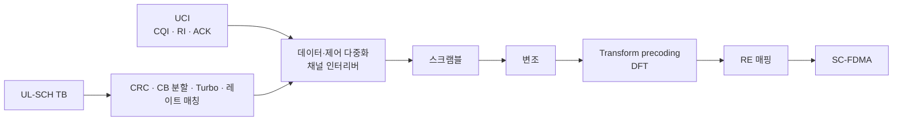

# PUSCH

!!! spec "스펙 · 릴리즈"
    TS 36.211 §5.3 (PUSCH), §5.5.2 (PUSCH DMRS) · TS 36.212 §5.2.2 (UL-SCH, UCI 다중화) · TS 36.213 §8 (PUSCH 절차), §8.6 (MCS/TBS)

    Rel-8~ (Rel-10 UL MIMO·clustered 할당, Rel-12 64QAM 확대, Rel-14 256QAM)

!!! basic "한눈에 보기"
    **PUSCH(Physical Uplink Shared Channel)**는 단말이 **상향 데이터**를 보내는 채널입니다.

    - 기지국이 PDCCH(DCI 0 또는 4)로 **언제, 어디로, 어떻게 보낼지** 미리 알려 줍니다(UL grant). 단말이 마음대로 보낼 수 없습니다.
    - FDD에서는 grant를 받고 **4 ms 뒤**에 보냅니다.
    - **SC-FDMA**로 전송해서 단말 전력 증폭기 효율을 높입니다. 그래서 RB는 **연속**으로 할당하는 것이 기본입니다.
    - 데이터와 함께 ACK/NACK, CQI 같은 제어 정보(UCI)도 실을 수 있습니다.

## 처리 과정 { .l2 }

## 서브프레임 구조 { .l2 }

- Normal CP: 슬롯당 7 심볼 중 **심볼 3(가운데)이 DMRS**, 나머지 6개가 데이터 → 서브프레임당 데이터 12 심볼
- Extended CP: 슬롯당 6 심볼 중 심볼 2가 DMRS
- SRS가 설정되면 서브프레임 **마지막 심볼**은 데이터 대신 SRS용으로 비움

위의 [PUCCH 페이지 그림](pucch.md#자원-위치)에서 빨간 열이 PUSCH DMRS입니다.

## 자원 할당과 호핑 { .l2 }

| 항목 | 내용 |
|---|---|
| UL 자원 할당 Type 0 | 연속 RB (RIV), Rel-8 |
| UL 자원 할당 Type 1 | 클러스터 2개 (Rel-10) |
| RB 수 제약 | \(2^a 3^b 5^c\) (DFT 크기) |
| 주파수 호핑 Type 1 | DCI가 지시하는 오프셋으로 두 번째 슬롯 이동 |
| 주파수 호핑 Type 2 | 미리 정한 부대역 패턴으로 이동 |

## UCI를 PUSCH에 실을 때 { .l2 }

| UCI | 위치 | 이유 |
|---|---|---|
| **HARQ-ACK** | DMRS 바로 옆 심볼 (2, 4), 데이터를 **펑처링** | 채널 추정이 가장 정확한 곳, 가장 중요한 정보 |
| **RI** | ACK 다음 바깥 심볼 (1, 5) | CQI 해석에 필요 |
| **CQI/PMI** | 데이터 앞쪽에 시간 우선 배치, 데이터가 레이트 매칭으로 비켜 줌 | |

UCI 각각의 자원 양은 \(\beta_{offset}\) (RRC)과 PUSCH MCS로 정해집니다. 예: ACK 자원 ≈ (ACK 비트 × β_offset^HARQ-ACK) / (데이터 스펙트럼 효율).

??? expert "전문가 노트 — DMRS 시퀀스, TTI bundling, UL MIMO"
    **DMRS 시퀀스.** 기저 시퀀스 \(\bar r_{u,v}(n)\)에 순환 이동을 곱합니다.

    \[
    r^{(\alpha)}_{u,v}(n) = e^{j\alpha n}\,\bar r_{u,v}(n), \quad \alpha = 2\pi n_{cs}/12, \quad n_{cs} = (n_{DMRS}^{(1)} + n_{DMRS}^{(2)} + n_{PN}(n_s)) \bmod 12
    \]

    - 그룹 번호 \(u\) (0–29): 30개 시퀀스 그룹. 셀 간 간섭을 줄이려고 PCI mod 30으로 배정하고, **그룹 호핑**(슬롯마다 변경)을 켤 수 있습니다.
    - \(n_{DMRS}^{(2)}\): DCI 0의 3비트 CS 필드. **UL MU-MIMO** 단말들을 서로 다른 CS로 구분합니다.
    - 길이가 3 RB 미만이면 컴퓨터로 찾은 QPSK 시퀀스, 이상이면 ZC 확장 시퀀스를 씁니다.
    - Rel-10에서 슬롯 간 **OCC**([+1 +1], [+1 −1])가 추가되어 레이어/단말 구분이 늘었습니다.

    **TTI bundling.** 셀 가장자리 VoLTE 단말을 위해 같은 TB를 **연속 4 서브프레임**에 서로 다른 RV로 보냅니다. HARQ RTT는 16 ms, 프로세스는 4개가 됩니다. QPSK, 최대 3 PRB 제한이 있습니다.

    **UL MIMO (Rel-10, TM2 UL).** DCI 4로 최대 4 레이어, 2 코드워드. 코드북 기반 프리코딩(2포트: 6개, 4포트: 랭크별 코드북). 실제 상용 단말 지원은 드뭅니다.

    **UL 64QAM / 256QAM.** Rel-8 Cat 5만 64QAM을 지원했고, Rel-12에서 UL 카테고리 분리 후 Cat 13 등으로 확대, Rel-14에서 256QAM(`ue-CategoryUL` 16 이상)이 추가되었습니다.

    **비적응 재전송과 PHICH.** NACK만 받으면 같은 RB·같은 MCS로 RV를 바꿔(0 → 2 → 3 → 1) 재전송합니다. 이 때문에 eNB 스케줄러는 재전송 단말의 RB를 미리 비워 두어야 합니다(동기 HARQ의 단점).

## 관련 페이지

- [PUCCH와 UCI](pucch.md)
- [OFDMA와 DFT-s-OFDM](../../basics/ofdma-scfdma.md)
- [참조신호](reference-signals.md) — SRS
- [전력 제어](power-control.md)
