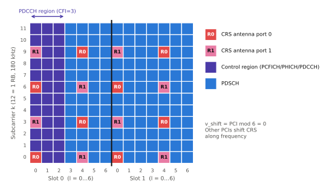
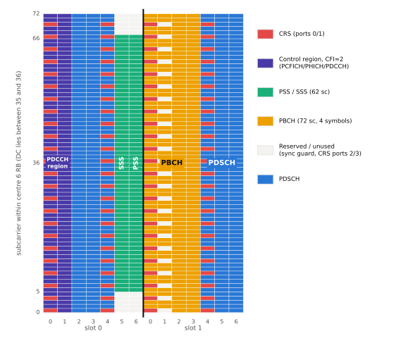

# 리소스 그리드

!!! spec "스펙 · 릴리즈"
    TS 36.211 §6.2 (DL 리소스 그리드), §5.2 (UL), §6.2.3 (RB), §6.2.4 (REG) · 채널 대역폭: TS 36.101 §5.6 · EARFCN: TS 36.101 §5.7.3 · 자원 할당 유형: TS 36.213 §7.1.6

    Rel-8~

!!! basic "한눈에 보기"
    LTE의 무선 자원은 **엑셀 표**처럼 생각할 수 있습니다.

    - **가로축 = 시간** (OFDM 심볼)
    - **세로축 = 주파수** (부반송파, 15 kHz 간격)
    - 칸 하나 = **RE (Resource Element)** = 부반송파 1개 × 심볼 1개. QAM 심볼 하나가 들어갑니다.
    - **RB (Resource Block)** = 12 부반송파(180 kHz) × 1 슬롯(7 심볼) = 84 RE
    - 실제 스케줄링은 서브프레임 단위로 **RB 쌍**(2 슬롯 = 168 RE)을 묶어 할당합니다.

    20 MHz 캐리어는 100 RB이고, 1 ms마다 100개의 RB 쌍을 여러 단말에게 나눠 줍니다.

## 대역폭별 RB 수 { .l2 }

| 채널 대역폭 | 1.4 MHz | 3 MHz | 5 MHz | 10 MHz | 15 MHz | 20 MHz |
|---|---|---|---|---|---|---|
| \(N_{RB}\) | 6 | 15 | 25 | 50 | 75 | 100 |
| 전송 대역 | 1.08 MHz | 2.7 MHz | 4.5 MHz | 9 MHz | 13.5 MHz | 18 MHz |
| RBG 크기 \(P\) (Type 0) | 1 | 2 | 2 | 3 | 4 | 4 |
| 제어 영역 최대 | 4 심볼 | 3 | 3 | 3 | 3 | 3 |

규격상 \(N_{RB}\)는 6–110이지만 실제 정의된 채널 대역폭은 위 6가지입니다.

## RB 하나의 구조 { .l2 }

<figure markdown>

<figcaption>하향 RB 쌍 하나 (12 부반송파 × 14 심볼 = 168 RE). 2포트 CRS, CFI=3 예시. 포트 0이 송신하는 RE 위치에서 포트 1은 아무것도 보내지 않습니다(서로 간섭하지 않도록).</figcaption>
</figure>

### RB 쌍당 PDSCH RE 수

| CRS 포트 | CFI = 1 | CFI = 2 | CFI = 3 |
|---|---|---|---|
| 1 포트 | 150 | 138 | 126 |
| 2 포트 | 144 | 132 | 120 |
| 4 포트 | 136 | 128 | 116 |

(PSS/SSS/PBCH가 없는 일반 서브프레임, CSI-RS·DMRS 없음 기준)

## 실제 서브프레임 0의 모습 { .l2 }

<figure markdown>

<figcaption>FDD 서브프레임 0의 중앙 6 RB (72 부반송파). 제어 영역(CFI=2), SSS·PSS(슬롯 0의 심볼 5, 6), PBCH(슬롯 1의 심볼 0–3), CRS가 배치됩니다. PBCH 영역은 4포트 CRS 위치를 비워 둡니다.</figcaption>
</figure>

## 하향 자원 할당 유형 { .l2 }

| 유형 | 단위 | 표현 | 특징 | DCI |
|---|---|---|---|---|
| **Type 0** | RBG (P개 RB 묶음) | 비트맵 (RBG마다 1비트) | 떨어진 RB 할당 가능 | 1, 2, 2A … |
| **Type 1** | RBG 부분집합 안의 RB | 부분집합 선택 + 비트맵 | RB 단위로 더 세밀 | 1, 2, 2A … |
| **Type 2** | 연속 VRB | 시작 RB + 길이 (RIV) | 비트 수 적음, 연속 할당 | **1A**, 1B, 1C, 1D |

Type 2는 **Localized VRB**(VRB = PRB) 또는 **Distributed VRB**(주파수 다이버시티를 위해 슬롯마다 다른 PRB로 분산) 중 선택합니다.

??? expert "전문가 노트 — EARFCN, RIV, 주파수 계산"
    **EARFCN ↔ 주파수 (TS 36.101 §5.7.3).**

    \[
    F_{DL} = F_{DL,low} + 0.1\,(N_{DL} - N_{Offs\text{-}DL}) \ \text{[MHz]}
    \]

    | 밴드 | \(F_{DL,low}\) (MHz) | \(N_{Offs\text{-}DL}\) | DL EARFCN 범위 | 예 |
    |---|---|---|---|---|
    | 1 (2.1 GHz) | 2110 | 0 | 0 – 599 | EARFCN 300 → 2140 MHz |
    | 3 (1.8 GHz) | 1805 | 1200 | 1200 – 1949 | EARFCN 1350 → 1820 MHz |
    | 5 (850 MHz) | 869 | 2400 | 2400 – 2649 | |
    | 7 (2.6 GHz) | 2620 | 2750 | 2750 – 3449 | EARFCN 3100 → 2655 MHz |

    채널 래스터는 100 kHz이며, EARFCN이 가리키는 주파수는 캐리어의 중심(DL은 DC 부반송파)입니다.

    **RIV (Type 2).** 시작 RB \(RB_{start}\), 길이 \(L_{CRBs}\)일 때

    \[
    RIV = \begin{cases} N_{RB}(L-1) + RB_{start} & (L-1) \le \lfloor N_{RB}/2 \rfloor \\ N_{RB}(N_{RB}-L+1) + (N_{RB}-1-RB_{start}) & \text{otherwise} \end{cases}
    \]

    필드 길이는 \(\lceil \log_2(N_{RB}(N_{RB}+1)/2) \rceil\) 비트 (100 RB → 13비트).

    **부반송파 인덱스.** DL에서 RB \(n_{PRB}\)의 부반송파 \(k = n_{PRB} \cdot 12 + k'\)이고, DC 부반송파는 \(k = N_{RB}\cdot 6\) 위치에서 비워집니다(실제 매핑에서는 DC를 건너뜀). UL은 DC를 비우지 않는 대신 7.5 kHz 이동이 있습니다.

    **REG (Resource Element Group).** 제어 채널 매핑 단위로, 한 심볼에서 참조신호를 제외한 연속 4개 RE입니다. CRS가 있는 심볼에서는 RB당 REG 2개(6 RE 중 CRS 2개 제외 4개씩), 없는 심볼에서는 3개입니다. CCE = 9 REG.

## LTE ↔ NR 비교

| 항목 | LTE | NR |
|---|---|---|
| RB 정의 | 12 부반송파 × **1 슬롯** | 12 부반송파 (시간 정의 없음) |
| 최대 RB/캐리어 | 100 (20 MHz) | 275 |
| 주파수 기준점 | 캐리어 중심 (DC) | **Point A** (공통 RB 0) |
| 부분 대역 | 없음 (캐리어 전체) | **BWP** |

## 관련 페이지

- [프레임 구조](frame-structure.md)
- [참조신호](reference-signals.md)
- [PDCCH와 DCI](pdcch-dci.md)
- [NR 리소스 그리드와 Point A](../../nr/phy/resource-grid.md)
