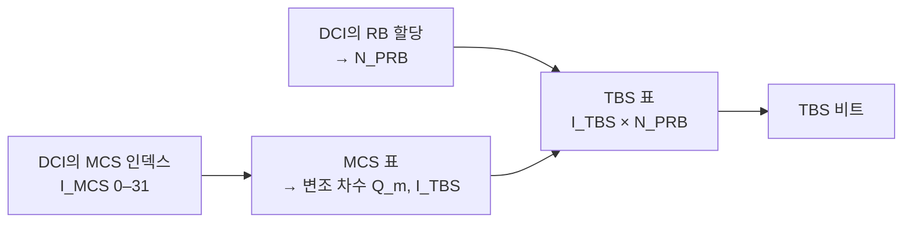

# TBS와 MCS

!!! spec "스펙 · 릴리즈"
    TS 36.213 §7.1.7 (PDSCH MCS·TBS 결정), Table 7.1.7.1-1 (MCS 표, 64QAM), 7.1.7.1-1A (256QAM), 7.1.7.1-1B (1024QAM, Rel-15) · Table 7.1.7.2.1-1 (TBS 표) · §8.6 (PUSCH)

    Rel-8~ (Rel-12 256QAM 표, Rel-15 1024QAM 표)

!!! basic "한눈에 보기"
    기지국은 매 서브프레임 단말에게 **MCS(Modulation and Coding Scheme)** 번호를 알려 줍니다. MCS 하나로 두 가지가 정해집니다.

    - **변조 방식** (QPSK, 16QAM, 64QAM, 256QAM)
    - **코딩률** (얼마나 튼튼하게 보호할지)

    여기에 **할당 RB 수**를 더하면 이번에 보내는 데이터 양, 즉 **TBS(Transport Block Size)**가 표에서 정해집니다.

    > MCS(번호) + RB 수 → 표 조회 → TBS(비트)

    채널이 좋으면 높은 MCS, 나쁘면 낮은 MCS를 씁니다. 단말이 보고한 CQI를 보고 기지국이 고릅니다.

## 결정 절차 { .l2 }

## MCS 표 (64QAM, Table 7.1.7.1-1) { .l2 }

| \(I_{MCS}\) | 변조 | \(I_{TBS}\) | | \(I_{MCS}\) | 변조 | \(I_{TBS}\) |
|---|---|---|---|---|---|---|
| 0 | QPSK | 0 | | 16 | 16QAM | 15 |
| 1 | QPSK | 1 | | 17 | 64QAM | 15 |
| 2 | QPSK | 2 | | 18 | 64QAM | 16 |
| 3 | QPSK | 3 | | 19 | 64QAM | 17 |
| 4 | QPSK | 4 | | 20 | 64QAM | 18 |
| 5 | QPSK | 5 | | 21 | 64QAM | 19 |
| 6 | QPSK | 6 | | 22 | 64QAM | 20 |
| 7 | QPSK | 7 | | 23 | 64QAM | 21 |
| 8 | QPSK | 8 | | 24 | 64QAM | 22 |
| 9 | QPSK | 9 | | 25 | 64QAM | 23 |
| 10 | 16QAM | 9 | | 26 | 64QAM | 24 |
| 11 | 16QAM | 10 | | 27 | 64QAM | 25 |
| 12 | 16QAM | 11 | | 28 | 64QAM | 26 |
| 13 | 16QAM | 12 | | 29 | QPSK | 재전송용 |
| 14 | 16QAM | 13 | | 30 | 16QAM | 재전송용 |
| 15 | 16QAM | 14 | | 31 | 64QAM | 재전송용 |

MCS 9↔10, 16↔17은 \(I_{TBS}\)가 같아서 **같은 TBS를 다른 변조로** 보낼 수 있습니다(변조 전환 구간의 성능 평탄화).
MCS 29–31은 TBS를 바꾸지 않고 변조만 지정하는 **재전송용** 값입니다.

## TBS 표 읽기 { .l2 }

TS 36.213 Table 7.1.7.2.1-1은 \(I_{TBS}\) 0–26(256QAM 표 사용 시 0–33) × \(N_{PRB}\) 1–110의 2차원 표입니다.

| 예 | 값 |
|---|---|
| 가장 작은 TBS (\(I_{TBS}\)=0, 1 PRB) | 16 비트 |
| 20 MHz 최대, 64QAM (\(I_{TBS}\)=26, 100 PRB, 1 레이어) | **75,376** 비트 |
| 같은 조건 2 레이어 (Table 7.1.7.2.2-1) | 149,776 비트 |
| 20 MHz, 256QAM (\(I_{TBS}\)=33, 100 PRB, 1 레이어) | 97,896 비트 |

TBS 75,376비트/ms ≈ **75 Mbps/레이어**. 2 레이어 150 Mbps, 4 레이어 300 Mbps가 Cat 4/5의 최대 속도입니다.

??? expert "전문가 노트 — 코딩률 계산과 특수 경우"
    **유효 코딩률 계산 예.** 20 MHz, 2포트 CRS, CFI=1, 일반 서브프레임, 100 PRB, MCS 28 (64QAM, TBS 75,376).

    - PDSCH RE = 100 × 144 = 14,400 RE → 비트 = 14,400 × 6 = 86,400
    - TB + CRC: 75,376 + 24 → CB 13개(CB마다 CRC 24 추가) → 정보 비트 ≈ 75,400 + 13 × 24 = 75,712
    - 유효 코딩률 ≈ 75,712 / 86,400 ≈ **0.876** (0.930 이하 → OK)

    같은 MCS로 CFI=3이면 RE가 12,000으로 줄어 코딩률이 1.05가 되어 **디코딩 불가**입니다. 그래서 스케줄러는 CFI·RS 오버헤드까지 계산해서 MCS를 고릅니다.

    **TBS 표 설계 원리.** 각 \(I_{TBS}\)는 "기준 오버헤드(제어 3 심볼, 2포트 CRS 등)에서 특정 코딩률"이 되도록 \(N_{PRB}\)에 비례하는 값으로 만든 뒤, Turbo 인터리버 크기와 CB 분할에 맞게 **바이트 정렬·허용 블록 크기**로 다듬었습니다. 그래서 \(N_{PRB}\)가 2배여도 TBS가 정확히 2배가 아닐 수 있습니다.

    **특수 경우.**
    - **DwPTS**: \(N_{PRB} = \max(\lfloor N'_{PRB} \times 0.75 \rfloor, 1)\) 로 줄여서 조회
    - **DCI 1C**(SI/페이징/RAR): 별도 TBS 표(Table 7.1.7.2.3-1) 32개 값
    - **SIB/페이징/RAR를 DCI 1A로**: \(N_{PRB}^{1A}\) = 2 또는 3 (TPC 필드 재해석)으로 TBS 열을 고정
    - **UL**: 같은 TBS 표를 쓰되 MCS 표가 다름(Table 8.6.1-1). UL MCS 21에서 64QAM 시작, 29–31은 RV 지정

    **256QAM 표 전환.** RRC `altCQI-Table-r12`와 `mcs-Table`(256QAM 표 사용)이 설정되면 C-RNTI로 스케줄된 DCI는 Table 7.1.7.1-1A를 씁니다. 공통 탐색 공간의 DCI 1A나 SPS는 기존 표를 유지해 폴백 안정성을 확보합니다.

## 관련 페이지

- [디지털 변조](../../basics/modulation.md)
- [채널 코딩](../../basics/channel-coding.md)
- [CQI·PMI·RI](../measurement/csi.md)
- [처리량 계산](../measurement/throughput.md)
