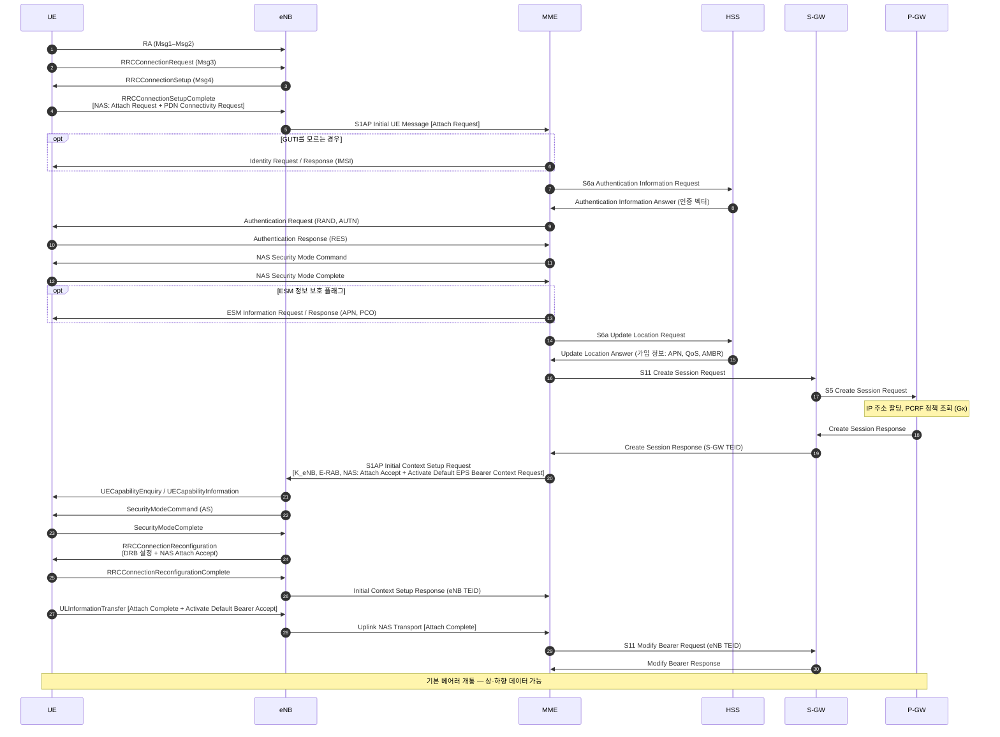

# Attach

!!! spec "스펙 · 릴리즈"
    절차 흐름: TS 23.401 §5.3.2.1 (E-UTRAN Initial Attach) · NAS: TS 24.301 §5.5.1 · S1AP: TS 36.413 §8.3.1 (Initial Context Setup) · GTPv2-C: TS 29.274 · S6a: TS 29.272

    Rel-8~ (Rel-13 CIoT "Attach without PDN connectivity")

!!! basic "한눈에 보기"
    **Attach**는 단말이 LTE 망에 **처음 등록하는** 절차입니다. Attach가 끝나면 세 가지가 준비됩니다.

    1. 망이 단말을 **인증**하고 보안 키를 나눠 가짐
    2. 단말에게 **임시 ID(GUTI)**와 위치 등록(TA 목록)이 주어짐
    3. **기본 베어러**가 만들어지고 **IP 주소**가 할당됨 → 바로 인터넷 사용 가능

    약 20개 메시지가 UE, eNB, MME, HSS, S-GW, P-GW 사이를 오갑니다. 아래 그림이 LTE 핵심 절차를 이해하는 가장 좋은 출발점입니다.

## 전체 흐름 { .l2 }

## 단계별 의미 { .l2 }

| 단계 | 메시지 | 하는 일 |
|---|---|---|
| ① RRC 연결 | 1–4 | SRB1 수립. Attach Request는 RRCConnectionSetupComplete 안에 실려 감 |
| ② 식별 | 5–6 | 유효한 GUTI가 없거나 MME가 모르는 GUTI면 IMSI 요청 |
| ③ 인증 | 7–10 | EPS-AKA. HSS에서 인증 벡터 (RAND, XRES, AUTN, K_ASME) |
| ④ NAS 보안 | 11–12 | NAS 메시지 무결성·암호화 시작 |
| ⑤ 위치 등록 | 14–15 | HSS에 "이 단말은 지금 이 MME에 있다" 등록, 가입 정보 수신 |
| ⑥ 세션 생성 | 16–19 | S-GW, P-GW에 기본 베어러 생성, **IP 할당** |
| ⑦ 무선 설정 | 20–25 | 단말 능력 확인, AS 보안, DRB 설정 |
| ⑧ 완료 | 26–30 | Attach Complete, S-GW에 eNB의 하향 터널 주소 알림 |

## Attach Request 주요 내용 { .l2 }

| IE | 의미 |
|---|---|
| EPS attach type | EPS attach / combined EPS/IMSI attach / emergency |
| EPS mobile identity | GUTI 또는 IMSI |
| UE network capability | 지원 보안 알고리즘 (EEA/EIA), 기타 능력 |
| ESM message container | **PDN Connectivity Request** (PDN 타입 IPv4/IPv6/IPv4v6, 요청 APN) |
| Last visited registered TAI | 마지막 TA |
| DRX parameter | 단말이 원하는 Idle DRX 주기 |
| Voice domain preference | CS voice only / IMS PS voice preferred 등 |

??? expert "전문가 노트 — 시간, 변형, 디버깅 포인트"
    **소요 시간.** 무선 구간 RA + RRC 약 30–50 ms, 인증·보안 약 50–100 ms, 세션 생성 약 50–100 ms. 전체 Attach는 대략 **0.3–1초**입니다. HSS가 로밍 상대국에 있으면 더 길어집니다.

    **GUTI Attach와 인증 생략.** 단말이 유효한 NAS 보안 컨텍스트와 GUTI를 가지고 있고 MME가 그 컨텍스트를 보관하고 있으면, 무결성 보호된 Attach Request만으로 인증을 생략할 수 있습니다(사업자 정책).

    **이전 MME에서 컨텍스트 가져오기.** GUTI가 다른 MME 것이면 새 MME는 **S10 Identification Request**로 이전 MME에서 IMSI와 보안 컨텍스트를 받아옵니다. 실패하면 Identity Request로 IMSI를 요구합니다.

    **IPv6.** P-GW는 IPv6 /64 프리픽스와 인터페이스 ID만 Attach에서 주고, 단말은 Attach 후 Router Solicitation → Router Advertisement로 주소를 완성합니다.

    **자주 보는 실패.**
    - Attach Reject #7 (EPS services not allowed), #15 (No suitable cells in TA), #19 (ESM failure — APN 오류, PDN 타입 불일치 등 ESM cause 동반)
    - Authentication Failure: #20 MAC failure (키 불일치), **#21 Synch failure** (SQN 불일치 → AUTS로 재동기화)
    - Initial Context Setup Failure: 보안 알고리즘 미지원, 무선 자원 부족

    **Attach without PDN (Rel-13).** NB-IoT/CIoT 단말은 ESM 컨테이너 없이 등록만 하고, 필요할 때 PDN을 연결할 수 있습니다(EMM-REGISTERED without PDN). 5GS의 Registration과 PDU Session 분리 구조와 같은 아이디어입니다.

## LTE ↔ NR 비교

| 항목 | LTE Attach | 5GS Registration |
|---|---|---|
| 세션 생성 | Attach와 함께 기본 베어러 생성 (always-on) | Registration과 **PDU 세션을 분리** |
| 가입자 ID | IMSI (평문 노출 가능) | SUPI → **SUCI**(암호화)로 전송 |
| 인증 | EPS-AKA | 5G-AKA 또는 EAP-AKA' (AUSF) |
| 핵심망 노드 | MME, HSS, S-GW, P-GW | AMF, AUSF, UDM, SMF, UPF |

## 관련 페이지

- [NAS (EMM·ESM)](../protocol/nas.md)
- [랜덤 액세스](random-access.md)
- [베어러와 QoS](../architecture/bearer-qos.md)
- [NR 등록 (Registration)](../../nr/procedures/registration.md)
