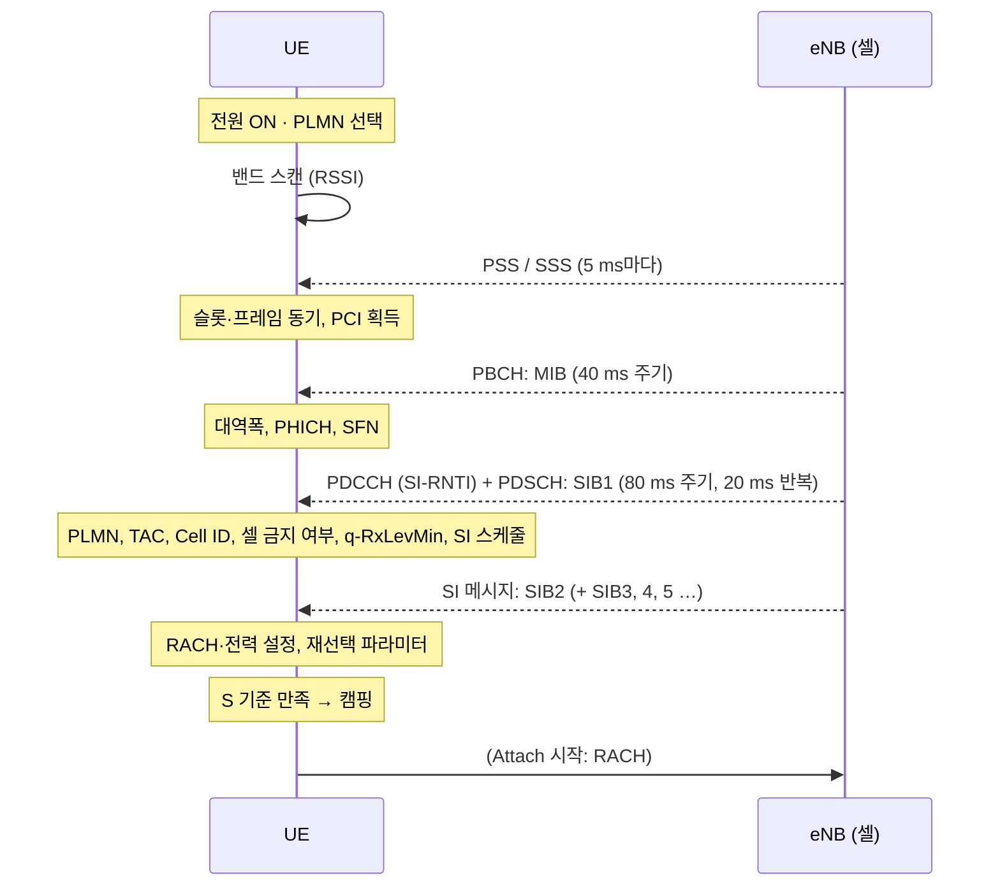

# 셀 탐색과 시스템 정보

!!! spec "스펙 · 릴리즈"
    셀 탐색 물리계층: TS 36.213 §4.1 · Idle 모드 절차(PLMN 선택, 셀 선택·재선택): TS 36.304 §5 · 시스템 정보 획득: TS 36.331 §5.2 · NAS PLMN 선택: TS 23.122

    Rel-8~ (Rel-9 Squal 기준, Rel-12 재선택 우선순위 확장, Rel-15 NR 재선택 SIB24)

!!! basic "한눈에 보기"
    휴대폰을 켜면 화면에 안테나 막대가 뜨기까지 다음 일이 일어납니다.

    1. **PLMN 선택**: 어느 통신사 망을 쓸지 정합니다 (SIM의 홈 사업자 우선).
    2. **주파수 스캔**: 지원하는 밴드를 훑으며 신호가 있는 주파수를 찾습니다.
    3. **동기 맞추기**: PSS/SSS로 셀 타이밍과 셀 ID(PCI)를 알아냅니다.
    4. **MIB 읽기**: 대역폭과 SFN을 알아냅니다.
    5. **SIB1, SIB2 … 읽기**: 이 셀이 어느 통신사인지, 들어가도 되는지, 접속 방법은 무엇인지 확인합니다.
    6. **셀 선택**: 신호가 충분히 세면 이 셀에 **캠핑(camp on)**합니다.
    7. 이후 **Attach**로 망에 등록합니다.

## 전체 흐름 { .l2 }

## 셀 선택 기준 (S-criterion) { .l2 }

\[
S_{rxlev} = Q_{rxlevmeas} - (Q_{rxlevmin} + Q_{rxlevminoffset}) - P_{compensation} - Q_{offset,temp} > 0
\]
\[
S_{qual} = Q_{qualmeas} - (Q_{qualmin} + Q_{qualminoffset}) - Q_{offset,temp} > 0 \quad (\text{Rel-9})
\]

| 항 | 의미 | 출처 |
|---|---|---|
| \(Q_{rxlevmeas}\) | 측정한 RSRP | 단말 |
| \(Q_{rxlevmin}\) | 최소 요구 RSRP (예: −124 dBm) | SIB1 `q-RxLevMin` (×2 dBm) |
| \(P_{compensation}\) | \(\max(P_{EMAX} - P_{PowerClass}, 0)\) — 단말 출력이 낮으면 기준을 높임 | SIB1 `p-Max` |
| \(Q_{qualmin}\) | 최소 RSRQ (예: −19 dB) | SIB1 `q-QualMin` |

## 셀 재선택 { .l2 }

캠핑한 뒤 단말은 주기적으로 주변 셀을 측정하고 더 좋은 셀로 옮깁니다(망 지시 없이 단말이 결정).

| 대상 | 조건 |
|---|---|
| **더 높은 우선순위** 주파수/RAT | 이웃 \(S_{rxlev} > Thresh_{X,High}\) 가 \(T_{reselection}\) 동안 유지 (서빙 상태와 무관) |
| **같은 우선순위** (동일 주파수 포함) | **R 기준**: \(R_n > R_s\) 가 \(T_{reselection}\) 동안 유지, \(R_s = Q_{meas,s} + Q_{hyst}\), \(R_n = Q_{meas,n} - Q_{offset}\) |
| **더 낮은 우선순위** | 서빙 \(S_{rxlev} < Thresh_{Serving,Low}\) 이고 이웃 \(S_{rxlev} > Thresh_{X,Low}\) |

배터리 절약을 위해 서빙 셀이 충분히 좋으면 측정을 생략합니다: \(S_{rxlev} > S_{IntraSearchP}\)면 동일 주파수 측정 생략, \(> S_{NonIntraSearchP}\)면 다른 주파수 측정 생략(높은 우선순위 주파수는 예외적으로 저빈도 측정).

## 시스템 정보 갱신 { .l2 }

- SI 내용은 **수정 주기(modification period)** 경계에서만 바뀝니다. 수정 주기 = `modificationPeriodCoeff` × `defaultPagingCycle` (예: 2 × 128 프레임 = 2.56 s).
- 변경 전 주기 동안 Paging의 `systemInfoModification` 플래그로 알립니다.
- SIB1의 `systemInfoValueTag`(0–31)가 바뀌었는지로 다시 읽을지 판단합니다. 저장된 SI는 3시간 후 무효입니다.
- ETWS/CMAS(재난 경보)는 수정 주기와 관계없이 즉시 Paging으로 알립니다.

??? expert "전문가 노트 — 실무 포인트"
    **초기 스캔 시간 단축.** 단말은 이전에 캠핑했던 주파수 목록(stored information cell selection)을 먼저 시도합니다. 전 밴드 스캔(initial cell selection)은 수 초~수십 초가 걸릴 수 있어서, 해외 로밍이나 망 장애 후 복구 시간에 큰 영향을 줍니다.

    **SI 창 계산.** SI 메시지 n번째(`schedulingInfoList`의 n번째 항목)의 창 시작: \(x = (n-1) \cdot w\), \(w\) = `si-WindowLength`(1–40 ms). 창은 SFN mod T = ⌊x/10⌋ 인 프레임의 서브프레임 x mod 10부터 시작합니다(T = `si-Periodicity`). 창 안에서 SI-RNTI PDCCH가 나오는 서브프레임을 블라인드로 찾습니다.

    **셀 금지와 예약.** `cellBarred`=barred면 300 s 동안 그 셀을 후보에서 제외하고, `intraFreqReselection`=notAllowed면 같은 주파수의 다른 셀도 제외합니다. `cellReservedForOperatorUse`는 특정 접근 등급(AC 11, 15)만 허용합니다.

    **접근 제어 (SIB2).** ACB(Access Class Barring): `ac-BarringFactor`(확률)와 `ac-BarringTime`. 혼잡 시 일반 단말의 연결 시도를 확률적으로 막습니다. Rel-11 EAB(MTC 단말 우선 차단), Rel-12 ACDC(앱 카테고리별), Rel-13 SSAC/ACB skip(VoLTE 예외).

    **NR 재선택 (Rel-15).** SIB24에 NR 주파수, SSB 측정 설정(SMTC)과 우선순위가 담겨 LTE Idle 단말이 SA NR 셀로 재선택할 수 있습니다. EN-DC만 쓰는 망은 SIB2의 `upperLayerIndication`으로 5G 아이콘 표시 여부만 알려 줍니다.

## 관련 페이지

- [동기신호 (PSS·SSS)](../phy/pss-sss.md)
- [PBCH와 MIB](../phy/pbch.md)
- [RRC](../protocol/rrc.md) — SIB 목록
- [랜덤 액세스](random-access.md)
