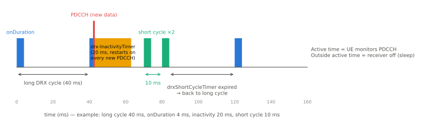

# DRX

!!! spec "스펙 · 릴리즈"
    연결 상태 DRX: TS 36.321 §5.7 · RRC 설정: TS 36.331 `DRX-Config` (`MAC-MainConfig`) · Idle DRX: TS 36.304 §7 · eDRX: TS 36.304 §7.3 (Rel-13)

    Rel-8~ (Rel-13 연결 상태 eDRX 최대 10.24 s, Idle eDRX)

!!! basic "한눈에 보기"
    단말은 PDCCH를 계속 보고 있어야 자기에게 온 데이터를 알 수 있습니다. 하지만 1 ms마다 수신기를 켜 두면 배터리가 빨리 닳습니다.

    **DRX(Discontinuous Reception)**는 "정해진 시간에만 깨어 PDCCH를 확인하고, 나머지는 잠자기"입니다.

    - **Idle DRX**: Idle 상태에서 페이징 기회에만 깨어남 (보통 1.28초마다)
    - **C-DRX (Connected DRX)**: 연결 상태에서도 데이터가 뜸할 때 주기적으로 잠듦

    스마트폰 대기 시간의 상당 부분이 DRX 설정에 달려 있습니다.

## C-DRX 동작 { .l2 }

<figure markdown>

<figcaption>Long DRX 주기마다 onDuration 동안 PDCCH를 확인합니다. 새 데이터 PDCCH를 받으면 inactivity timer 동안 깨어 있고, 만료 후 short DRX 주기를 몇 번 거쳐 다시 long 주기로 돌아갑니다.</figcaption>
</figure>

| 파라미터 | 의미 | 값 범위 (서브프레임 = ms) |
|---|---|---|
| `longDRX-CycleStartOffset` | Long 주기와 시작 오프셋 | 10, 20, 32, 40, 64, 80, 128, 160, 256, 320, 512, 640, 1024, 1280, 2048, 2560 |
| `onDurationTimer` | 주기마다 깨어 있는 시간 | 1 – 200 |
| `drx-InactivityTimer` | 새 데이터 PDCCH 후 깨어 있는 시간 | 1 – 2560 |
| `shortDRX-Cycle` | Short 주기 | 2 – 640 |
| `drxShortCycleTimer` | Short 주기 반복 횟수 | 1 – 16 |
| `drx-RetransmissionTimer` | HARQ 재전송을 기다리는 시간 | 1 – 33 |
| HARQ RTT Timer | 재전송이 올 수 없는 구간 | FDD 8 (고정), TDD 구성별 |

### Active time

다음 중 하나라도 해당하면 단말은 깨어 PDCCH를 봅니다.

- onDurationTimer, drx-InactivityTimer, drx-RetransmissionTimer, mac-ContentionResolutionTimer 동작 중
- SR을 보내고 응답 대기 중
- 비경쟁 RA의 RAR을 받고 C-RNTI PDCCH 대기 중
- 재전송 대기 중인 UL grant가 있음

## 대표 설정 예 { .l2 }

| 서비스 | Long 주기 | onDuration | Inactivity | Short 주기 |
|---|---|---|---|---|
| 일반 데이터 (스마트폰) | 320 ms | 10 ms | 100–200 ms | 사용 안 함 또는 40 ms |
| VoLTE | 40 ms | 4–10 ms | 4–10 ms | 20 ms (음성 패킷 주기에 맞춤) |
| IoT | 1280–2560 ms | 4–8 ms | 짧게 | — |

VoLTE는 20 ms마다 음성 패킷이 오므로 주기를 20 ms의 배수로 맞춥니다. 대기 중 짧은 주기는 응답성이 좋고, 긴 주기는 배터리에 유리합니다.

??? expert "전문가 노트 — 세부 동작과 상호작용"
    **onDuration 시작 조건.**
    - Long: \([(SFN \times 10) + \text{subframe}] \bmod \text{longDRX-Cycle} = \text{drxStartOffset}\)
    - Short: \([(SFN \times 10) + \text{subframe}] \bmod \text{shortDRX-Cycle} = \text{drxStartOffset} \bmod \text{shortDRX-Cycle}\)

    **DRX Command MAC CE.** 기지국이 더 보낼 데이터가 없으면 즉시 onDuration/Inactivity 타이머를 멈추게 해 단말을 재웁니다(short 주기가 설정되어 있으면 short로). Rel-12 **Long DRX Command**는 곧바로 long 주기로 보냅니다.

    **HARQ와 DRX.** DL 전송 후 HARQ RTT timer(8 ms) 동안은 재전송이 불가능하므로 잘 수 있고, RTT 만료 시 디코딩 실패였다면 drx-RetransmissionTimer 동안 재전송을 기다립니다.

    **CQI/SRS 보고와 DRX.** `cqi-Mask`가 설정되면 onDuration 동안만 주기 CQI를 보냅니다. Active time 밖에서는 주기 CQI·SRS를 보내지 않습니다.

    **측정과 DRX.** DRX 주기가 길면 측정 주기도 늘어나 이동성 성능 요구사항이 완화됩니다(TS 36.133: 측정 주기 = max(DRX 주기 × N, 기준값)). 너무 긴 C-DRX는 핸드오버 지연으로 이어질 수 있습니다.

    **eDRX (Rel-13).** 연결 상태 long 주기를 5.12 s, 10.24 s까지 확장하고, Idle에서는 H-SFN을 써서 최대 2621.44 s(약 43.7분)까지 늘립니다. NB-IoT Idle eDRX는 최대 10485.76 s(약 2.9시간)입니다.

    **NR과의 차이.** NR C-DRX는 ms 단위 타이머(서브-ms 가능), DL/UL 분리 재전송 타이머, Rel-16 **WUS(DCI 2_6)** 기반 웨이크업, Rel-17 PDCCH 모니터링 생략(skipping) 등으로 확장되었습니다.

## 관련 페이지

- [Paging과 TAU](paging-tau.md) — Idle DRX
- [MAC](../protocol/mac.md)
- [VoLTE와 IMS](../advanced/volte-ims.md)
- [NR UE 전력 절약](../../nr/advanced/power-saving.md)
