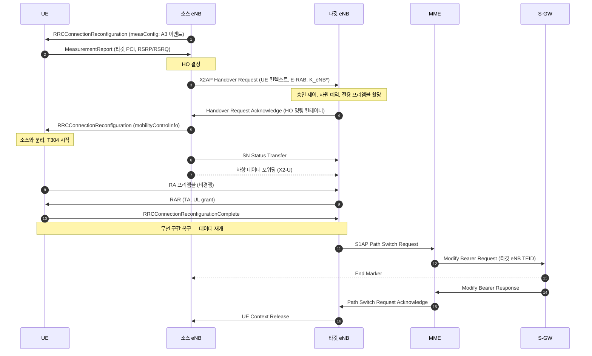

# 핸드오버

!!! spec "스펙 · 릴리즈"
    E-UTRAN 핸드오버: TS 36.300 §10.1.2 (X2 HO), TS 23.401 §5.5.1 (X2/S1 HO) · RRC: TS 36.331 §5.3.5.4 (`mobilityControlInfo`), §5.5 (측정) · 성능 요구: TS 36.133 §5.1

    Rel-8~ (Rel-9 MRO, Rel-14 make-before-break·RACH-less, Rel-16 LTE CHO·DAPS)

!!! basic "한눈에 보기"
    통화 중에 차를 타고 이동하면 단말은 **여러 셀을 옮겨 다닙니다**. 연결을 끊지 않고 서빙 셀을 바꾸는 것이 **핸드오버**입니다.

    LTE 핸드오버의 특징은 **망이 결정한다**는 점입니다.

    1. 기지국이 단말에게 "주변 셀을 재고, 이런 조건이 되면 보고해라" 설정
    2. 단말이 조건을 만족하면 **측정 보고(Measurement Report)**
    3. 소스 기지국이 타깃 기지국과 협의(**준비**)
    4. 소스가 단말에게 **핸드오버 명령**
    5. 단말이 타깃 셀에 RA로 접속(**실행**) → 소스는 남은 데이터를 타깃으로 넘김(**포워딩**)
    6. 핵심망 경로를 타깃으로 변경(**완료**)

    LTE는 **hard handover**입니다. 소스와의 연결을 끊고 타깃에 붙기까지 수십 ms의 데이터 중단이 있습니다.

## X2 핸드오버 { .l2 }

| 단계 | 메시지 | 비고 |
|---|---|---|
| 측정·준비 | 1–4 | 소스·타깃 eNB만 관여, 단말은 계속 소스와 통신 |
| 실행 | 5–10 | **중단 구간**: 5(HO 명령) 수신 ~ 10(Complete) 송신. 목표 수십 ms |
| 완료 | 11–16 | 핵심망 경로 변경. 그 전까지 하향은 소스 → 타깃 포워딩 |

## 핸드오버 명령 내용 { .l2 }

`RRCConnectionReconfiguration`의 **mobilityControlInfo**:

| 필드 | 의미 |
|---|---|
| `targetPhysCellId` | 타깃 PCI |
| `carrierFreq`, `carrierBandwidth` | 다른 주파수 HO 시 |
| `t304` | HO 완료 제한 시간 (50–2000 ms) |
| `newUE-Identity` | 타깃에서 쓸 C-RNTI |
| `radioResourceConfigCommon` | 타깃 셀의 공통 설정 (SIB2 상당) |
| `rach-ConfigDedicated` | 전용 프리앰블, PRACH 마스크 |

단말은 타깃 SIB를 읽지 않고 바로 접속할 수 있습니다. 보안 키는 \(K_{eNB}^*\)로 새로 유도합니다.

## 핸드오버 종류 { .l2 }

| 종류 | 조건 | 특징 |
|---|---|---|
| **X2 HO** | X2 존재, MME 유지 | 가장 일반적, 빠름 |
| **S1 HO** | X2 없음, MME/S-GW 재배치 | MME가 준비 단계를 중계 (Handover Required → Request → Command) |
| Intra-eNB | 같은 eNB의 다른 셀 | 내부 처리, 핵심망 관여 없음 |
| Inter-frequency | 다른 EARFCN | 측정 갭 필요 (단일 수신기 단말) |
| Inter-RAT | LTE → 3G/2G | PS HO, **SRVCC**(VoLTE → CS 음성), CSFB(리디렉션) |

??? expert "전문가 노트 — 중단 시간, 실패, 진화"
    **중단 시간 분해 (TS 36.133, 동일 주파수).** HO 명령 처리 약 15 ms + 타깃 동기·RACH 대기 최대 수 ms + RA 왕복 약 10 ms + Reconfiguration Complete ≈ **30–50 ms**. 규격 요구사항은 \(T_{interrupt} = T_{search} + T_{IU} + 20\) ms 형태로 정의됩니다(알려진 셀이면 \(T_{search}\) = 0).

    **T304 만료** → 핸드오버 실패 → 단말은 RRC 재수립을 시도합니다(소스로 돌아오면 Too-early, 다른 셀이면 Wrong-cell 후보).

    **MRO와 파라미터.** A3 offset, hysteresis, TTT, **CIO(Cell Individual Offset)**를 셀 쌍별로 조정합니다. 고속 이동(고속도로, 철도)에서는 TTT를 짧게, 핑퐁이 심한 곳은 길게 설정합니다.

    **SRVCC (Rel-8~).** VoLTE 통화 중 LTE 커버리지를 벗어나면 MME가 Sv 인터페이스로 MSC에 CS 핸드오버를 요청합니다. IMS 세션은 eSRVCC(Rel-10, ATCF/ATGW 앵커)로 빠르게 전환됩니다.

    **Rel-14 향상.**
    - **Make-before-break**: 단말이 타깃에 첫 UL을 보낼 때까지 소스와 송수신을 유지 (`makeBeforeBreak-r14`)
    - **RACH-less**: 타깃 UL grant를 HO 명령에 포함 → RA 생략

    **Rel-16 LTE 이동성 향상.**
    - **CHO (Conditional HO)**: 여러 후보 셀을 미리 준비하고, 단말이 조건(예: A3) 만족 시 **스스로** 실행 → Too-late HO 감소
    - **DAPS (Dual Active Protocol Stack)**: 타깃 접속 중에도 소스와 데이터 유지 → **0 ms 중단**에 근접
    두 기능 모두 NR에도 같은 릴리즈에 도입되었습니다. → [NR 핸드오버](../../nr/procedures/handover.md)

## 관련 페이지

- [측정 이벤트](../measurement/events.md)
- [인터페이스 (Uu·S1·X2)](../architecture/interfaces.md)
- [PDCP](../protocol/pdcp.md) — 무손실 핸드오버
- [RRC 연결 관리](rrc-connection.md) — RLF와 재수립
