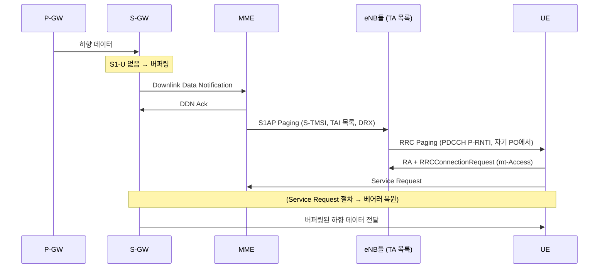
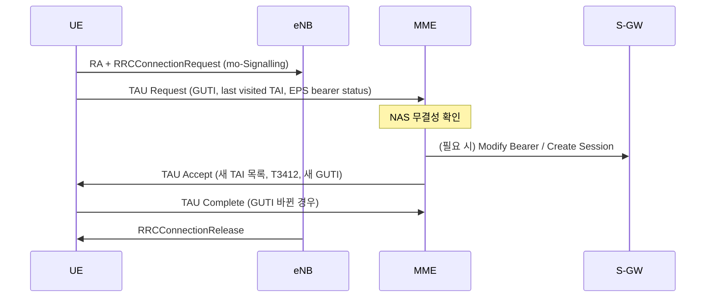

# Paging과 TAU

!!! spec "스펙 · 릴리즈"
    페이징 기회 계산: TS 36.304 §7 · Paging 메시지: TS 36.331 §5.3.2 · 망 트리거 Service Request: TS 23.401 §5.3.4.3 · TAU: TS 23.401 §5.3.3, TS 24.301 §5.5.3

    Rel-8~ (Rel-13 eDRX·H-SFN, NB-IoT 페이징, Rel-14 페이징 최적화)

!!! basic "한눈에 보기"
    Idle 상태의 단말은 배터리를 아끼려고 대부분 잠들어 있습니다. 그런데 전화가 오면 어떻게 깨울까요?

    - **Paging**: 망이 "이 단말 있으면 응답하라"고 방송합니다. 단말은 정해진 시간(**페이징 기회, PO**)에만 잠깐 깨어 확인합니다.
    - 망은 Idle 단말이 정확히 어느 셀에 있는지 모르고, **Tracking Area(TA)** 단위로만 압니다. 그래서 TA 안의 모든 셀에서 페이징합니다.
    - **TAU (Tracking Area Update)**: 단말이 등록된 TA 목록 밖으로 나가면 "나 여기 왔어요" 하고 위치를 갱신합니다. 오래 움직이지 않아도 주기적으로 갱신합니다.

## 착신 흐름 { .l2 }

## 페이징 기회 계산 { .l2 }

단말은 **페이징 프레임(PF)** 안의 **페이징 기회(PO)** 서브프레임에서만 P-RNTI PDCCH를 확인합니다.

\[
\text{PF: } SFN \bmod T = (T \div N) \cdot (UE\_ID \bmod N), \qquad i_s = \lfloor UE\_ID / N \rfloor \bmod N_s
\]

| 기호 | 의미 |
|---|---|
| \(T\) | DRX 주기 (프레임) = min(단말 요청 DRX, 셀 `defaultPagingCycle`) — 32, 64, 128, 256 |
| \(nB\) | 셀의 페이징 밀도 (4T, 2T, T, T/2 … T/32) |
| \(N\) | min(T, nB) — 주기당 PF 수 |
| \(N_s\) | max(1, nB/T) — PF당 PO 수 |
| \(UE\_ID\) | IMSI mod 1024 |

| \(N_s\) | PO 서브프레임 (FDD) | PO 서브프레임 (TDD) |
|---|---|---|
| 1 | 9 | 0 |
| 2 | 4, 9 | 0, 5 |
| 4 | 0, 4, 5, 9 | 0, 1, 5, 6 |

예: T = 128, nB = T → N = 128, Ns = 1. IMSI mod 1024 = 300이면 PF: SFN mod 128 = 300 mod 128 = 44 → SFN 44, 172, 300 … 의 서브프레임 9.

## Paging 메시지 { .l2 }

| 필드 | 용도 |
|---|---|
| `pagingRecordList` | 페이징할 단말 목록 (S-TMSI 또는 IMSI, `cn-Domain` ps/cs) |
| `systemInfoModification` | 다음 수정 주기에 SI 변경 |
| `etws-Indication` | 지진·쓰나미 경보 (SIB10/11 읽어라) |
| `cmas-Indication` (Rel-9) | 재난 문자 (SIB12) |
| `eab-ParamModification` (Rel-11) | EAB 파라미터 변경 |

## TAU { .l2 }

### 트리거

| 트리거 | 설명 |
|---|---|
| 새 TA 진입 | 현재 셀의 TAI가 등록된 **TAI 목록**에 없음 |
| 주기적 TAU | **T3412** 만료 (기본 54분) |
| CSFB 후 복귀 | 3G에서 LTE로 돌아옴 |
| 부하 분산 | Release cause `loadBalancingTAUrequired` |
| 단말 능력·DRX 변경 | UE network capability 등 |
| Idle 중 RAT 변경 | 3G/2G (ISR 미적용) 등 |

### 흐름 (Idle에서 TA 변경, S-GW 유지)

??? expert "전문가 노트 — TA 설계와 페이징 전략"
    **TA 목록 크기 트레이드오프.** TA 목록이 크면 TAU는 줄지만 페이징 부하(셀 수 × 단말 수)가 늘어납니다. 작으면 반대입니다. MME는 단말마다 다른 TAI 목록을 줄 수 있어, TA 경계에서 핑퐁하는 단말에게 양쪽 TA를 모두 넣어 주는 식으로 최적화합니다.

    **페이징 단계화(Paging escalation).** 많은 MME 구현은 마지막으로 접속한 eNB → 마지막 TA → 전체 TAI 목록 순서로 페이징 범위를 넓힙니다. 첫 시도에 응답이 없을 때만 넓혀 시그널링을 아낍니다. 응답 지연은 수 초 늘어날 수 있습니다.

    **페이징 용량.** PO 하나의 Paging 메시지에는 최대 16개 레코드가 들어갑니다. nB를 늘리면 PO가 늘어 용량이 커지지만, 단말별 DRX 주기는 그대로입니다.

    **eDRX와 H-SFN (Rel-13).** eDRX 주기가 10.24 s보다 길면 **PH(Paging Hyperframe)**: H-SFN mod \(T_{eDRX,H}\) = (UE_ID_H mod \(T_{eDRX,H}\)) 와 **PTW(Paging Time Window)** 안에서 일반 PO를 봅니다. UE_ID_H는 S-TMSI의 해시입니다.

    **ISR (Idle mode Signalling Reduction).** LTE와 3G를 오가는 단말이 RAT를 바꿀 때마다 TAU/RAU를 하지 않도록, MME와 SGSN에 동시에 등록해 두는 기능입니다(TIN = RAT-related TMSI).

    **CS 페이징 (CSFB).** MSC가 SGs로 MME에 페이징을 요청하면 MME가 LTE에서 `cn-Domain = cs`로 페이징하고, 단말은 Extended Service Request로 응답 → 3G로 리디렉션/핸드오버됩니다.

## 관련 페이지

- [DRX](drx.md)
- [NAS (EMM·ESM)](../protocol/nas.md)
- [RRC 연결 관리](rrc-connection.md)
- [NR Paging](../../nr/procedures/paging.md)
