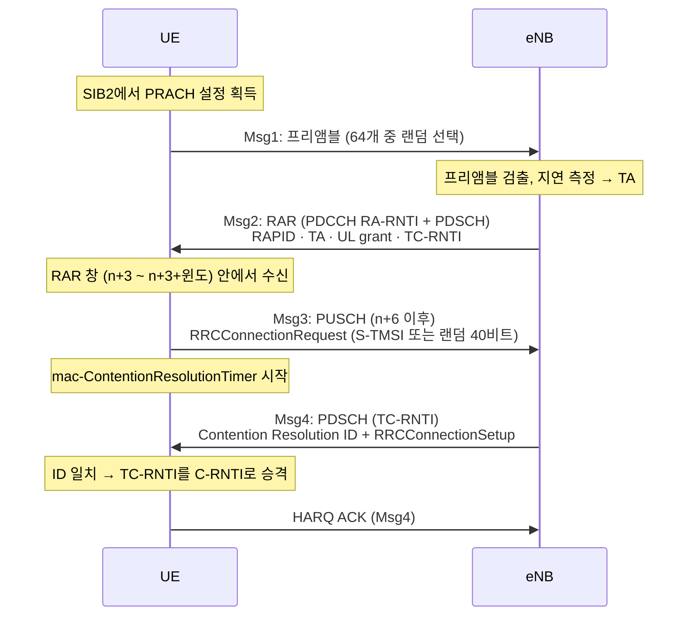
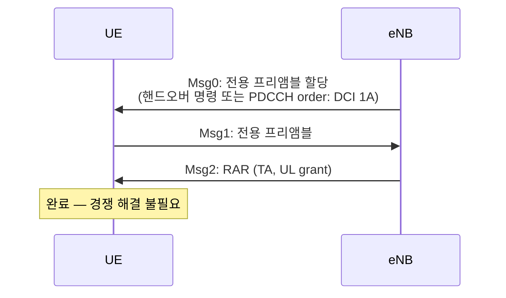

# 랜덤 액세스

!!! spec "스펙 · 릴리즈"
    MAC 절차: TS 36.321 §5.1 · 물리계층: TS 36.213 §6 (RAR grant §6.2) · PRACH: TS 36.211 §5.7 · RRC 설정: TS 36.331 `RACH-ConfigCommon`, `RACH-ConfigDedicated`

    Rel-8~ (Rel-13 eMTC CE 레벨, NB-IoT, Rel-14 RACH-less 핸드오버)

!!! basic "한눈에 보기"
    **랜덤 액세스(RA)**는 단말이 기지국과 **상향 동기를 맞추고 첫 자원을 얻는** 절차입니다. 식당에 처음 들어가 "몇 명이요" 하고 자리를 안내받는 것과 비슷합니다.

    여러 단말이 같은 프리앰블을 우연히 고를 수 있으므로(충돌), 일반적인 RA는 **4단계**로 충돌을 해결합니다.

    1. **Msg1**: 단말 → 프리앰블 송신 ("누군가 여기 있어요")
    2. **Msg2**: 기지국 → RAR ("그 프리앰블 보낸 분, 타이밍은 이만큼 당기고 이 자원으로 말하세요")
    3. **Msg3**: 단말 → 자기 신원 전송 ("저는 이런 사람이에요")
    4. **Msg4**: 기지국 → 경쟁 해결 ("당신으로 확정")

## RA가 필요한 경우 { .l2 }

| 상황 | 방식 |
|---|---|
| 초기 접속 (RRC_IDLE → CONNECTED) | 경쟁 기반 |
| RRC 연결 재수립 (RLF 후) | 경쟁 기반 |
| 핸드오버 (타깃 셀 접속) | 비경쟁 (전용 프리앰블) 우선, 없으면 경쟁 |
| 연결 상태에서 DL 데이터 도착, UL 동기 잃음 | 비경쟁 (**PDCCH order**) |
| 연결 상태에서 UL 데이터 도착, UL 동기 잃음 또는 SR 자원 없음 | 경쟁 기반 |
| 측위를 위한 TA 측정 | 비경쟁 |

## 경쟁 기반 RA (4-step) { .l2 }

### RAR 내용

| 필드 | 크기 | 의미 |
|---|---|---|
| RAPID | 6비트 | 어느 프리앰블에 대한 응답인지 |
| **Timing Advance** | 11비트 | 0–1282 × 16 Ts (최대 0.67 ms ≈ 100 km) |
| **UL grant** | 20비트 | 호핑 1 · RB 할당 10 · MCS 4 · TPC 3 · UL delay 1 · CSI 요청 1 |
| Temporary C-RNTI | 16비트 | Msg3/Msg4에서 쓸 임시 ID |
| (MAC 헤더) Backoff Indicator | 4비트 | 혼잡 시 재시도 전 대기 (0–960 ms) |

### 경쟁 해결

- **Msg3에 CCCH SDU(RRCConnectionRequest)를 보낸 경우**: Msg4의 **UE Contention Resolution Identity MAC CE**가 Msg3의 CCCH SDU 앞 48비트와 같으면 성공
- **Msg3에 C-RNTI MAC CE를 보낸 경우**(연결 상태 단말): 자기 C-RNTI로 스크램블된 PDCCH(UL grant 등)를 받으면 성공

같은 프리앰블을 고른 두 단말은 같은 RAR을 받고 같은 자원에 Msg3를 보냅니다. 기지국은 둘 중 하나만 디코딩하거나 둘 다 실패하고, Msg4로 승자를 알립니다. 진 단말은 백오프 후 다시 시도합니다.

## 비경쟁 RA { .l2 }

??? expert "전문가 노트 — 타이밍, 재시도, 실패 처리"
    **타이밍 (FDD).**
    - RAR 창: 프리앰블을 보낸 마지막 서브프레임 + 3부터 `ra-ResponseWindowSize`(2–10 서브프레임)
    - Msg3: RAR을 받은 서브프레임 \(n\)에서 \(n+6\) 이후 첫 UL 서브프레임 (UL delay 필드가 1이면 한 서브프레임 더 뒤)
    - 경쟁 해결 타이머: `mac-ContentionResolutionTimer` 8–64 서브프레임, Msg3 재전송마다 재시작

    **재시도.** RAR을 못 받거나 경쟁에서 지면 PREAMBLE_TRANSMISSION_COUNTER를 올리고, 전력을 `powerRampingStep`만큼 높여 다시 보냅니다(백오프 지시가 있으면 0 ~ BI 사이 랜덤 대기). `preambleTransMax`에 도달하면 MAC이 RRC에 **RA 문제**를 알리고, 연결 상태라면 RLF가 됩니다.

    **Msg3 크기.** RAR grant의 TBS는 보통 56–144비트 수준입니다. RRCConnectionRequest(약 48비트 + 헤더)가 들어가는 최소 크기는 56비트입니다. Msg3가 크면(예: 연결 상태에서 BSR+데이터) 프리앰블 그룹 B를 써서 큰 grant를 요청합니다. 그룹 B 사용 조건: Msg3 크기 > `messageSizeGroupA` 이고 경로 손실이 \(P_{CMAX} - P_{O,PRE} - \Delta_{PREAMBLE,Msg3} - messagePowerOffsetGroupB\)보다 작을 때.

    **Msg3 HARQ.** Msg3는 동기 HARQ로 재전송되며 최대 횟수는 `maxHARQ-Msg3Tx`(1–8)입니다. Msg3 스크램블은 TC-RNTI로 합니다.

    **RA-RNTI 충돌.** 같은 서브프레임의 PRACH를 쓴 단말들은 같은 RA-RNTI를 공유하므로, 하나의 RAR MAC PDU에 여러 RAPID 응답이 함께 들어갑니다.

    **RACH-less 핸드오버 (Rel-14).** 소스와 타깃 셀이 같은 사이트이거나 TA가 같다고 판단되면, 핸드오버 명령에 타깃의 UL grant를 미리 넣어 RA를 생략합니다(`rach-Skip`). 중단 시간을 줄입니다.

## LTE ↔ NR 비교

| 항목 | LTE | NR |
|---|---|---|
| 단계 | 4-step | 4-step + **2-step (Rel-16, MsgA/MsgB)** |
| RA-RNTI | 서브프레임·주파수 인덱스 | 심볼·슬롯·주파수·캐리어 인덱스 |
| 빔 | 없음 | SSB 선택 → 그 SSB에 연동된 RO 사용 |
| Msg3 | RRCConnectionRequest | RRCSetupRequest / RRCResumeRequest |
| 실패 시 | 전력 ramping | ramping + **빔 변경**(카운터 유지) |

## 관련 페이지

- [PRACH](../phy/prach.md)
- [MAC](../protocol/mac.md)
- [RRC 연결 관리](rrc-connection.md)
- [NR 랜덤 액세스 (4-step·2-step)](../../nr/procedures/random-access.md)
