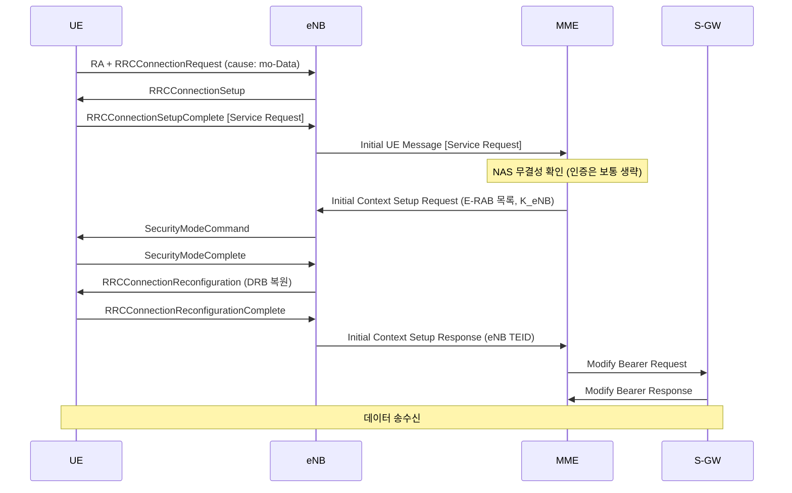
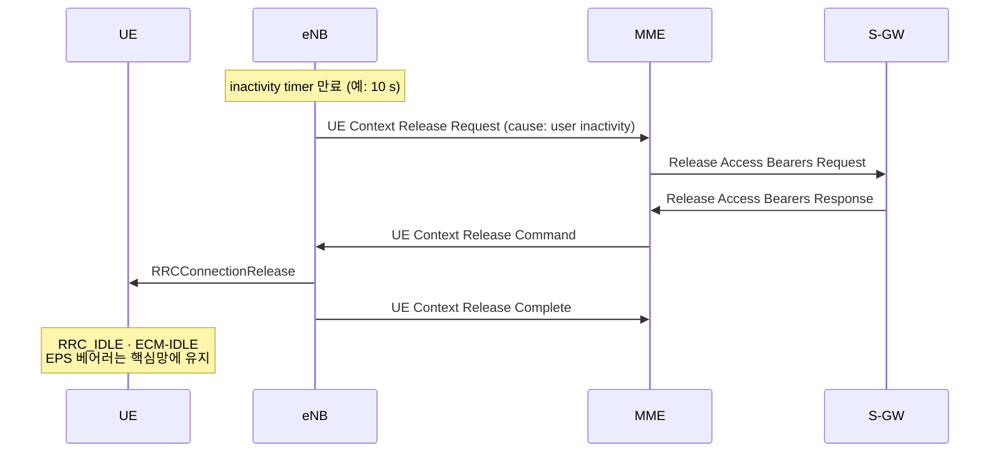
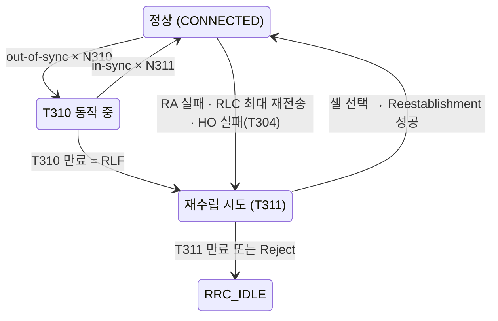

# RRC 연결 관리

!!! spec "스펙 · 릴리즈"
    TS 36.331 §5.3.3 (연결 수립), §5.3.5 (재구성), §5.3.7 (재수립), §5.3.8 (해제), §5.3.11 (RLF) · Service Request: TS 23.401 §5.3.4 · S1 Release: §5.3.5

    Rel-8~ (Rel-13 Suspend/Resume, Rel-14 Light connection)

!!! basic "한눈에 보기"
    LTE 단말은 데이터를 보낼 때만 **RRC_CONNECTED**로 들어가고, 한동안 데이터가 없으면 기지국이 연결을 끊어 **RRC_IDLE**로 돌려보냅니다. 배터리와 무선 자원을 아끼기 위해서입니다.

    - **연결 수립**: Idle → Connected (Service Request, 페이징 응답, Attach, TAU)
    - **재구성**: 연결 중 설정 변경 (베어러 추가, 측정, 핸드오버, CA)
    - **해제**: Connected → Idle (보통 10초 정도 데이터가 없으면)
    - **재수립**: 연결이 갑자기 끊겼을 때(RLF) 빠르게 복구

## Idle → Connected (Service Request) { .l2 }

이미 Attach된 단말이 Idle 상태에서 데이터를 보내려 할 때의 흐름입니다.

## 연결 설정 원인 (establishmentCause) { .l2 }

| 원인 | 상황 |
|---|---|
| emergency | 긴급 호 |
| highPriorityAccess | 접근 등급 11–15 (공공 안전 등) |
| mt-Access | 페이징 응답 (착신) |
| mo-Signalling | 단말 발신 시그널링 (Attach, TAU, Detach) |
| mo-Data | 단말 발신 데이터 |
| delayTolerantAccess (Rel-10) | MTC 저우선 단말 |
| mo-VoiceCall (Rel-12) | VoLTE 발신 (ACB 예외 처리용) |

기지국은 혼잡 시 **RRCConnectionReject**(`waitTime` 1–16 s)로 거절할 수 있습니다.

## Connected → Idle (Release) { .l2 }

Idle이 되어도 **EPS 베어러와 IP 주소는 유지**됩니다. 무선 구간(DRB)과 S1 구간만 해제되므로 다음 Service Request에서 빠르게 복원됩니다.

RRCConnectionRelease에 담을 수 있는 것:

- `redirectedCarrierInfo`: 특정 주파수/RAT로 바로 가라 (예: CSFB 시 3G, 부하 분산)
- `idleModeMobilityControlInfo`: 단말 전용 재선택 우선순위 (T320 동안 유효)
- `releaseCause`: other / loadBalancingTAUrequired / cs-FallbackHighPriority / rrc-Suspend

## RLF와 재수립 { .l2 }

재수립에 성공하면 SRB1이 복구되고 이어서 Reconfiguration으로 DRB도 되살아납니다(데이터 끊김 수백 ms). 실패하면 Idle로 가서 NAS가 Service Request부터 다시 합니다(수 초).

??? expert "전문가 노트 — 재수립 조건과 최적화"
    **재수립 성공 조건.** 단말이 선택한 셀의 eNB가 **단말 컨텍스트를 가지고 있어야** 합니다. Reestablishment Request에는 `ue-Identity`(이전 셀의 C-RNTI, PCI, shortMAC-I)가 들어가며, eNB는 shortMAC-I로 진짜 그 단말인지 검증합니다.
    - 소스 셀로 돌아온 경우: 성공 (Too-late HO의 흔한 모습)
    - 핸드오버 준비된 타깃 셀: 성공
    - 준비 안 된 셀: Reject → Idle (Rel-9 이후 X2 RLF Indication으로 원래 셀에 알림)

    **Rel-9 MRO 분류.**
    - **Too Late HO**: 소스에서 RLF → 다른 셀(타깃이었어야 할 셀)에서 재수립
    - **Too Early HO**: 타깃으로 HO 직후 RLF → 소스로 재수립
    - **HO to Wrong Cell**: 타깃으로 HO 직후 RLF → 제3 셀로 재수립

    **inactivity timer 설계.** 짧으면 Idle↔Connected 전환이 잦아 시그널링(약 10–20 메시지)과 지연이 늘고, 길면 단말 배터리와 eNB 컨텍스트 자원을 씁니다. 스마트폰 앱의 keep-alive 패턴 때문에 보통 5–20초로 운용합니다. C-DRX가 그 사이 전력 소모를 줄여 줍니다.

    **Suspend / Resume (Rel-13 UP CIoT).** Release with `rrc-Suspend` → 단말과 eNB가 AS 컨텍스트 보관 → **RRCConnectionResumeRequest**(resumeID, shortResumeMAC-I) → Resume. 보안 모드·DRB 재설정 메시지를 생략합니다. MME에서 S1 연결은 "suspended" 상태로 유지됩니다.

## 관련 페이지

- [RRC](../protocol/rrc.md)
- [랜덤 액세스](random-access.md)
- [Paging과 TAU](paging-tau.md)
- [DRX](drx.md)
- [NR RRC 상태와 INACTIVE](../../nr/procedures/rrc-states.md)
