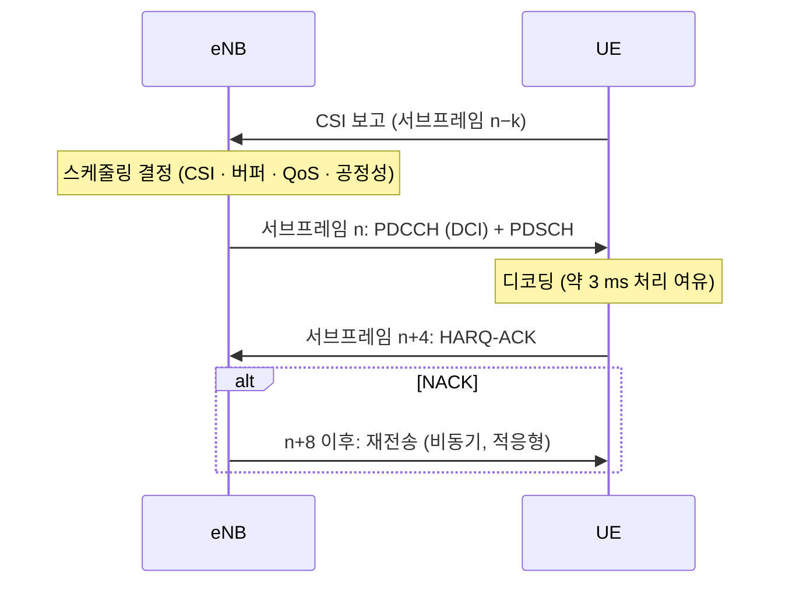
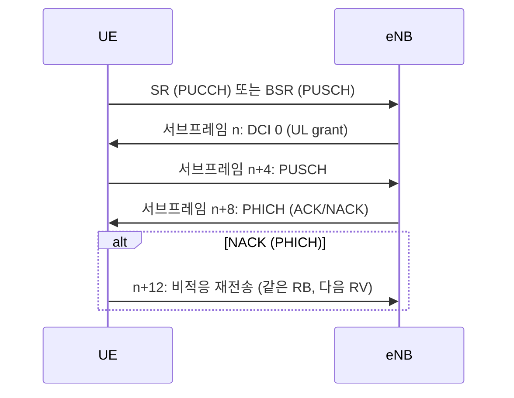

# 스케줄링

!!! spec "스펙 · 릴리즈"
    스케줄링 개요: TS 36.300 §11 · DL 할당·UL grant 해석: TS 36.213 §7.1, §8 · CSI 보고: §7.2 · SPS: TS 36.321 §5.10 · QoS: TS 23.203

    Rel-8~ (스케줄링 알고리즘 자체는 표준이 아니라 **기지국 구현**)

!!! basic "한눈에 보기"
    LTE 기지국의 MAC 스케줄러는 **1 ms마다** 다음을 결정합니다.

    - 이번 서브프레임에 **누구에게** 보낼까 (DL)
    - 누구에게 **보낼 기회를** 줄까 (UL)
    - **어떤 RB**를 줄까
    - **어떤 MCS, 몇 레이어**로 보낼까

    표준은 스케줄링 "결과를 알리는 방법"(DCI)만 정하고, **어떻게 고를지는 각 장비 제조사의 기술**입니다. 이 알고리즘이 셀 처리량과 사용자 체감 품질을 크게 좌우합니다.

## 스케줄링에 쓰는 정보 { .l2 }

| 방향 | 입력 | 출처 |
|---|---|---|
| DL | 채널 품질 (CQI, PMI, RI) | 단말 CSI 보고 (PUCCH/PUSCH) |
| DL | 버퍼량 | eNB의 PDCP/RLC 큐 |
| DL | HARQ 상태 (ACK/NACK) | PUCCH/PUSCH |
| UL | 버퍼량 | 단말 **BSR**, **SR** |
| UL | 전력 여유 | 단말 **PHR** |
| UL | 채널 품질 | **SRS**, PUSCH DMRS 측정 |
| 공통 | QoS (QCI, GBR, AMBR, 지연 예산) | 베어러 설정 |

## 하향 스케줄링 타임라인 (FDD) { .l2 }

## 상향 스케줄링 타임라인 (FDD) { .l2 }

## 대표 스케줄링 정책 { .l2 }

| 정책 | 선택 기준 | 특징 |
|---|---|---|
| Round Robin | 순서대로 | 공정, 셀 처리량 낮음 |
| Max C/I | 채널 최고인 단말 | 처리량 최대, 셀 가장자리 단말 굶음 |
| **Proportional Fair (PF)** | 순간 속도 ÷ 평균 속도 최대 | 처리량과 공정성의 균형 (실무 기본) |
| QoS 기반 | GBR 충족, 지연 예산 임박 순 | VoLTE 등 우선 처리 |

PF는 각 단말이 **자기 평소보다 채널이 좋은 순간**에 스케줄링되도록 해서, 페이딩을 오히려 이득으로 바꿉니다(**다중 사용자 다이버시티**).

??? expert "전문가 노트 — 링크 적응과 구현 요소"
    **PF 메트릭.** 단말 \(k\), 시간 \(t\), RB \(n\)에서

    \[
    k^*(n) = \arg\max_k \frac{R_k(t,n)}{\bar T_k(t)}, \qquad \bar T_k(t+1) = (1-\tfrac{1}{t_c})\bar T_k(t) + \tfrac{1}{t_c}R_k(t)
    \]

    \(t_c\)(평균 창)가 짧으면 공정성 시간 범위가 짧아지고, 길면 처리량 위주가 됩니다. 여기에 QCI 가중치, GBR 부족분, HOL(head-of-line) 지연을 곱하는 변형이 흔합니다.

    **OLLA (Outer Loop Link Adaptation).** CQI 보고는 지연·양자화·추정 오차가 있으므로 목표 BLER(보통 10%)를 맞추도록 보정값을 더합니다.

    \[
    \Delta_{OLLA} \leftarrow \begin{cases} \Delta_{OLLA} + \Delta_{up} & \text{ACK} \\ \Delta_{OLLA} - \Delta_{down} & \text{NACK} \end{cases}, \quad \frac{\Delta_{up}}{\Delta_{down}} = \frac{BLER_{target}}{1 - BLER_{target}}
    \]

    예: BLER 10% → \(\Delta_{down} = 9\,\Delta_{up}\) (예: +0.01 dB / −0.09 dB).

    **처리 순서(일반적 구현).** ① HARQ 재전송 우선 배정 → ② 시그널링·GBR(VoLTE, SPS) → ③ non-GBR을 PF로 → ④ 남은 RB로 MU-MIMO 페어링 시도. 제어 영역(PDCCH CCE) 부족이 실제 동시 스케줄 단말 수의 병목이 되는 경우가 많습니다(CCE blocking).

    **UL 특유의 제약.** 연속 RB(SC-FDMA), \(2^a3^b5^c\) RB 수, 전력 제한(PHR 음수 단말에 많은 RB를 주면 RB당 전력이 떨어져 손해), 동기 HARQ 재전송 자리 확보, 이웃 셀 IoT(Interference over Thermal) 제어.

    **TDD 스케줄링.** UL/DL 구성에 따라 DCI와 PUSCH 간격 \(k\), ACK 타이밍이 표로 정해지고, 한 DL 서브프레임에서 여러 UL 서브프레임 grant를 줄 수도 있습니다(config 0의 UL index).

    **CA 스케줄링.** 셀별 독립 스케줄러 + 단말 단위 공정성 조정. 교차 캐리어 스케줄링(CIF 3비트)으로 간섭이 큰 셀의 PDCCH를 피할 수 있습니다.

## 관련 페이지

- [MAC](../protocol/mac.md) — BSR, SR, PHR
- [PDCCH와 DCI](../phy/pdcch-dci.md)
- [TBS와 MCS](../phy/tbs-mcs.md)
- [CQI·PMI·RI](../measurement/csi.md)
