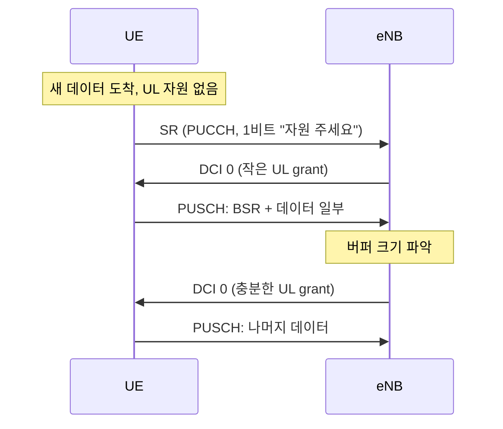

# MAC

!!! spec "스펙 · 릴리즈"
    TS 36.321 (E-UTRA MAC) — §5.1 랜덤 액세스, §5.2 TA 유지, §5.3–5.4 DL/UL-SCH와 HARQ, §5.4.4 SR, §5.4.5 BSR, §5.4.6 PHR, §5.7 DRX, §6 PDU 형식

    Rel-8~ (Rel-10 CA 확장 PHR·활성화 CE, Rel-12 DC, Rel-13 eMTC/NB-IoT)

!!! basic "한눈에 보기"
    **MAC(Medium Access Control)**은 무선 자원이라는 "공유 도로"의 교통정리를 맡습니다.

    - **스케줄링**: 기지국 MAC이 1 ms마다 누구에게 얼마나 줄지 결정합니다.
    - **다중화**: 여러 논리 채널(음성, 데이터, 제어)의 데이터를 하나의 전송 블록에 담습니다.
    - **HARQ**: 깨진 블록을 빠르게 재전송합니다.
    - **단말 보고**: 단말 MAC은 "보낼 데이터가 얼마나 있다(BSR)", "전력 여유가 얼마다(PHR)", "자원을 주세요(SR)"를 기지국에 알립니다.
    - **랜덤 액세스**, **TA(타이밍) 유지**, **DRX(절전)**도 MAC 기능입니다.

## MAC PDU 구조 { .l2 }

```
| MAC 헤더 (서브헤더 R/F2/E/LCID/F/L × n) | MAC CE 1 | MAC CE 2 | MAC SDU 1 | MAC SDU 2 | … | 패딩 |
```

LTE MAC은 서브헤더들을 **맨 앞에 모아서** 둡니다. 각 서브헤더의 **LCID(5비트)**가 뒤따르는 내용이 무엇인지 알려줍니다.

### 하향(DL-SCH) LCID

| LCID | 내용 |
|---|---|
| 0 | CCCH |
| 1–10 | 논리 채널 (SRB1, SRB2, DRB…) |
| 27 (11011) | Activation/Deactivation (SCell, Rel-10) |
| 28 (11100) | **UE Contention Resolution Identity** (Msg4) |
| 29 (11101) | **Timing Advance Command** |
| 30 (11110) | DRX Command |
| 31 (11111) | 패딩 |

### 상향(UL-SCH) LCID

| LCID | 내용 |
|---|---|
| 0 | CCCH |
| 1–10 | 논리 채널 |
| 25 (11001) | Extended PHR (CA, Rel-10) |
| 26 (11010) | Power Headroom Report |
| 27 (11011) | **C-RNTI** (Msg3에서 연결 상태 단말 식별) |
| 28 (11100) | Truncated BSR |
| 29 (11101) | Short BSR |
| 30 (11110) | Long BSR |
| 31 (11111) | 패딩 |

## 상향 스케줄링 요청 흐름 { .l2 }



SR 자원이 설정되지 않았거나 SR을 `dsr-TransMax`번 보내도 응답이 없으면, 단말은 **랜덤 액세스**로 자원을 요청합니다.

## 주요 MAC CE { .l2 }

| MAC CE | 방향 | 내용 |
|---|---|---|
| **BSR** (Short/Truncated/Long) | UL | 논리 채널 그룹(LCG 0–3)별 버퍼 크기 (6비트 인덱스 → 0 ~ 150 kB 이상) |
| **PHR** | UL | 최대 전력 대비 남은 전력 여유 (−23 ~ +40 dB, 1 dB 단위) |
| C-RNTI | UL | 경쟁 기반 RA의 Msg3에서 자기 식별 |
| **Timing Advance Command** | DL | TA 조정값 (6비트, ±31 × 16 Ts 단위) |
| **UE Contention Resolution Identity** | DL | Msg3의 CCCH SDU 앞 48비트를 돌려줌 → 경쟁 해결 |
| DRX Command | DL | 즉시 DRX 진입 |
| Activation/Deactivation | DL | SCell 활성화 (CA) |

## 논리 채널 우선순위 (LCP) { .l2 }

UL grant를 받은 단말은 다음 순서로 바이트를 나눕니다.

1. 우선순위(priority)가 높은 논리 채널부터, 각 채널의 **PBR(Prioritised Bit Rate)** 만큼 (토큰 버킷 \(B_j\))
2. 남는 자원은 다시 우선순위 순서로, 데이터가 바닥날 때까지
3. MAC CE 우선순위: C-RNTI / UL-CCCH > BSR(패딩 BSR 제외) > PHR > 일반 데이터 > 패딩 BSR

PBR 덕분에 낮은 우선순위 채널도 완전히 굶지는 않습니다.

??? expert "전문가 노트 — 타이머와 경계 조건"
    **TA 유지.** RAR의 TA는 11비트(0–1282, 단위 16 Ts ≈ 0.52 µs → 최대 약 0.67 ms, 셀 반경 약 100 km).
    이후 MAC CE의 6비트 TA는 상대 조정값 \(N_{TA,new} = N_{TA,old} + (T_A - 31)\times 16\)입니다.
    `timeAlignmentTimer`(500 ms – 10240 ms 또는 infinity)가 만료되면 단말은 상향 동기를 잃은 것으로 보고 PUCCH/SRS 자원을 해제하고 HARQ 버퍼를 비웁니다. 이후 UL 송신 전에 RA가 필요합니다.

    **BSR 트리거.**
    - Regular BSR: 버퍼가 비어 있던 LCG에 데이터 도착, 또는 더 높은 우선순위 데이터 도착, 또는 `retxBSR-Timer` 만료 → **SR을 트리거함**
    - Periodic BSR: `periodicBSR-Timer` 만료
    - Padding BSR: 패딩 공간이 BSR보다 클 때

    **PHR 트리거.** `prohibitPHR-Timer` 만료 상태에서 경로 손실이 `dl-PathlossChange` dB 이상 변화, 또는 `periodicPHR-Timer` 만료, 또는 설정·재설정 시.
    \(PH = P_{CMAX,c} - \{10\log_{10}(M_{PUSCH}) + P_{O\_PUSCH} + \alpha \cdot PL + \Delta_{TF} + f\}\) (Type 1). CA/DC에서는 셀별 PH를 담는 Extended PHR, Type 2(PUCCH+PUSCH) PH가 쓰입니다.

    **SR 설정.** `sr-PUCCH-ResourceIndex`, `sr-ConfigIndex`(주기 1–80 ms, Rel-9 이후 1 ms·2 ms 포함), `dsr-TransMax`(4–64). `sr-ProhibitTimer`로 연속 SR을 제한합니다.

    **HARQ 엔터티.** CA에서는 서빙 셀마다 HARQ 엔터티가 따로 있습니다. LTE UL은 동기식이라 서브프레임 번호로 프로세스가 결정됩니다(FDD: 8개, TTI bundling 시 4개).

    **MAC 리셋.** 핸드오버, 재수립 시 MAC은 리셋되어 HARQ 버퍼를 비우고 타이머를 멈춥니다. 데이터 손실은 RLC AM과 PDCP 상태 보고가 복구합니다.

## 관련 페이지

- [HARQ](../../basics/harq.md)
- [랜덤 액세스](../procedures/random-access.md)
- [DRX](../procedures/drx.md)
- [스케줄링](../procedures/scheduling.md)
- [RLC](rlc.md)
