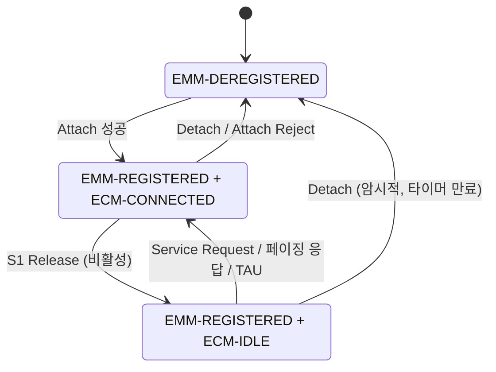

# NAS (EMM · ESM)

!!! spec "스펙 · 릴리즈"
    TS 24.301 (EPS NAS) — §5 EMM, §6 ESM, §8–9 메시지 형식, §10 타이머 · 절차 흐름: TS 23.401 §5.3 · 보안: TS 33.401

    Rel-8~ (Rel-12 PSM, Rel-13 eDRX·CIoT 최적화, Rel-15 5GS 연동 지시)

!!! basic "한눈에 보기"
    **NAS(Non-Access Stratum)**는 단말과 핵심망(MME)이 **기지국을 건너뛰고** 직접 나누는 대화입니다. 기지국은 내용을 보지 않고 전달만 합니다.

    NAS는 두 부분으로 나뉩니다.

    - **EMM (EPS Mobility Management)**: "나 여기 있어요" — 망 등록(Attach), 위치 갱신(TAU), 인증, 서비스 요청, 등록 해제
    - **ESM (EPS Session Management)**: "데이터 통로 만들어 주세요" — PDN 연결, 베어러 생성·수정·해제

    LTE는 Attach 때 기본 베어러까지 한 번에 만듭니다. 그래서 LTE 단말은 **망에 붙어 있으면 항상 IP 주소를 가집니다(always-on)**.

## 상태 { .l2 }

| 상태 구분 | 상태 | 의미 |
|---|---|---|
| **EMM** | EMM-DEREGISTERED | 망에 등록 안 됨, MME가 위치 모름 |
| | EMM-REGISTERED | 등록됨, TA 단위로 위치 앎 |
| **ECM** | ECM-IDLE | 단말–MME 간 NAS 시그널링 연결 없음 (S1 연결 없음) |
| | ECM-CONNECTED | S1 연결 존재 (RRC_CONNECTED와 대응) |

## EMM 절차 { .l2 }

| 절차 | 시작 | 메시지 |
|---|---|---|
| **Attach** | UE | Attach Request → (인증, 보안) → Attach Accept → Attach Complete |
| **Detach** | UE / 망 | Detach Request → Detach Accept |
| **Tracking Area Update** | UE | TAU Request → TAU Accept (→ TAU Complete, GUTI 변경 시) |
| **Service Request** | UE | Service Request (또는 Extended Service Request — CSFB) |
| Authentication | 망 | Authentication Request (RAND, AUTN) → Response (RES) |
| Security Mode Control | 망 | Security Mode Command → Complete |
| Identity | 망 | Identity Request → Response (IMSI/IMEI) |
| GUTI Reallocation | 망 | GUTI Reallocation Command → Complete |
| EMM Information | 망 | 망 이름, 시간대 |

## ESM 절차 { .l2 }

| 절차 | 시작 | 메시지 |
|---|---|---|
| PDN Connectivity | UE | PDN Connectivity Request (Attach Request 안에 포함되기도 함) |
| Default EPS bearer activation | 망 | Activate Default EPS Bearer Context Request → Accept |
| Dedicated EPS bearer activation | 망 | Activate Dedicated EPS Bearer Context Request → Accept |
| Bearer modification | 망 | Modify EPS Bearer Context Request → Accept |
| Bearer deactivation | 망 | Deactivate EPS Bearer Context Request → Accept |
| UE 요청 자원 할당/수정 | UE | Bearer Resource Allocation / Modification Request |
| PDN Disconnect | UE | PDN Disconnect Request |

??? expert "전문가 노트 — 타이머, 거절 원인, 절전 기능"
    **주요 UE 측 타이머 (TS 24.301 §10.2)**

    | 타이머 | 기본값 | 용도 |
    |---|---|---|
    | T3410 | 15 s | Attach Request 응답 대기 |
    | T3411 | 10 s | Attach/TAU 실패 후 재시도 간격 |
    | T3402 | 12 min | Attach/TAU 5회 실패 후 대기 |
    | **T3412** | 54 min | **주기적 TAU** |
    | T3417 | 5 s | Service Request 응답 대기 |
    | T3430 | 15 s | TAU Request 응답 대기 |
    | T3421 | 15 s | Detach Request 응답 대기 |
    | T3324 | 망 설정 | PSM 진입 전 활성 시간 (Rel-12) |

    **자주 보는 EMM 원인 값**

    | 값 | 의미 |
    |---|---|
    | #3 / #6 | Illegal UE / Illegal ME (인증 실패, 블랙리스트) |
    | #7 | EPS services not allowed |
    | #8 | EPS and non-EPS services not allowed |
    | #11 | PLMN not allowed |
    | #12 | Tracking area not allowed |
    | #13 | Roaming not allowed in this tracking area |
    | #15 | No suitable cells in tracking area |
    | #22 | Congestion (T3346 백오프 함께 전달) |
    | #40 | No EPS bearer context activated |

    **NAS 보안.** 인증(EPS-AKA)으로 \(K_{ASME}\)를 만든 뒤 Security Mode Command로 알고리즘을 정합니다. 이후 NAS 메시지는 보안 헤더 타입(1: 무결성, 2: 무결성+암호화)과 MAC, NAS COUNT를 포함합니다. Attach Request처럼 보안 컨텍스트가 없을 때의 첫 메시지는 평문입니다.

    **Combined Attach.** CSFB와 SMS over SGs를 쓰려면 `EPS attach type = combined EPS/IMSI attach`로 MSC/VLR에도 등록합니다(SGs). 응답의 `additional update result`로 "SMS only" 여부를 알 수 있습니다.

    **PSM과 eDRX (CIoT).**
    - **PSM (Rel-12)**: Idle 진입 후 T3324(활성 시간) 동안만 페이징을 받고, 그 뒤 T3412(확장 시 최대 413일)까지 **완전히 꺼진 것처럼** 동작합니다. 망은 단말이 도달 불가능함을 압니다.
    - **eDRX (Rel-13)**: Idle DRX 주기를 최대 2621.44초(약 43분)까지 늘립니다.

    **CIoT EPS 최적화 (Rel-13).** Control Plane CIoT 최적화는 작은 데이터를 **NAS 메시지 안에** 실어 보내(ESM Data Transport) DRB 설정을 생략합니다. User Plane 최적화는 RRC Suspend/Resume을 씁니다.

## 관련 페이지

- [Attach 절차](../procedures/attach.md)
- [Paging과 TAU](../procedures/paging-tau.md)
- [베어러와 QoS](../architecture/bearer-qos.md)
- [LTE-M과 NB-IoT](../advanced/lte-m-nbiot.md)
