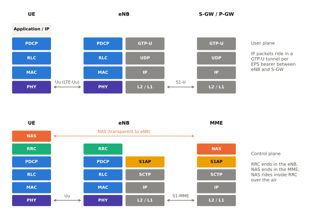
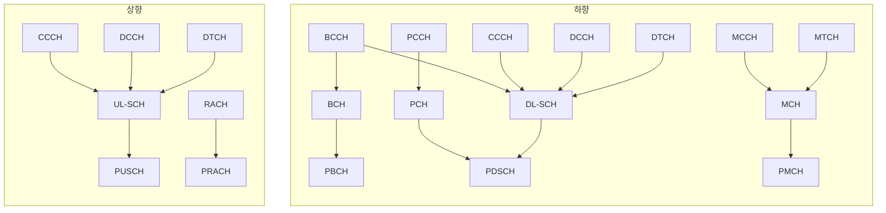
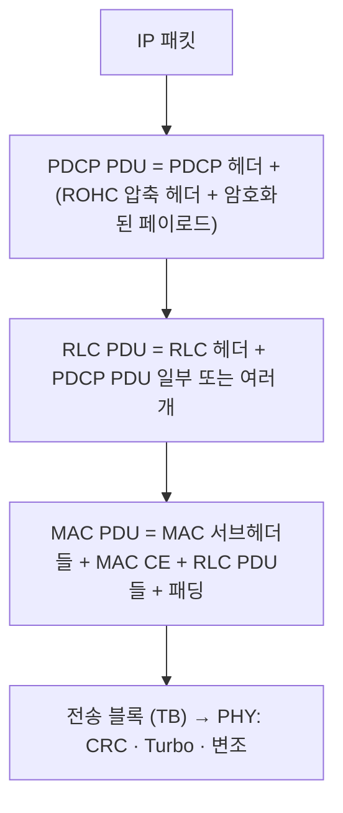

# 프로토콜 스택 개요 (CP · UP)

!!! spec "스펙 · 릴리즈"
    무선 프로토콜 구조: TS 36.300 §4.3, §5–6 · 채널 매핑: TS 36.300 §5.3, §6.1.3, TS 36.321 §4.5 · L2 구조 그림: TS 36.300 §6

    Rel-8~

!!! basic "한눈에 보기"
    LTE 무선 구간의 프로토콜은 계층으로 나뉩니다. 위에서부터 차례로 데이터를 포장하고, 받는 쪽에서는 거꾸로 풀어냅니다.

    | 계층 | 한 줄 요약 |
    |---|---|
    | **NAS** | 단말 ↔ MME 대화 (접속, 인증, 위치 등록, 세션) |
    | **RRC** | 단말 ↔ 기지국 무선 연결 제어 (연결, 설정, 측정, 핸드오버) |
    | **PDCP** | 헤더 압축, 암호화, 순서 정렬 |
    | **RLC** | 쪼개고 붙이기, 재전송(ARQ) |
    | **MAC** | 스케줄링, 다중화, HARQ |
    | **PHY** | 코딩, 변조, 실제 전파 송수신 |

    PDCP·RLC·MAC을 묶어 **L2(계층 2)**, RRC를 **L3**, PHY를 **L1**이라고 부릅니다.

## 사용자 평면과 제어 평면 { .l2 }

<figure markdown>

<figcaption>위: 사용자 평면 — IP 패킷은 eNB에서 GTP-U 터널로 S-GW에 전달됩니다. 아래: 제어 평면 — RRC는 eNB에서 끝나고, NAS는 RRC 메시지 안에 실려 MME까지 갑니다.</figcaption>
</figure>

## 세 종류의 채널 { .l2 }

계층 사이의 서비스 접점마다 "채널"이라는 이름이 붙습니다.

| 채널 종류 | 위치 | 기준 | 예 |
|---|---|---|---|
| **논리 채널** | RLC ↔ MAC | **무엇을** 보내는가 (정보 종류) | BCCH, PCCH, CCCH, DCCH, DTCH |
| **전송 채널** | MAC ↔ PHY | **어떻게** 보내는가 (전송 형식) | BCH, PCH, DL-SCH, UL-SCH, RACH |
| **물리 채널** | PHY | **어디에** 보내는가 (시간·주파수 자원) | PBCH, PDSCH, PDCCH, PUSCH, PUCCH, PRACH |

BCCH는 두 갈래입니다. **MIB**는 BCH → PBCH로, **SIB**들은 DL-SCH → PDSCH로 갑니다.
PDCCH, PCFICH, PHICH, PUCCH는 전송 채널 없이 물리계층 제어 정보(DCI, CFI, HI, UCI)만 나릅니다.

## 시그널링 무선 베어러 (SRB) { .l2 }

| SRB | 논리 채널 | RLC 모드 | 실어 나르는 것 |
|---|---|---|---|
| SRB0 | CCCH | TM | RRC 연결 요청·설정·거절, 재수립 (보안 전) |
| SRB1 | DCCH | AM | 대부분의 RRC 메시지, 초기 NAS 메시지 |
| SRB2 | DCCH | AM | NAS 메시지 (SRB1보다 낮은 우선순위). 보안 활성화 후 설정 |
| SRB1bis | DCCH | AM | NB-IoT의 보안 전 시그널링 (Rel-13) |

## 데이터 포장 과정 { .l2 }

한 계층의 출력(PDU)이 아래 계층의 입력(SDU)이 됩니다.

??? expert "전문가 노트 — 계층 간 상호작용"
    - **RLC PDU 크기는 MAC이 정합니다.** MAC이 스케줄링으로 받은 TB 크기에 맞춰 각 논리 채널에 바이트를 나눠주면(LCP), RLC는 그 크기에 맞게 분할·연결해서 PDU를 만듭니다. 그래서 LTE RLC는 전송 직전에야 PDU를 완성할 수 있습니다(NR은 이 제약을 없앰).
    - **RRC는 모든 하위 계층을 설정합니다.** `RadioResourceConfigDedicated` 안에 SRB/DRB 추가·수정(`srb-ToAddModList`, `drb-ToAddModList`), MAC 설정(`mac-MainConfig`), 물리 설정(`physicalConfigDedicated`)이 들어 있습니다.
    - **보안 경계.** 무결성 보호는 PDCP의 SRB에만, 암호화는 SRB·DRB 모두에 적용됩니다. NAS 보안은 별도로 MME와의 사이에 적용되므로 NAS 메시지는 이중 보호됩니다.
    - **RLF 감지는 여러 계층에서.** PHY의 동기 이탈(out-of-sync, N310/T310), MAC의 RA 실패, RLC의 최대 재전송 도달 중 하나가 일어나면 RRC가 RLF를 선언하고 재수립을 시도합니다.
    - **NR과의 차이.** NR은 PDCP 위에 **SDAP**(QoS 플로우 → DRB 매핑)가 추가되고, RLC의 연결(concatenation)과 순서 정렬이 사라졌으며, MAC 서브헤더가 각 서브PDU 앞에 붙는 구조로 바뀌었습니다. → [NR 프로토콜 스택](../../nr/protocol/overview.md)

## 관련 페이지

- [MAC](mac.md) · [RLC](rlc.md) · [PDCP](pdcp.md) · [RRC](rrc.md) · [NAS](nas.md)
- [E-UTRAN과 EPC](../architecture/overview.md)
