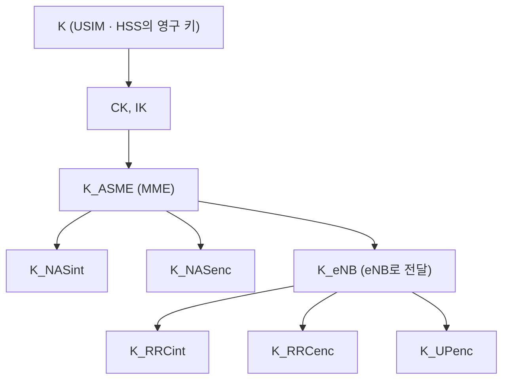

# PDCP

!!! spec "스펙 · 릴리즈"
    TS 36.323 (E-UTRA PDCP) — §5.5 헤더 압축, §5.6–5.7 암호화·무결성, §5.4 SDU 폐기, §5.2 핸드오버 시 처리 · 보안 구조: TS 33.401 · ROHC: RFC 5795

    Rel-8~ (Rel-11 15비트 SN, Rel-12 DC split bearer, Rel-13 18비트 SN·LWA, Rel-15 PDCP duplication은 NR에서)

!!! basic "한눈에 보기"
    **PDCP(Packet Data Convergence Protocol)**는 IP 패킷이 무선으로 나가기 전 **마지막 손질**을 합니다.

    1. **헤더 압축 (ROHC)**: VoLTE 음성 패킷은 페이로드가 30여 바이트인데 IP/UDP/RTP 헤더가 40–60바이트입니다. 헤더를 1–3바이트로 줄입니다.
    2. **암호화**: 엿들어도 내용을 알 수 없게 합니다.
    3. **무결성 보호**: 제어 메시지(RRC)가 중간에 조작되지 않았는지 확인합니다.
    4. **핸드오버 때 순서 유지와 손실 방지**: 기지국이 바뀌어도 패킷이 빠지거나 중복되지 않게 합니다.

## PDCP 기능 { .l2 }

| 기능 | SRB | DRB |
|---|---|---|
| ROHC 헤더 압축 | — | ✔ (설정 시) |
| 암호화 (ciphering) | ✔ | ✔ |
| 무결성 보호 (integrity) | ✔ | — (LTE에서는 없음) |
| 순서 정렬·중복 제거 (핸드오버 시) | ✔ | ✔ (RLC AM) |
| 타이머 기반 SDU 폐기 | — | ✔ (`discardTimer`) |
| PDCP 상태 보고 | — | ✔ (AM, 무손실 핸드오버) |

## PDCP PDU 형식 { .l2 }

| 종류 | SN 길이 | 헤더 크기 | 용도 |
|---|---|---|---|
| SRB 데이터 PDU | 5비트 | 1바이트 + MAC-I 4바이트 (꼬리) | RRC 메시지 |
| DRB 데이터 PDU (짧은 SN) | 7비트 | 1바이트 | RLC UM (VoLTE) |
| DRB 데이터 PDU (긴 SN) | 12비트 | 2바이트 | RLC AM / UM |
| DRB (확장) | 15비트 (Rel-11) / 18비트 (Rel-13) | 2 / 3바이트 | 대용량 CA, DC |
| 제어 PDU | — | — | PDCP 상태 보고, ROHC 피드백 |

## 보안 { .l2 }

| 알고리즘 | 암호화 | 무결성 | 기반 |
|---|---|---|---|
| 0 | EEA0 (암호화 없음) | EIA0 (긴급 호만) | — |
| 1 | 128-EEA1 | 128-EIA1 | SNOW 3G |
| 2 | 128-EEA2 | 128-EIA2 | AES |
| 3 | 128-EEA3 | 128-EIA3 | ZUC |

암호화는 **COUNT(32비트) = HFN + PDCP SN**, 베어러 ID, 방향(UL/DL)을 입력으로 키스트림을 만들어 XOR합니다. 같은 COUNT를 같은 키로 두 번 쓰면 안 되므로, COUNT가 한 바퀴 돌기 전에 키를 바꿔야 합니다.

??? expert "전문가 노트 — 핸드오버와 ROHC 세부"
    **무손실 핸드오버 (RLC AM DRB).**
    1. 소스 eNB가 **SN Status Transfer**(X2/S1)로 UL 수신 상태와 DL 다음 할당 COUNT를 타깃에 넘깁니다.
    2. 아직 ACK 못 받은 DL PDCP SDU는 X2-U로 타깃에 포워딩합니다.
    3. 단말은 PDCP를 **재수립**(새 키 적용)하고, 수신 상태를 담은 **PDCP Status Report**를 보내 중복 재전송을 줄입니다.
    4. 타깃은 포워딩된 패킷을 먼저, 그다음 S-GW에서 새로 오는 패킷을 보냅니다(End Marker로 경계 확인).

    RLC UM DRB(VoLTE)는 무손실이 아니라 **seamless** 핸드오버입니다. 포워딩 없이 약간의 손실을 허용하고 지연을 최소화합니다.

    **ROHC 프로파일.** 0x0001(RTP/UDP/IP), 0x0002(UDP/IP), 0x0003(ESP/IP), 0x0004(IP), 0x0006(TCP/IP), 0x0101–0x0104(RFC 5225 ROHCv2).
    ROHC는 U(단방향), O(양방향 낙관), R(양방향 신뢰) 모드가 있고, LTE VoLTE는 보통 O-mode로 동작합니다. 압축 상태가 IR → FO → SO로 올라가면 헤더가 1–3바이트까지 줄어듭니다.
    핸드오버 시 ROHC 컨텍스트는 기본적으로 리셋됩니다(Rel-15 이후 `drb-ContinueROHC`로 유지 가능).

    **discardTimer.** SDU가 PDCP에 들어온 뒤 이 시간 안에 전송 못 하면 버립니다(VoLTE 100 ms 등). 이미 RLC에 넘긴 경우 RLC에 폐기를 지시합니다.

    **Split bearer (Rel-12 DC).** MeNB PDCP가 MeNB RLC와 SeNB RLC 두 경로로 PDU를 분배합니다. 수신 측 PDCP는 두 경로에서 순서가 섞여 오므로 `t-Reordering`으로 정렬합니다. 이 구조가 EN-DC split bearer와 NR PDCP의 기본이 되었습니다.

    **LWA (Rel-13).** PDCP PDU를 Wi-Fi로 보내는 LTE-WLAN Aggregation. LWAAP 헤더를 붙여 WLAN으로 전달합니다.

## 관련 페이지

- [RLC](rlc.md)
- [RRC](rrc.md) — Security Mode Command
- [핸드오버](../procedures/handover.md)
- [VoLTE와 IMS](../advanced/volte-ims.md)
